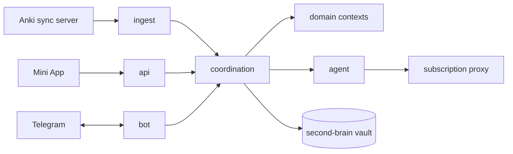

# Architecture

A map of DeckStreak for someone about to change it: where things live, what may depend on what,
and the rules that hold everywhere. The binding record of contexts and edges is
[docs/CONTEXT-MAP.md](docs/CONTEXT-MAP.md); each decision is an ADR in [docs/decisions/](docs/decisions/).

## Bird's eye view

DeckStreak syncs a private copy of its owner's Anki collection from the owner's own sync server,
reads it read-only, and recomputes each study day: the score, XP and levels, streaks, quests and
chests, coins, curriculum progress. It speaks through one notification router to two surfaces, a
Telegram bot and a Telegram Mini App, and runs an AI agent (Claude Code through the owner's
subscription proxy) for the daily pre-study readings, the digest's coaching and the second-brain
duties. It is one Rust binary, `deckstreakd`, run as systemd units behind Caddy on one small VM,
with a SQLite database replicated by Litestream.

## Code map

| path | what lives there |
|---|---|
| `crates/kernel/` | the shared kernel: ids, study day, track, verdict, errors, config, the SQLite base, the data-rights port |
| `crates/ingest/` | the Anki anti-corruption layer: sync, read, change gate, new-card queue, skip day |
| `crates/identity/` | Telegram `initData`, the owner allow-list, sessions, linked sign-in |
| `crates/{analytics,progression,streaks,curriculum,economy,quests,habits,focus,discipline,markets}/` | the game's domain contexts |
| `crates/notifications/` | the one router (`src/router.rs`), the ladder, budgets, quiet hours, digests and nudges |
| `crates/readings/` | the daily pre-study readings |
| `crates/vault/` | the second-brain vault's anti-corruption layer |
| `crates/agent/` | the AI agent: duty runs, personas, the output gate |
| `crates/{insights,publishing,privacy}/` | research instruments, the public export, data rights |
| `crates/coordination/` | use cases and scheduled jobs across contexts |
| `crates/api/`, `crates/bot/` | the HTTPS and Telegram adapters |
| `crates/daemon/` | the composition root (`deckstreakd`) and `src/wiring.rs` |
| `web/app/` | the SvelteKit Mini App |
| `web/site/` | the Astro landing page (planned) |
| `agent/` | the agent's public duty skills, prompts, settings template and runner |
| `deploy/` | systemd unit and Caddy templates, the host budget, deploy and rollback scripts |
| `tools/parity-oracle/` | the golden generator and the committed goldens |
| `.packs/` | the vendored packs and their probes (ADR-004) |
| `scripts/` | the gate: `check.sh`, the methodology probes, `pack-rows.py` |
| `docs/` | the charter's companions: context map, lexicon, SPECs, ADRs, schematics, red-first records |

## Invariants

- The crate graph equals the context map; domain contexts never depend on each other.
- The study day turns over at 04:00 local; every screen shows the server's study day.
- Coins are the only confiscable stake.
- Every celebration and nudge passes through `notifications::router::route`.
- Every AI output passes the packs' blocking checks before delivery, or is not delivered.
- No secret reaches an environment variable, argv, a log line or a row.
- The repository carries no private value.

## Boundaries

Four anti-corruption layers own the foreign models: `ingest` (Anki), `vault` (the second brain's
files), `identity` (Telegram's `initData`) and `agent` (the Claude Code runner). The Mini App
reaches the backend only through the HTTPS API under `/api` on its own origin.

## Cross-cutting concerns

- **Time**: an injected clock and the kernel's study-day calendar; no test sleeps.
- **Observability**: tracing JSON to journald, a TraceLayer with request ids, SLOs in
  `deploy/slo.json`, one Telegram alert path, a memory watch (the observability pack).
- **Privacy**: `privacy.json` declares every category of personal data; export and erase are
  symmetric and tested (the privacy-gdpr pack).
- **AI safety**: `ai-safety.json` declares every AI task, its fenced untrusted inputs, its tools and
  its gate (the ai-content-safety pack).
