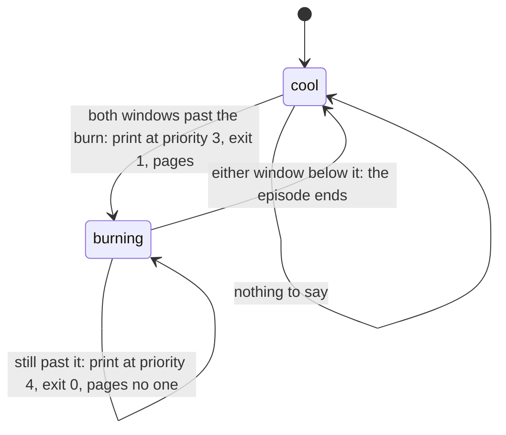

# Schematic: from a failing unit or a burning budget to one Telegram page

Kind: data flow, and the episode state machine the evaluator and the memory watch share. Read at
DeckStreak `main` e05dfa5 (ADR-010, `docs/schematics/deployment.md`, the observability pack's
`slo.template.json`, `alert@.template.service`, `alert-telegram.template.sh`,
`memory-watch.template.sh`) and redrawn at SPEC-031's delivery. Decided by ADR-031; built by
SPEC-031 over SPEC-032's units.

```mermaid
flowchart LR
  api[deck-streak-api.service] -->|TraceLayer response event at INFO: route, status, latency| journal[(journald)]
  roles[every role of deckstreakd] -->|a panic: the kernel's hook, one ERROR event through the redacting writer| journal
  slotimer[deck-streak-slo.timer, every 5 min] --> eval[slo-evaluate.py: long and short windows per alert]
  journal -->|the API's response events, read once over the longest window| eval
  eval -->|both windows past the burn, first time this episode| fail1[exit 1]
  mwtimer[deck-streak-memory-watch.timer, every minute] --> watch[memory-watch.sh: memory.events of every deck-streak cgroup]
  watch -->|new oom_kill or max| fail2[exit 1]
  watch -->|new high, or crossing 90 percent of memory.max| journal
  units[api, bot, job units: exit non-zero, a watchdog or an OOM kill] --> fail3[unit failed]
  fail1 & fail2 & fail3 -->|OnFailure=deck-streak-alert@%n.service| alert[alert-telegram.sh]
  journal -->|the failed run's last five error lines| alert
  creds[$CREDENTIALS_DIRECTORY: telegram-bot-token, owner-user-id] --> alert
  alert -->|URL and fields through curl --config on stdin| tg((Telegram sendMessage))
```

| page source | fires when | pages how often |
|---|---|---|
| a unit's own failure | the process exits non-zero, a watchdog timeout, an OOM kill | at each failure, including each one an automatic restart follows (systemd 254 and later start `OnFailure=` units on that failed state); a crash loop ends at the start limit |
| the SLO evaluator | both windows of an alert exceed its burn rate | once per burn episode (`$STATE_DIRECTORY`) |
| the memory watch | a new `oom_kill` or `max` event in a unit's `memory.events` | once per event (`$STATE_DIRECTORY`) |
| a scheduled job's transition | SPEC-027's paging transitions | once per episode |

## The alert template unit

`deck-streak-alert@.service` is the one alert path. Its instance is the failed unit's full name, so
a job instance's failure makes an instance whose name holds a second `@`, which systemd 255 accepts
(`%i` is everything after the first `@`). It names no `OnFailure=` itself: a page that fails must not
start a page about the page. It reads no settings file and writes nothing: it holds only its two
credentials, the journal group that lets it quote the failed run's lines, and the network.

```mermaid
sequenceDiagram
  participant systemd
  participant alert as alert-telegram.sh
  participant journal as journalctl
  participant curl
  systemd->>alert: %i, MONITOR_UNIT, MONITOR_SERVICE_RESULT, MONITOR_INVOCATION_ID
  alert->>alert: read telegram-bot-token and owner-user-id from $CREDENTIALS_DIRECTORY
  alert->>journal: that run's error lines (the unit's, when no run is named)
  journal-->>alert: at most the last five
  alert->>alert: the text: unit, result, lines; at most 3500 bytes, cut at a character boundary
  alert->>curl: --config - on stdin: url, chat_id, text (never argv)
  curl->>curl: POST sendMessage, three retries
```

## The episode, remembered in `$STATE_DIRECTORY`

The evaluator keeps the set of alerts burning at its last run; the memory watch keeps each unit's
counters with its cgroup's identity. A page is the edge from cool to burning, never the level.



The evaluator's own failure (a journal it cannot read, a declaration it cannot parse) is an episode
of the same machine under its own key, so a broken evaluator pages once rather than every five
minutes. The memory watch's first sight of a unit is its baseline; a cgroup made since its last run
(a restart, or a oneshot's next run) counts every event it holds as new.
