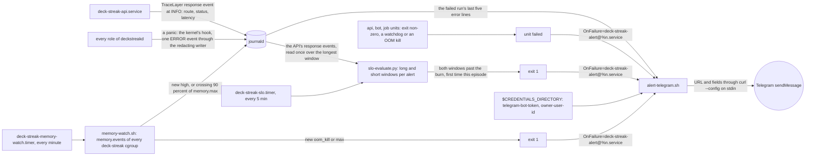
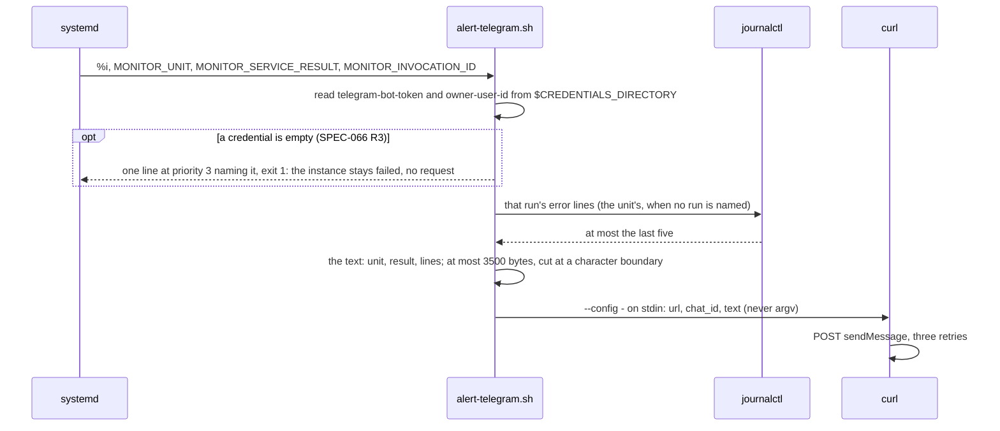
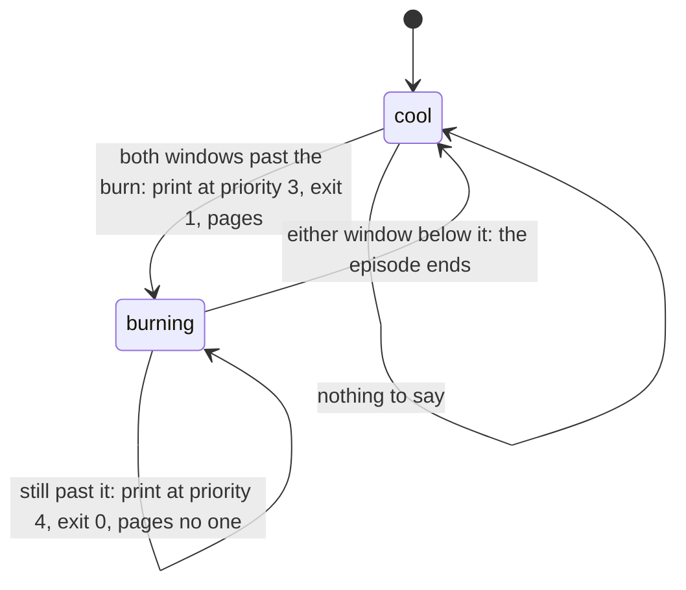
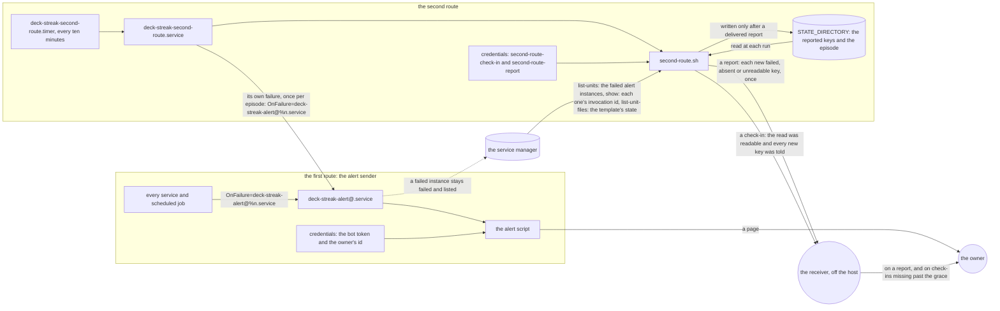
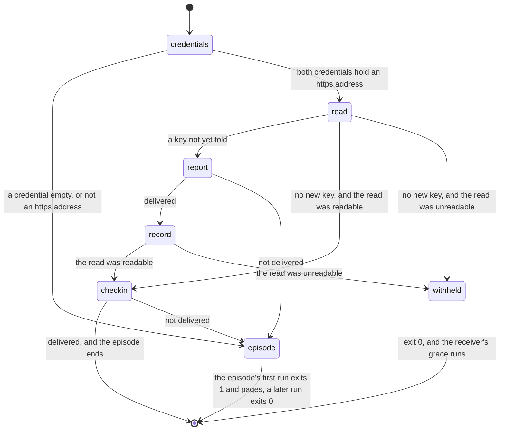

# Schematic: from a failing unit or a burning budget to one Telegram page

Kind: data flow, and the episode state machine the evaluator and the memory watch share. Read at
DeckStreak `main` e05dfa5 (ADR-010, `docs/schematics/deployment.md`, the observability pack's
`slo.template.json`, `alert@.template.service`, `alert-telegram.template.sh`,
`memory-watch.template.sh`) and redrawn at SPEC-031's delivery. Decided by ADR-031; built by
SPEC-031 over SPEC-032's units.

| page source | fires when | pages how often |
|---|---|---|
| a unit's own failure | the process exits non-zero, a watchdog timeout, an OOM kill | at each failure, including each one an automatic restart follows (systemd 254 and later start `OnFailure=` units on that failed state); a crash loop ends at the start limit |
| the SLO evaluator | both windows of an alert exceed its burn rate | once per burn episode (`$STATE_DIRECTORY`) |
| the memory watch | a new `oom_kill` or `max` event in a unit's `memory.events` | once per event (`$STATE_DIRECTORY`) |
| a scheduled job's transition | SPEC-027's paging transitions | once per episode |

## The alert template unit

`deck-streak-alert@.service` is the one alert path. Its instance is the failed unit's full name, so
a job instance's failure makes an instance whose name holds a second `@`, which systemd accepts:
`%i` is everything after the first `@` (systemd.unit(5)). It names no `OnFailure=` itself: a page
that fails must not start a page about the page. Its own refusal of an empty credential (SPEC-066
R3) is one line at error priority naming the credential and exit 1, before any request, so the
instance stays failed, in `systemctl --failed` and the journal; a page about it needs a route that
does not depend on the alert sender (#285). It reads no settings file and writes nothing: it holds
only its two credentials, the journal group that lets it quote the failed run's lines, and the
network.

## The episode, remembered in `$STATE_DIRECTORY`

The evaluator keeps the set of alerts burning at its last run; the memory watch keeps each unit's
counters with its cgroup's identity. A page is the edge from cool to burning, never the level.

The evaluator's own failure (a journal it cannot read, a declaration it cannot parse) is an episode
of the same machine under its own key, so a broken evaluator pages once rather than every five
minutes. The memory watch's first sight of a unit is its baseline; a cgroup made since its last run
(a restart, or a oneshot's next run) counts every event it holds as new.

## The second route (SPEC-396)

Kind: component and data flow, with the state machine of one run. Read at DeckStreak `dev`
`164ac206`, where the alert template names no `OnFailure=` (SPEC-066 R3) and its own failure is
recorded where the service manager and the journal show it; the route that tells the owner is
#285's (the section above). Decided by ADR-410; built by SPEC-396. The alert sender is unchanged;
this section adds a route with its own unit, its own process, its own two credentials and its own
far end.

| failure | the first route | the second route |
|---|---|---|
| a monitored unit fails | pages it | does not repeat it |
| the alert sender refuses an empty credential (SPEC-066 R3) | its instance stays failed | reports `failed <instance> <invocation id>` once |
| the alert sender's request is refused or unanswered after its retries | its instance stays failed | reports the same key once |
| the alert sender runs past its timeout, or is killed at its memory ceiling | its instance stays failed | reports the same key once |
| the socket does not deliver an alert credential | the start fails, the instance stays failed | reports the same key once |
| a later failure under a name already reported | its instance fails again | a new invocation id, so a new key, reported once |
| the alert template absent, masked or in another state | `OnFailure=` starts nothing | reports `template <state>` once |
| the service manager's state unreadable | not involved | reports `unreadable` once and withholds every check-in while it lasts |
| the second route's own failure: a credential empty or not https, a request not delivered | pages it once per episode | withholds the check-in |
| the host, its service manager or its network down, or both routes down | silent | check-ins stop, and the receiver tells the owner after its grace |

| route | process | credential roles it holds | far end |
|---|---|---|---|
| the alert sender | `deck-streak-alert@.service`, the alert script | the bot token, the owner's id | the owner's chat |
| the second route | `deck-streak-second-route.service`, `second-route.sh` | `second-route-check-in`, `second-route-report` | the receiver, off the host |

No credential id is in both rows, and no process: the second route never runs the alert script, and
asks the service manager only to list units, list unit files and show an invocation id. Each
credential reaches its own unit from the credential socket at every start (ADR-038), and the service
manager keeps each unit's credentials invisible to every other unit.

A failed alert instance that a later instance of the same name replaces with a delivered page,
before the second route reads it, is told by that page: it names the same failed unit. The model
`formal/tla/SecondRoute` holds the order of these steps against a service manager that fails and
replaces alert instances between them (SPEC-396 §7).
