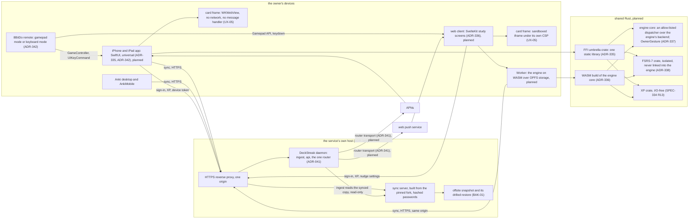
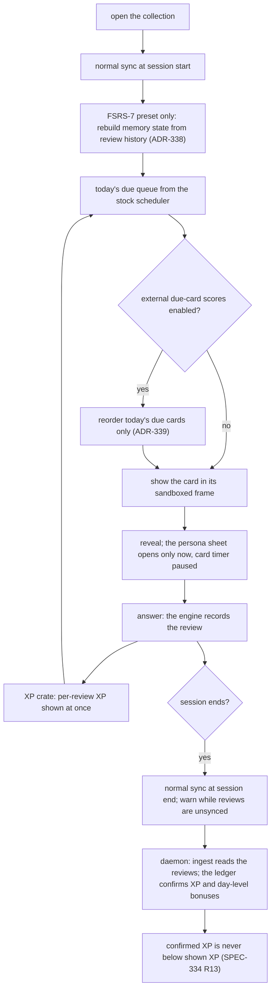
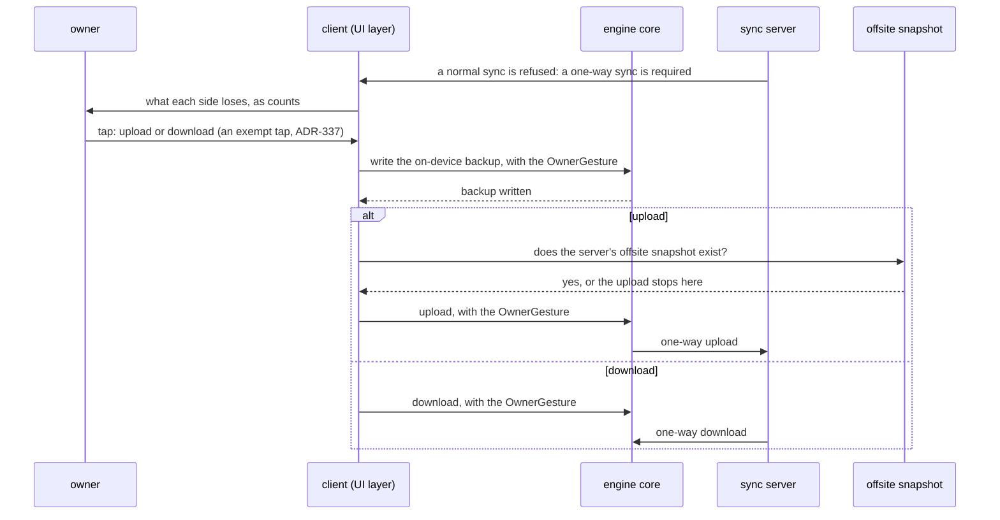
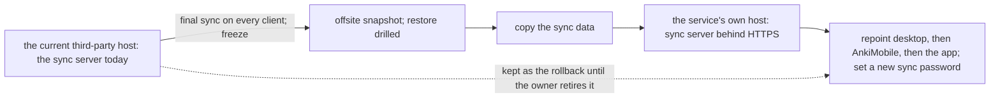
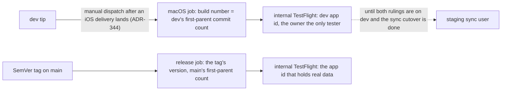

# Schematic: the app clients, the engine's two transports, the sync server and the one router

Kind: component diagram and data flow, with the full-sync choice as a sequence. Read at DeckStreak
`dev` df2a4cd (`crates/notifications/src/transport.rs:84`, the router's one outbound port;
`crates/ingest/Cargo.toml` and `crates/readings/Cargo.toml`, the engine's only consumers;
`docs/CONTEXT-MAP.md`). Added by SPEC-334, the app campaign's PRD. Every component drawn with a
dashed edge or named "planned" does not exist yet: it enters the tree, and the context map, through
the delivery that builds it, under the ADR named beside it.

## The components

- The engine has one port and two transports: FFI on iPhone and iPad, WASM in the browser
  (SPEC-334 R3). If the browser engine spike says NO-GO, the Worker is replaced by ADR-336's
  fallback: the server-side study collection behind the daemon's study API, and the web client
  calls it over HTTPS instead.
- The FSRS-7 crate and the XP crate join the same umbrella static library on iPhone and iPad and
  the same WASM build in the browser. FSRS-7 never links into the engine, and it writes only the
  stock fields through it (ADR-338).
- The daemon's router keeps its Telegram transport (`BotTransport`,
  `crates/notifications/src/transport.rs:84`) until native push carries it; then the Mini App and
  the bot retire (ADR-341).

## The study flow

## The full-sync choice

No normal sync may run between the backup and the snapshot check and the one-way write. SPEC-334
section 9 records the TLA+ model of that ordering as a candidate for the delivery that builds it.

## The sync-server move

## Builds to the owner's devices

A TestFlight upload publishes a signed build for the owner's devices; it changes no host and is
not a deploy (ADR-335, RELEASING.md). The team id, the app ids, the associated-domains file and
the upload key come from the private deploy rail, never from this repository.
