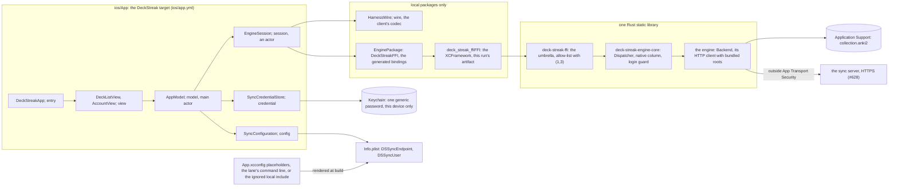
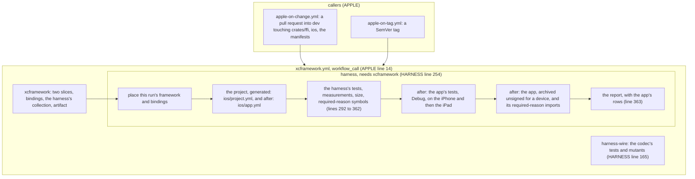
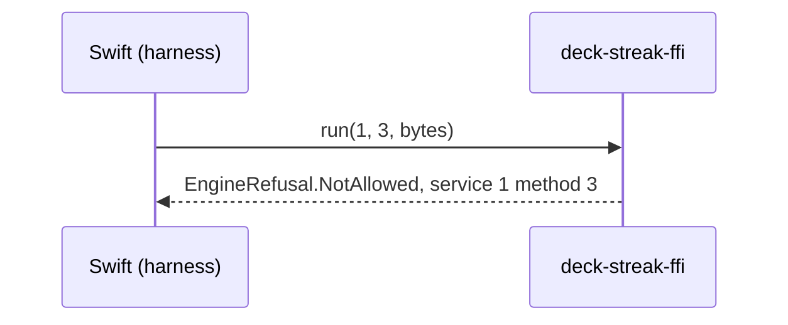
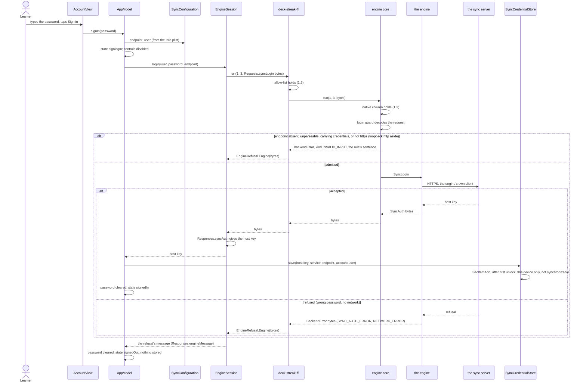
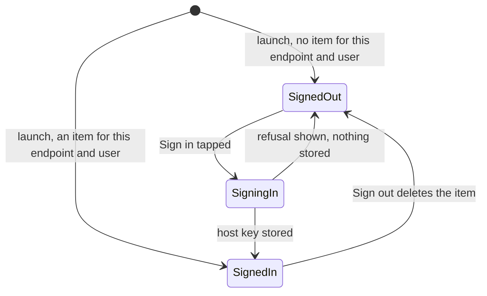
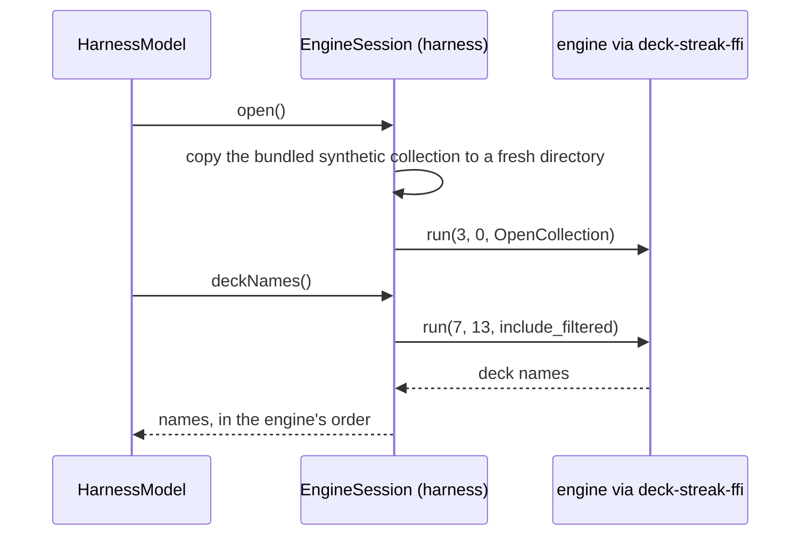
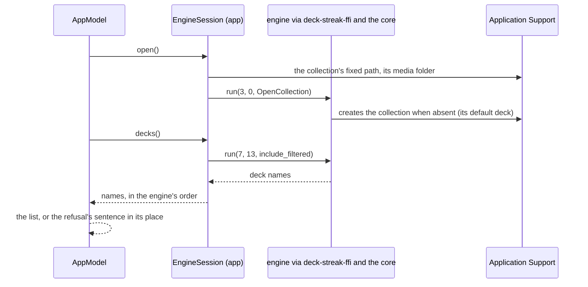
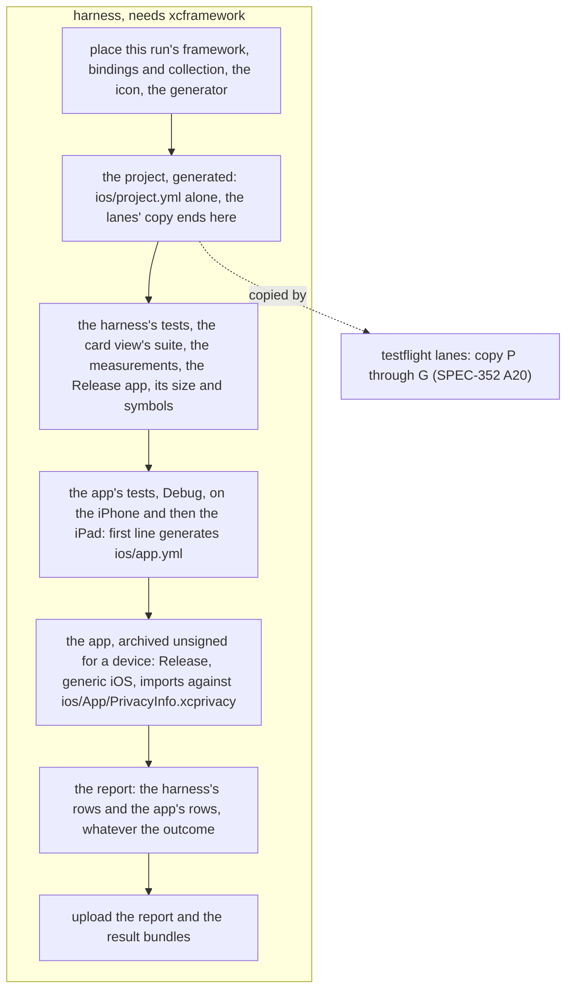

# Schematic: the app shell, its login and its deck list (SPEC-347, ADR-358)

Read at DeckStreak `dev` `96eae6afd97384108cb31d66e7d3243d2d70f5af` (DEV), #656 at
`d295cd886a520ea61387723c0b081fed29a33c5d` (HARNESS) and #659 at
`01773951348d8c14fe9f0ba186f5e78c2244d954` (APPLE); the engine's files at the revision root
`Cargo.toml` line 133 names. Every `path:line` below is at those commits. The core
(`crates/engine-core`) and the umbrella's shape are as #623's and #624's designs place them; this
schematic draws only what #625 adds to them.

## 1. Components, after

What each edge may carry is the census's door (SPEC-347 R11): only `session` reaches the
bindings, the codec and the file system; only `credential` reaches the Keychain; only `config`
reads the info dictionary. No Swift file opens a network connection or a store of its own.

## 2. The Apple job body, before and after

Before: H2 generates `ios/project.yml` alone, and H4 and H5 do not exist. After: no job, workflow,
runner or cargo command is added; the tag caller runs the same steps, so a SemVer tag's build is
archived the same way the lane will sign it (#634).

## 3. The login, before

No ref holds a sync pair on the native path (`crates/ffi/src/allow_list.rs`, DEV line 23, HARNESS
line 25), and no Swift file names the Keychain (SPEC-347 M5).

## 4. The login, after

The password lives in the field and the model for the call alone. The guard's sentence, like the
engine's, names neither the endpoint, the user nor the password (SPEC-347 R2, R3).

## 5. The account's states

Sign-out is offered only in `SignedIn`, and the sheet's controls are disabled in `SigningIn`, so no
sign-out can race a login. A build with another endpoint or user starts in `SignedOut`, because its
key finds no item (ADR-358 D2).

## 6. The deck list, before (the harness)

HARNESS `ios/Harness/Sources/EngineSession.swift` lines 60 to 90: every launch starts from the same
bundled card.

## 7. The deck list, after (the app)

Nothing of the list is cached outside the engine's collection (SPEC-347 R7). The detail pane
reads "Choose a deck" until the review screen exists (#632).

## 8. The `harness` job after part 2 (SPEC-347 R13, ADR-358 D10)

Read at `dev` `1a3bdcf3`, where `xcframework.yml` has grown since section 2 was drawn: the jobs
are `xcframework` (line 30), `harness-wire` (178), `card-isolation` (267) and `harness` (356), so
section 2's line numbers are HARNESS's, not this tree's. In `harness`, "the project, generated" is
line 394, the harness's tests 397, the card view's planted suite 410, the Release measurements 421,
the Release app built alone 434, its size 443, its required-reason symbols 449, the report 479 and
the upload 599. Section 2's H2 is superseded: the app's project is generated by its own step, and
"the project, generated" keeps its one line.

| step | runs | signing | reads |
|---|---|---|---|
| the app's tests, Debug, on the iPhone and then the iPad | `xcodegen generate --spec ios/app.yml`, then `xcodebuild test` of the `DeckStreak` scheme on both simulators, one after the other | ad hoc on its command line, no team (SPEC-347 section 6's fallback) | its own derived data and result bundle `app.xcresult` |
| the app, archived unsigned for a device | `xcodebuild archive` of the `DeckStreak` scheme, Release, `generic/platform=iOS`, then `nm -u` of the archived executable | off on its command line | `ios/App/PrivacyInfo.xcprivacy`, against the categories the harness's check names |
| the report | as before, plus the app's minutes, its test cases on each simulator and its required-reason lines | none | the app's result bundle and its symbols file |

No job, workflow, runner or cargo command is added. The harness's own steps are unchanged, so a
failure in them stops the job before the app's steps run, and the report still runs.
