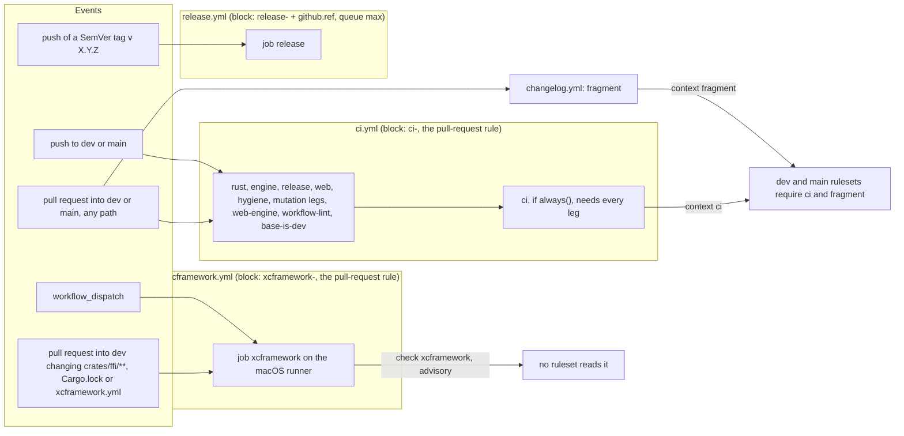
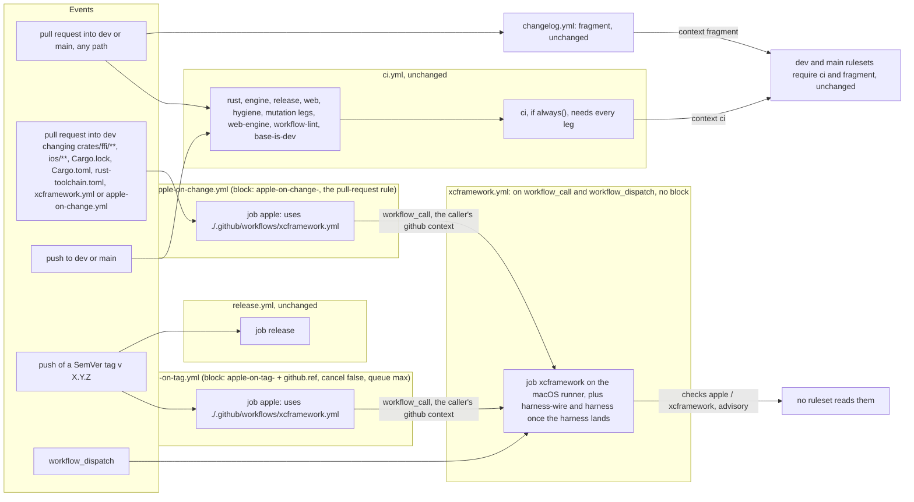
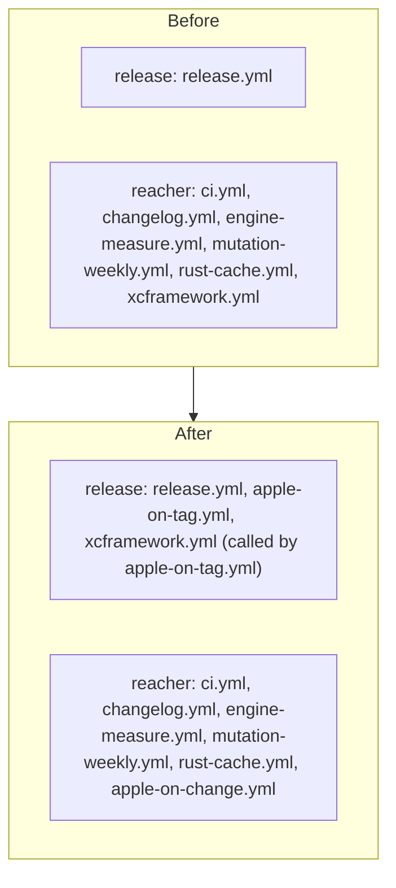
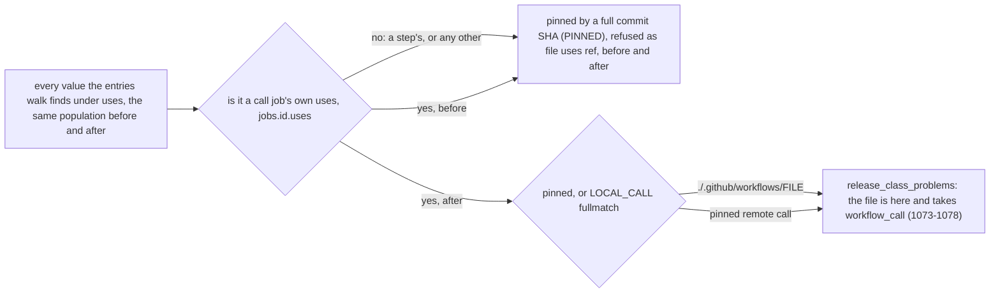

# The Apple build on a change and on every release tag: the CI job graph before and after

Kind: data flow (events and paths into workflows, workflows into jobs, jobs into checks and the
ruleset contexts). Read at DeckStreak `dev` `1eec0870e67e801fc3aa279318219d6986116ec7`; every
`path:line` below is at that commit. Decided by ADR-355; specified by SPEC-344.

## 1. Before (`dev` today)

What the graph shows, measured:

- A tag reaches `release.yml` alone (`release.yml:13-15`). No Apple job runs for a tag
  (`xcframework.yml:13-21` declares `pull_request` and `workflow_dispatch` only).
- `Cargo.toml`, `rust-toolchain.toml` and, after #656, `ios/**` are inputs of the Apple build that
  a change to alone does not start it for (`xcframework.yml:17-20`).
- The aggregate `ci` needs fourteen jobs of `ci.yml` and nothing else (`ci.yml:840`). The rulesets
  require `ci` and `fragment` (`.github/rulesets/dev.json:39-50`, `main.json:31-34`).

## 2. After

What changes, and what holds it:

- A SemVer tag starts two workflows, `release.yml` (unchanged) and `apple-on-tag.yml`. The second
  takes `release.yml`'s tag filter and no path filter: GitHub does not evaluate a path filter for a
  tag push (SPEC-344 R3, A2).
- Both callers run one body, `xcframework.yml`, which reads the caller's `github` context and no
  pull-request-only value (R1, A3). A dispatch still runs it directly.
- The aggregate, the rulesets and `release.yml` are unchanged; the Apple checks stay advisory and
  are now named `apple / <job>` (R4, R8).

## 3. The concurrency classes, before and after

`membership` (`scripts/tests/test_workflow_concurrency.py:997-1016`) puts a workflow a tag can
start, and every workflow it calls, in the release class; every other workflow is a reacher.

| workflow | block after | rule that holds it | literal start of its group |
|---|---|---|---|
| `apple-on-change.yml` | `apple-on-change-` + the pull-request form, cancel on a pull request | the pull-request rule (`test_workflow_concurrency.py:70-91`) | `apple-on-change-` |
| `apple-on-tag.yml` | `apple-on-tag-${{ github.ref }}`, cancel `false`, `queue: max` | `release_problems` (241-285), `closed_by_construction` (487-530), `release_class_problems` (1035-1117) | `apple-on-tag-` |
| `xcframework.yml` | none | no rule owes a callee a block (`release_problems` is applied to tag-started files only, 1140-1153); its runs take the caller's | none |
| `release.yml` | `release-${{ github.ref }}`, unchanged | as before | `release-` |
| the other five | unchanged | as before | `ci-`, `changelog-`, `engine-measure-`, `mutation-weekly-`, `rust-cache` |

No literal start in the last column is a prefix of another, which is the release class's
reachability rule (`release_class_problems`, the prefix loop after line 1108).

## 4. The pin census's reading of `uses`, before and after

One pattern, `LOCAL_CALL`, serves both censuses: it moves into `test_ci_workflows.py` and
`test_workflow_concurrency.py` imports it back, since that module already imports from
`test_ci_workflows.py` and the reverse import would be circular (ADR-355 D2).
