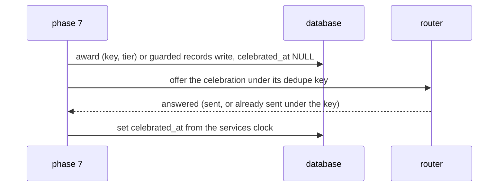

# Schematic: badges, records and the next milestone, awarded once and celebrated at most once

Kind: component, data flow and sequence. Built by SPEC-073, decided by ADR-303 (the design the
model `formal/tla/AwardOnce/` chose) and by ADR-041 (the router's once-ever dedupe key). It ports
the predecessor's badge conditions, record detection and next-milestone selection, which the
parity goldens under `tools/parity-oracle/` hold.

## 1. The components

```mermaid
flowchart LR
  fold[coordination::recompute phase 7, per evaluated day] --> ctx[progression_view::badge_context]
  ctx --> cond[progression::badges::conditions]
  cond --> award[progression::badges::award: AwardPort]
  award -->|BEGIN IMMEDIATE| tb[(badges_earned)]
  fold --> rec[coordination::recompute::records: guarded write]
  rec -->|BEGIN IMMEDIATE| tr[(records)]
  award --> offer[offer-pending loop]
  rec --> offer
  offer -->|event + dedupe key| router[notifications router: one send per key]
  router -->|answered| mark[set celebrated_at from the services clock]
  api[GET /api/badges, /records, /milestone] --> views[coordination views]
  bot[/badges, /records] --> views
  milestone[progression::milestone::next_milestone] --> views
```

Each row is progression's. `badges_earned` has one row per (key, tier); `records` has one row per
kind, and its `study_day` names the day that set it. `celebrated_at` is the one column a later write
sets, after the router answers; a band badge is written already marked.

## 2. The sequence of one evaluated day



A crash between the first and the third step leaves the row unmarked. The next evaluation of any
day offers every unmarked award again, and the router's unique dedupe key keeps each to one send.

## 3. The guard on the records write

A record row holds one kind. A day's write that would replace an earlier day's row first offers that
row's mark inside the write's own read, so a record is offered before it can be superseded; one
superseded before it could be offered is named in a log line with its kind and day.

## 4. The milestone

`next_milestone` is a pure function of three numbers over three ladders. The winner has the smallest
`remaining / rung`; a tie keeps the earlier ladder (reviews, streak, mature). The mature input is
Road to C2's, so until it supplies one the view answers `pending` and computes nothing from a stand-in.
