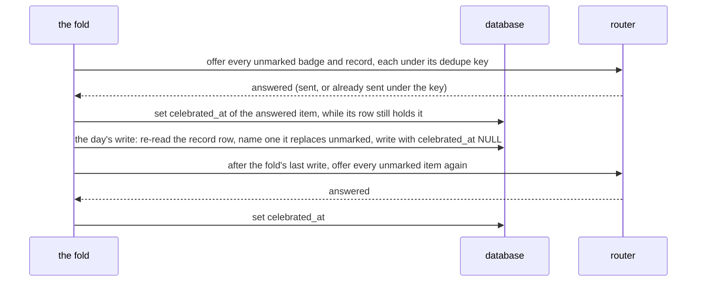

# Schematic: badges, records and the next milestone, awarded once and celebrated at most once

Kind: component, data flow and sequence. Built by SPEC-073, decided by ADR-303 (the design the
model `formal/tla/AwardOnce/` chose) and by ADR-041 (the router's once-ever dedupe key). It ports
the predecessor's badge conditions, record detection and next-milestone selection, which the
parity goldens under `tools/parity-oracle/` hold.

## 1. The components

```mermaid
flowchart LR
  fold[coordination::recompute phase 7, per evaluated day] --> ctx[progression_view::badge_context]
  ctx --> cond[progression::badges::conditions]
  cond --> award[progression::badges::award: AwardPort]
  award -->|BEGIN IMMEDIATE| tb[(badges_earned)]
  fold --> rec[coordination::recompute::records: re-checked write]
  rec -->|BEGIN IMMEDIATE| tr[(records)]
  fold --> offer[the fold's offers, between its writes]
  tb --> offer
  tr --> offer
  offer -->|event + dedupe key| router[notifications router: one send per key]
  router -->|answered| mark[set celebrated_at from the services clock, own write]
  api[GET /api/badges, /records, /milestone] --> views[coordination views]
  bot[/badges, /records] --> views
  milestone[progression::milestone::next_milestone] --> views
```

Each row is progression's. `badges_earned` has one row per (key, tier); `records` has one row per
kind, and its `study_day` names the day that set it. `celebrated_at` is the one column a later write
sets, after the router answers; a band badge is written already marked.

## 2. The sequence of one evaluated day



Each arrow into the database is its own `BEGIN IMMEDIATE` write, and the router writes through its
own connection (`router.rs::route` opens `self.db.write()`), so no offer runs inside a write. A crash
between any two steps leaves the row unmarked: the next offers, of this evaluation or of any later
one, offer it again, and the router's unique dedupe key keeps each to one send. A router call that
does not answer marks nothing.

## 3. The re-check on the records write

A record row holds one kind. The offers before a day's write give an earlier day's unmarked record
its send. The write itself re-reads the row inside its own `BEGIN IMMEDIATE`: when it is about to
replace an earlier day's row whose mark is still unset (the router did not answer, or a crash fell
between), it names that record in a log line with its kind, its day and "celebration not sent", and
then writes. The write never waits for the router: deferring it until the mark is set would stall
every later record while the router does not answer (ADR-303).

This section corrects the earlier text, which had the offer run inside the write's own read: the
router opens a write of its own, so the code cannot do that.

## 4. The milestone

`next_milestone` is a pure function of three numbers over three ladders. The winner has the smallest
`remaining / rung`; a tie keeps the earlier ladder (reviews, streak, mature). The mature input is
Road to C2's, so until it supplies one the view answers `pending` and computes nothing from a stand-in.
