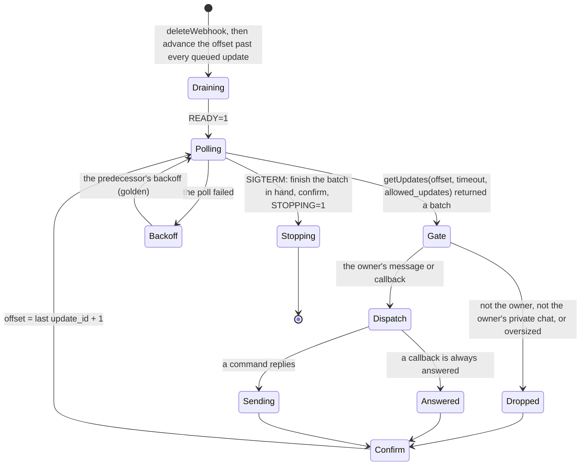
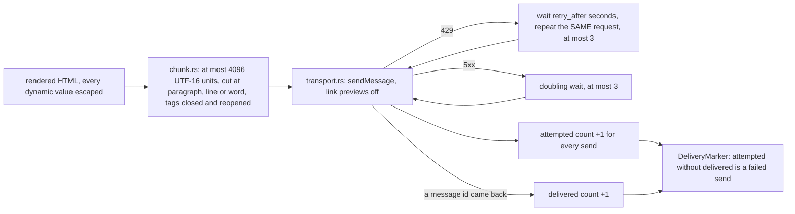

# Schematic: the bot's update loop and its outbound transport

Kind: state machine and data flow. Read at DeckStreak `main` e05dfa5 (ADR-006, ADR-007, the
telegram-platform pack), and at the predecessor's `27ee2bc` for the behaviour it ports
(`bot.py:CommandBot.run`, `poll_once`, `_drain_offset`, `_backoff_delay`, `_process_update`,
`_process_callback`, `telegram.py:TelegramNotifier`). Decided by ADR-026; built by SPEC-026.

