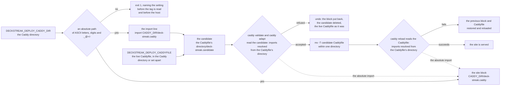

# Schematic: the Caddy steps' paths in both Caddyfile layouts

Kind: data flow. Added by SPEC-353; ADR-364 decides it. Every `path:line` below was read at
DeckStreak `dev` 296963bb, the base this delivery cuts from, and names a line the cure changes or
reads. The flow is the one SPEC-127 and ADR-198 decided: block, candidate, checks, rename, reload,
undo. Only the paths that flow carries change. Every host step is the owner's go (#161).

## What each Caddy step reads and writes (data flow)

The removal follows the same paths. Its candidate is the live Caddyfile without the import line,
written in the Caddyfile's own directory and checked there. After the rename it moves the block
aside and reloads.

## The lines it changes and reads

| line at 296963bb | role | after the cure |
|---|---|---|
| `deploy/deploy.sh:69` | the import line | names the block by its absolute path in the Caddy directory (D1) |
| `deploy/deploy.sh:76` (`need_host() {`) | none | the Caddy directory's check, a function added before it (D3) |
| `deploy/deploy.sh:272` | the install's `local` line | followed by the check's call (D3) |
| `deploy/deploy.sh:287` | the install's candidate | in the Caddyfile's own directory (D2) |
| `deploy/deploy.sh:300`, `:343` | the Caddyfile directory's write checks | unchanged; they now also cover the candidate's directory |
| `deploy/deploy.sh:301`-`:305`, `:344`-`:352` | the name guards | unchanged; they read `$copy` |
| `deploy/deploy.sh:310`-`:311`, `:355`-`:356` | the checks | unchanged; they read `$copy` |
| `deploy/deploy.sh:313`, `:358` | the rename onto the Caddyfile | unchanged; now within one directory |
| `deploy/deploy.sh:314`, `:360` | the reload | unchanged |
| `deploy/deploy.sh:328` | the removal's first statement | preceded by the check's call (D3) |
| `deploy/deploy.sh:334` | the removal's candidate | in the Caddyfile's own directory (D2) |

## The two layouts

| layout | the Caddy directory holds | the Caddyfile's directory holds |
|---|---|---|
| beside (the default) | the block, its previous copy, the candidate, the Caddyfile, its previous copy | (the same directory) |
| set apart | the block, its previous copy | the candidate, the Caddyfile, its previous copy |

In both layouts, the import line, the candidate's checks and the reload resolve the site import to
the one block in the Caddy directory (SPEC-353 R1, R2).
