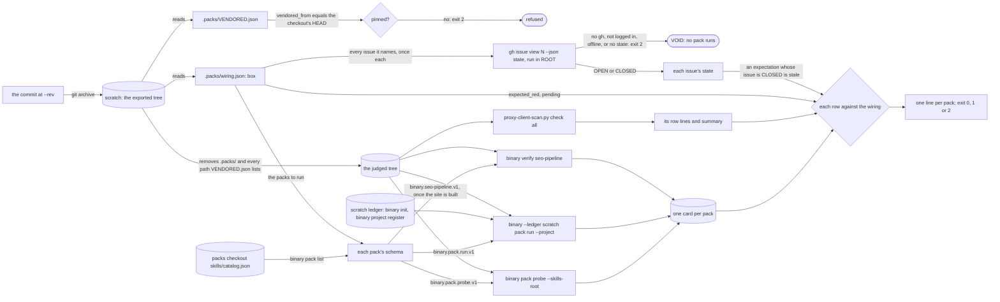

# Schematic: one box-pack run, from a commit to one line per pack

Kind: data flow, with the verdict each pack reaches. Read at DeckStreak `dev` cb66427
(`scripts/box-packs.sh`, `.packs/wiring.json`, `.packs/VENDORED.json`, ADR-004), and at the
vendored packs commit for the verbs it drives (`<binary> pack list`, `<binary> pack probe`,
`<binary> pack run`, `<binary> verify seo-pipeline`, `<binary> init`, `<binary> project register`, and
`scripts/proxy-client-scan.py`). Decided by ADR-030; built by SPEC-030. The issue-state step was
added by SPEC-054 R4, read at `dev` c0dbf2a with `gh issue view <n> --json state`.

The scratch directory holds the exported tree and the ledger. It is created with the process's
temporary directory, outside both repositories (the run refuses a scratch directory inside either),
and removed when the run ends, whatever its verdict. The cards are kept under `$BOX_PACKS_OUT`, to
be posted on the pull request.

## The verdict of one pack

| the card says | the wiring says | the pack reads | fails the run |
|---|---|---|---|
| no card: the binary refused, or the card's schema is not the verb's | anything | `FAIL` with the binary's last line | yes |
| examined 0 (a declarative walk, or no built site) | `pending #N` | `pending #N` | no |
| examined 0 | nothing | `FAIL` VOID | yes |
| examined 1 or more | `pending #N` | `FAIL`, the pending issue stale | yes |
| a blocking row red | the row under `expected_red` | counted expected | no |
| a blocking row red | not named | `FAIL`, an unexpected red by name | yes |
| a row named under `expected_red` is not red | named | `FAIL`, a stale expectation by name | yes |
| an advisory row failed | anything | counted as neither | no |
| anything | a row under `expected_red`, or `pending`, whose issue is CLOSED | `FAIL`, the expectation stale by row and issue (`<row> (#N is closed)`) | yes |

The proxy scan is judged by its row lines, never by its exit, because `check all` exits VOID over
RED. Any RED line fails the run. With no RED line, it reads `pending #N` while it examines no
settings document and the wiring names that issue; a pending issue it has outgrown (a settings
document examined) is stale; and a blocking VOID row with a settings document present is VOID.

| step | what crosses | guard |
|---|---|---|
| repository to scratch | the committed tree at `--rev`, never the working copy | `git archive` of a resolved commit |
| scratch to judged tree | DeckStreak's own files | `.packs/` and every `VENDORED.json` path removed before any pack runs |
| wiring to GitHub | each issue the `box` section names, once, and its state | read with `gh` in ROOT before any pack runs; an issue `gh` cannot answer for (no `gh`, not logged in, offline, no state) makes the run VOID, exit 2 |
| catalog to verb | the schema a pack's row declares | a schema no verb admits, or a pack the catalog lacks, fails that pack by name |
| card to verdict | each row's id and state | the wiring's expectations; a card that is not the verb's schema is no card |
| run to pull request | one line per pack and a summary | exit 0 only when every pack examined a row or reads pending, and none failed |

Amendment (2026-09-28): names of the maintainer's private tooling were replaced with 'the box-run
packs' and neutral names for their repository, binary and checkout under the public-text rule
(ADR-059).
