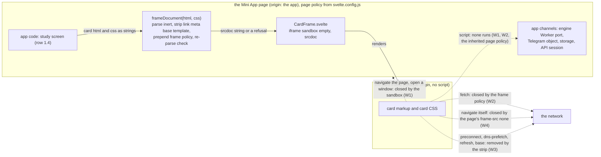
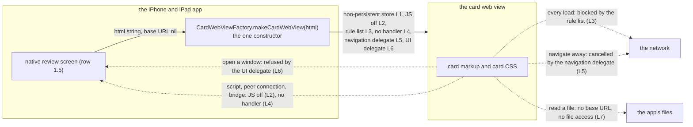
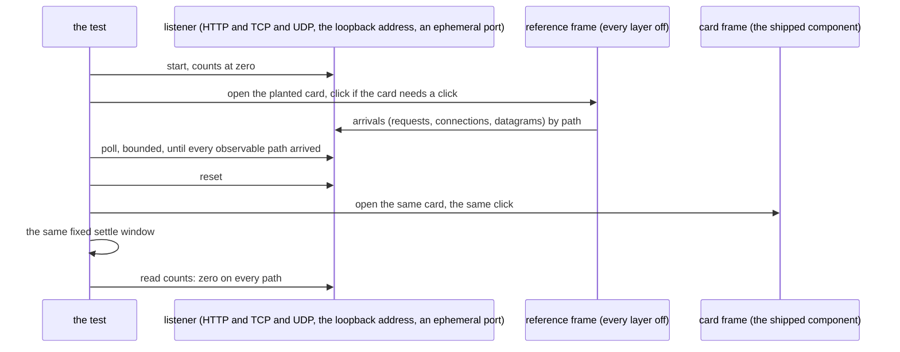

# Schematic: the card frame's channels on the web and on iPhone and iPad

Kind: component (the layers and what each sits between) and data flow (every channel a card's
markup can open, and the layer that closes it), with one planted pair as a sequence. Read at
DeckStreak `dev` c56bbd11 (`web/app/svelte.config.js`, the page policy;
`deploy/caddy/deck-streak.caddy`, the edge's header). The iOS half's seam is #616's harness, which
is not on `dev` yet. Both deliveries cite this one schematic: the web delivery (SPEC-341) adds it,
and the iPhone and iPad delivery amends its iOS tables with what its suite measured.

- **SPECs:** SPEC-341 (the web card frame) and the iPhone and iPad delivery's own SPEC (the card
  view).
- **ADRs:** ADR-352 (both platforms: scripts off, the layer sets, the channel inventory) and the
  iPhone and iPad delivery's own ADR (the iOS mechanics).
- **Campaign:** SPEC-334 R6 (UX-05, RND-01) and row 1.2; ADR-335's card-face layers.
- **Findings closed:** SEC01-F13 (the card frame's navigation), SEC01-F14 (peer connections from
  card script), SEC01-F15 (the card frame's other channels).

## 1. Why the inventory is the design

A card face is HTML the app did not write: a shared deck's author wrote it. The card may hold
markup that asks the engine to fetch, navigate, open a window, submit a form, connect to a peer, or
call into the app. Each of those is a **channel**. A layer that closes one channel does not close
the others, so the design is the table below: every channel, the layers that close it, and the
layer that closes it **alone**, if any. A channel the table does not name is a channel nobody has
decided, which is what SEC01-F15 found.

The planted suite (section 5) is this table run: one planted card per channel, opened once in a
reference frame with every layer off, where it must reach its listener, and once in the card frame,
where it must reach nothing. A coverage test reads the channel ids in section 3 and refuses a
suite that plants a different set.

## 2. Components

## 3. Web channels

The card frame is `<iframe sandbox="" srcdoc="...">`. The layers:

| layer | what it is | where it is set |
|---|---|---|
| W1 | the sandbox with no token: an opaque origin, no script, no forms, no popups, no top navigation, no downloads, no plugins | `CardFrame.svelte` |
| W2 | the frame policy, a `Content-Security-Policy` meta element placed first in the frame's head: `default-src 'none'; img-src data:; media-src data:; font-src data:; style-src 'unsafe-inline'; form-action 'none'; base-uri 'none'` | `policy.js` `FRAME_POLICY`, written by `frameDocument` |
| W3 | the strip: the card's `link`, `meta`, `base` and `template` elements removed (a `template` can declare a shadow root whose `link` the inert parse never sees, and with no script a card has no use for one), `x-dns-prefetch-control` off, and a re-parse of the composed document that refuses the card if any of them came back | `frame-document.ts` |
| W4 | the page's `frame-src 'none'`: a frame's own navigation, including one the frame starts itself, is checked against the embedding page's `frame-src`. A `srcdoc` document is not fetched, so the card frame itself still renders | `svelte.config.js`, from `policy.js` `PAGE_FRAME_SRC` |
| P | the page policy the srcdoc document inherits: hash-mode `script-src`, `object-src 'none'`, `base-uri 'self'`, `connect-src 'self'` | `svelte.config.js` (not this work's layer; listed because it closes channels too) |

"Layer alone" names the one layer whose removal, with every other layer on, opens the channel. A
dash means at least two layers hold it, so no single-layer variant opens it.

| channel | the planted card | blocked in the card frame by | layer alone |
|---|---|---|---|
| `img` | `img src`, `img srcset`, `picture source`, `input type=image`, SVG `image` and `use`, `video poster` at the listener | W2 | W2 |
| `css-url` | `url()` and `image-set()` in a style attribute and in the card CSS (background, cursor, list-style, border-image) | W2 | W2 |
| `css-import` | `@import url()` in the card CSS | W2 | W2 |
| `font` | an `@font-face` whose `src` is the listener | W2 | W2 |
| `media` | `audio src`, `video src`, `track src` | W2 | W2 |
| `stylesheet` | `link rel=stylesheet` | W3, W2 | - |
| `preload` | `link rel=preload` and `rel=modulepreload` | W3, W2 | - |
| `prefetch` | `link rel=prefetch` | W3, W2 | - |
| `preconnect` | `link rel=preconnect` (a TCP connection, no request) | W3 | W3 |
| `dns-prefetch` | `link rel=dns-prefetch` | W3 | W3 (UNOBSERVABLE: no lookup reaches a listener) |
| `shadow-link` | a `template shadowrootmode=open` holding `link rel=preconnect` | W3 | W3 (UNOBSERVABLE in an engine that ignores a preconnect in a shadow tree) |
| `meta-refresh` | `meta http-equiv=refresh` to the listener | W3, W4, W1 in some engines | - |
| `base` | `base href` at the listener, then a relative `img` | W3, W2, P | - |
| `nav-self` | a full-frame link at the listener, clicked | W4 | W4 (SEC01-F13) |
| `nav-top` | a full-frame link with `target=_top`, clicked | W1 | W1 |
| `nav-blank` | a full-frame link with `target=_blank`, clicked | W1 | W1 |
| `download` | a full-frame link with `download`, clicked | W1, W4 | - |
| `ping` | a same-document link with `ping` at the listener, clicked | W2, P | - |
| `form` | a full-frame submit button in a form whose action is the listener, clicked | W1, W2, W4 | - |
| `nested-frame` | `iframe src` at the listener, and an `iframe srcdoc` holding an `img` at the listener | W2, P (the inherited `frame-src 'none'`); the srcdoc child inherits both policies and the sandbox | - |
| `external-scheme` | a full-frame `mailto:` link, clicked | W1, W4 | - (UNOBSERVABLE: no listener sees a handler launch) |
| `object` | `object data` and `embed src` | W1, W2, P | - |
| `script-inline` | an inline script that fetches the listener | W1, W2, P | - |
| `script-src` | `script src` at the listener | W1, W2, P | - |
| `event-handler` | a data-image `onload` that fetches the listener | W1, W2, P | - |
| `javascript-url` | a full-frame `javascript:` link that fetches the listener, clicked | W1, W2, P | - |
| `webrtc` | an inline script that opens a peer connection to the UDP listener as its STUN server | W1, W2, P (none of them by policy: they stop the script, not the peer connection) | - |
| `bridge` | an inline script that calls the page's bridge stand-in, posts to the parent and the top, posts on a BroadcastChannel, and reads the page's storage markers | W1, W2, P | - |

**The scripts-on measurement (SEC01-F14).** One variant gives the frame `allow-scripts` and admits
one script source, every other layer on. In it the `webrtc` card reaches the UDP listener: no CSP
directive the frame carries governs a peer connection. That measured reach is why card scripts are
off: with them off, no card code can open one. In the same variant the `bridge` card's parent
`postMessage` arrives at the page with origin `"null"`, the bridge stand-in, storage and the
BroadcastChannel stay unreached (the opaque origin), which is why a page listener, if one is ever
added, must check `event.source` against the card frame's `contentWindow`, never `event.origin`.

**What W1 does NOT stop:** a fetch, a frame's own navigation, or preconnect. **W2 does NOT stop:**
a navigation of the frame, preconnect or dns-prefetch, or a peer connection from script.
**W3 does NOT stop:** any fetch from an element it keeps. **W4 does NOT stop:** a fetch, a top
navigation or a popup. **Scripts off does NOT stop:** markup's own fetches and navigations, which is
why W2, W3 and W4 exist.

**Settled by evidence:** `frame-src 'none'` does not stop a `srcdoc` frame from rendering (the
render-proof card shows it per engine); the srcdoc document inherits the page policy, so a hash-mode
page could not run a card's inline script even with `allow-scripts`.

## 4. iPhone and iPad channels

The iPhone and iPad delivery's to amend with what its suite measures. The card view is a
`WKWebView` built by `CardWebViewFactory.makeCardWebView(html:)` and handed the card as a string
with no base URL. The layers:

| layer | what it is |
|---|---|
| L1 | `WKWebsiteDataStore.nonPersistent()` |
| L2 | `WKWebpagePreferences.allowsContentJavaScript = false` (the app's own `evaluateJavaScript` still runs) |
| L3 | a compiled `WKContentRuleList` whose one rule blocks `.*` for every resource type, compiled before the first load |
| L4 | no `WKScriptMessageHandler` in the view's user content controller |
| L5 | a navigation delegate that allows exactly the first main-frame load (the string the app hands it) and cancels every later navigation action, main frame and subframe |
| L6 | a UI delegate whose `createWebViewWith` returns nil |
| L7 | no file access: `loadHTMLString(_:baseURL: nil)`, never `loadFileURL` |

| channel | the planted card | blocked in the card view by | layer alone |
|---|---|---|---|
| `img` | as on the web | L3 | L3 |
| `css-url` | as on the web | L3 | L3 |
| `css-import` | as on the web | L3 | L3 |
| `font` | as on the web | L3 | L3 |
| `media` | as on the web | L3 | L3 |
| `stylesheet` | as on the web | L3 | L3 |
| `preload` | as on the web | L3 | L3 |
| `prefetch` | as on the web | L3 | L3 |
| `preconnect` | as on the web | measured: L3 if the rule list covers it, else a residual the iOS ADR records | measured |
| `dns-prefetch` | as on the web | L3 | UNOBSERVABLE |
| `shadow-link` | as on the web | measured, as `preconnect` is | measured |
| `meta-refresh` | as on the web | L3, L5 | - |
| `base` | as on the web | L3 | L3 |
| `nav-self` | a full-view link at the listener, clicked by the app's script | L3, L5 | - |
| `nav-data` | a full-view link to a `data:` document, clicked | L5 | L5 |
| `nav-blank` | a full-view link with `target=_blank`, clicked | L6 | L6 |
| `external-scheme` | a full-view `mailto:` link, clicked (observed by the reference view's counting navigation delegate) | L5 | L5 |
| `form` | as on the web | L3, L5 | - |
| `nested-frame` | as on the web | L3, L5 | - |
| `object` | as on the web | L3 | L3 |
| `script-inline` | an inline script that sets a marker on the document element | L2 | L2 |
| `script-src` | `script src` at the listener | L2, L3 | - |
| `event-handler` | a data-image `onload` that sets the marker | L2 | L2 |
| `javascript-url` | a full-view `javascript:` link that sets the marker, clicked | L2 | L2 |
| `webrtc` | as on the web | L2 | L2 (SEC01-F14) |
| `bridge` | an inline script that posts to a `bridge` message handler | L2, L4 | - |
| `file` | an `img` whose `src` is a file URL of a fixture image the test wrote | L7, L3 | - |

**Layers with no channel of their own under the shipped configuration:** L1 (with scripts off, no
card code can write storage; it is depth, kept for the day scripts are on) and L4 (with scripts off,
no card code can reach a handler). The iOS suite declares this set and measures it; the two must be
equal.

**The JS-on measurement (SEC01-F14 on iOS).** A variant with page JavaScript on and every other
layer on: the `webrtc` card reaches the UDP listener (a content rule list does not govern a peer
connection), and `typeof window.webkit` is what L4 leaves visible to card script.

On iOS a script card's observable is the marker, read by the app's own `evaluateJavaScript`, so
the rule list's block on a script's fetch does not hide whether the script ran.

**What L3 does NOT stop:** script, a peer connection, or a navigation the app starts. **L2 does NOT
stop:** markup's own loads. **L5 does NOT stop:** a subresource load. **L6 does NOT stop:** a
navigation in the same view.

## 5. The planted suite (data flow of one pair)

A pair whose reference cannot reach its listener in an engine is in the suite's declared
UNOBSERVABLE table for that engine, with a reason; the table must equal the measured set exactly,
so a probe that went blind fails rather than passing.
