# Schematic: the card frame's channels on the web and on iPhone and iPad

Kind: component (the layers and what each sits between) and data flow (every channel a card's
markup can open, and the layer that closes it), with one planted pair as a sequence. Read at
DeckStreak `dev` c56bbd11 (`web/app/svelte.config.js`, the page policy;
`deploy/caddy/deck-streak.caddy`, the edge's header). The iOS half's seam is #616's harness, which
is not on `dev` yet. Both deliveries cite this one schematic: the web delivery (SPEC-341) adds it,
and the iPhone and iPad delivery amends its iOS tables with what its suite measured.

- **SPECs:** SPEC-341 (the web card frame) and the iPhone and iPad delivery's own SPEC (the card
  view).
- **ADRs:** ADR-352 (both platforms: scripts off, the layer sets, the channel inventory) and the
  iPhone and iPad delivery's own ADR (the iOS mechanics).
- **Campaign:** SPEC-334 R6 (UX-05, RND-01) and row 1.2; ADR-335's card-face layers.
- **Findings closed:** SEC01-F13 (the card frame's navigation), SEC01-F14 (peer connections from
  card script), SEC01-F15 (the card frame's other channels).

## 1. Why the inventory is the design

A card face is HTML the app did not write: a shared deck's author wrote it. The card may hold
markup that asks the engine to fetch, navigate, open a window, submit a form, connect to a peer, or
call into the app. Each of those is a **channel**. A layer that closes one channel does not close
the others, so the design is the table below: every channel, the layers that close it, and the
layer that closes it **alone**, if any. A channel the table does not name is a channel nobody has
decided, which is what SEC01-F15 found.

The planted suite (section 5) is this table run: one planted card per channel, opened once in a
reference frame with every layer off, where it must reach its listener, and once in the card frame,
where it must reach nothing. A coverage test reads the channel ids in section 3 and refuses a
suite that plants a different set.

## 2. Components

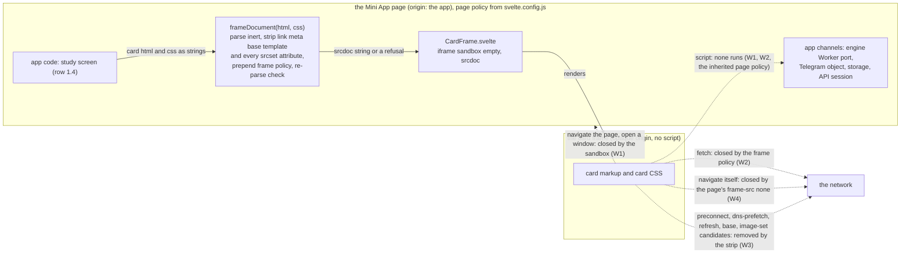

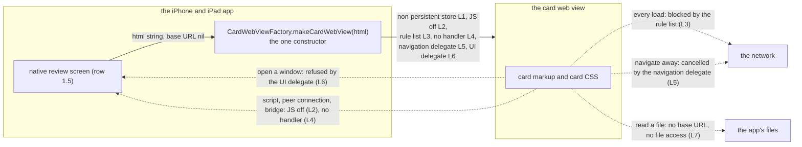

## 3. Web channels

The card frame is `<iframe sandbox="" srcdoc="...">`. The layers:

| layer | what it is | where it is set |
|---|---|---|
| W1 | the sandbox with no token: an opaque origin, no script, no forms, no popups, no top navigation, no downloads, no plugins | `CardFrame.svelte` |
| W2 | the frame policy, a `Content-Security-Policy` meta element placed first in the frame's head: `default-src 'none'; img-src data:; media-src data:; font-src data:; style-src 'unsafe-inline'; form-action 'none'; base-uri 'none'` | `policy.js` `FRAME_POLICY`, written by `frameDocument` |
| W3 | the strip: the card's `link`, `meta`, `base` and `template` elements removed (a `template` can declare a shadow root whose `link` the inert parse never sees, and with no script a card has no use for one), the `srcset` attribute removed from every element that carries one (an image-set candidate is fetched from what that attribute lists, and the element's `src` still shows its image), `x-dns-prefetch-control` off, and a re-parse of the composed document that refuses the card if any of those elements came back or any element, the root included, carries a `srcset` | `frame-document.ts` |
| W4 | the page's `frame-src 'none'`: a frame's own navigation, including one the frame starts itself, is checked against the embedding page's `frame-src`. A `srcdoc` document is not fetched, so the card frame itself still renders | `svelte.config.js`, from `policy.js` `PAGE_FRAME_SRC` |
| P | the page policy the srcdoc document inherits: hash-mode `script-src`, `object-src 'none'`, `base-uri 'self'`, `connect-src 'self'` | `svelte.config.js` (not this work's layer; listed because it closes channels too) |

"Layer alone" names the one layer whose removal, with every other layer on, opens the channel. A
dash means at least two layers hold it, so no single-layer variant opens it.

| channel | the planted card | blocked in the card frame by | layer alone |
|---|---|---|---|
| `img` | `img src`, `input type=image`, SVG `image` and `use`, `video poster` at the listener | W2 | W2 |
| `srcset` | `img srcset` and `picture source` at the listener, each form at its own path | W3, W2 | - |
| `css-url` | `url()` and `image-set()` in a style attribute and in the card CSS (background, cursor, list-style, border-image) | W2 | W2 |
| `css-import` | `@import url()` in the card CSS | W2 | W2 |
| `font` | an `@font-face` whose `src` is the listener | W2 | W2 |
| `media` | `audio src`, `video src`, `track src` | W2 | W2 |
| `stylesheet` | `link rel=stylesheet` | W3, W2 | - |
| `preload` | `link rel=preload` and `rel=modulepreload` | W3, W2 | - |
| `prefetch` | `link rel=prefetch` | W3, W2 | - (UNOBSERVABLE in WebKit, measured: it sends no prefetch request under the suite) |
| `preconnect` | `link rel=preconnect` (a TCP connection, no request) | W3 | W3 (UNOBSERVABLE in Chromium, measured: it opens no preconnect connection under the suite; UNOBSERVABLE in Firefox, measured: it opens no preconnect connection under the suite) |
| `dns-prefetch` | `link rel=dns-prefetch` | W3 | W3 (UNOBSERVABLE: no lookup reaches a listener) |
| `shadow-link` | a `template shadowrootmode=open` holding `link rel=preconnect` | W3 | W3 (UNOBSERVABLE in Chromium, measured: it opens no preconnect connection under the suite, in a shadow tree or out of one; UNOBSERVABLE in Firefox, measured: it opens no preconnect connection under the suite, in a shadow tree or out of one) |
| `meta-refresh` | `meta http-equiv=refresh` to the listener | W3, W4, W1 in some engines | - |
| `base` | `base href` at the listener, then a relative `img` | W3, W2, P | - |
| `nav-self` | a full-frame link at the listener, clicked | W4 | W4 (SEC01-F13) |
| `nav-top` | a full-frame link with `target=_top`, clicked | W1 | W1 |
| `nav-blank` | a full-frame link with `target=_blank`, clicked | W1 | W1 |
| `download` | a full-frame link with `download`, clicked | W4 (measured in Chromium: a `download` link to another origin is followed as a navigation of the frame, which the sandbox allows); W1 stops a download itself | W4 |
| `ping` | a same-document link with `ping` at the listener, clicked | W2, P | - (UNOBSERVABLE in Firefox, measured: it sends no hyperlink audit under the suite) |
| `form` | a full-frame submit button in a form whose action is the listener, clicked | W1, W2, W4 | - |
| `nested-frame` | `iframe src` at the listener, and an `iframe srcdoc` holding an `img` at the listener | the `iframe src`: W2, P (the inherited `frame-src 'none'`); the srcdoc child: W2 (measured in Chromium: a `srcdoc` document is not fetched, so `frame-src` does not apply to it, and the inherited page policy admits its `img`) | W2 |
| `external-scheme` | a full-frame `mailto:` link, clicked | W1, W4 | - (UNOBSERVABLE: no listener sees a handler launch) |
| `object` | `object data` and `embed src` | W1, W2, P | - |
| `script-inline` | an inline script that fetches the listener | W1, W2, P | - |
| `script-src` | `script src` at the listener | W1, W2, P | - |
| `event-handler` | a data-image `onload` that fetches the listener | W1, W2, P | - |
| `javascript-url` | a full-frame `javascript:` link that fetches the listener, clicked | W1, W2, P | - |
| `webrtc` | an inline script that opens a peer connection to the UDP listener as its STUN server | W1, W2, P (none of them by policy: they stop the script, not the peer connection) | - (UNOBSERVABLE in Firefox, measured: its peer connection sends no datagram to the UDP listener under the suite) |
| `bridge` | an inline script that calls the page's bridge stand-in, posts to the parent and the top, posts on a BroadcastChannel, and reads the page's storage markers | W1, W2, P | - |

**The scripts-on measurement (SEC01-F14).** One variant gives the frame `allow-scripts` and admits
one script source, every other layer on. In it the `webrtc` card reaches the UDP listener: no CSP
directive the frame carries governs a peer connection. That measured reach is why card scripts are
off: with them off, no card code can open one. In the same variant the `bridge` card's parent
`postMessage` arrives at the page with origin `"null"`, the bridge stand-in, storage and the
BroadcastChannel stay unreached (the opaque origin), which is why a page listener, if one is ever
added, must check `event.source` against the card frame's `contentWindow`, never `event.origin`.

**What W1 does NOT stop:** a fetch, a frame's own navigation (a `download` link to another origin
included, which Chromium follows as one), or preconnect. **W2 does NOT stop:**
a navigation of the frame, preconnect or dns-prefetch, or a peer connection from script.
**W3 does NOT stop:** any fetch from an element it keeps, through any attribute other than `srcset`. **W4 does NOT stop:** a fetch, a top
navigation, a popup or a nested `srcdoc` frame, which is not fetched. **Scripts off does NOT stop:** markup's own fetches and navigations, which is
why W2, W3 and W4 exist.

**Settled by evidence:** `frame-src 'none'` does not stop a `srcdoc` frame from rendering (the
render-proof card shows it per engine); the srcdoc document inherits the page policy, so a hash-mode
page could not run a card's inline script even with `allow-scripts`.

### The image forms, from the author's HTML to the frame document (SPEC-402, ADR-416)

A card's markup is the author's HTML from a shared deck. `frameDocument` parses it inert, as a
body (`frame-document.ts:38`), and the strip (W3) removes the stripped elements whole (`:39`) and
then the `srcset` attribute from every element that still carries one, keeping the element and its
`src`. The composed document puts the frame policy (W2) first in its head (`:45`), and the re-parse
check parses it again (`:46`) and keeps it only when nothing the strip removed came back (`:47-50`
and its new `srcset` conjunct); otherwise the card is refused as `escaped` (`:51`), and
`CardFrame.svelte:15` renders a frame with no document. A kept document is the frame's `srcdoc`,
under the sandbox (W1) and the page's `frame-src 'none'` (W4).

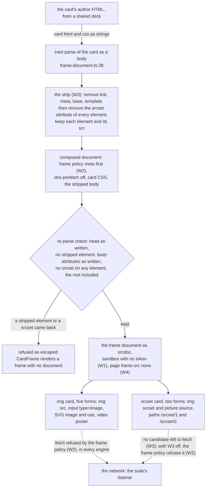

Each image-set form, its path and the layer that holds it, per engine. The suite reads a card's
arrival by path prefix (`web/app/tests-card/listeners.ts:111-115`), so each form has a path of its
own.

| the form | its path | Chromium | WebKit | Firefox, read by #766 over this strip | layer alone |
|---|---|---|---|---|---|
| the `img srcset` form, on the `srcset` card | `/srcset/1` | W3 removes the candidate; with W3 off, W2 refuses the fetch | W3 removes the candidate; with W3 off, W2 refuses the fetch | W3 removes the candidate; with W3 off, the form stayed closed in #766's first reading with W1, W2 and W4 on | - |
| the `picture source` form, on the `srcset` card | `/srcset/2` | W3 removes the candidate; with W3 off, W2 refuses the fetch | W3 removes the candidate; with W3 off, W2 refuses the fetch | W3 removes the candidate; with W3 off, the form stayed closed in #766's first reading with W1, W2 and W4 on | - |
| both forms at `dev`, before this change | `/img/2` and `/img/3`, read only inside the `img` card's prefix `/img/` | W2 | W2 | W2 only beside W1 and W4: with W1 off or W4 off each form arrived | W2, read through the prefix |

What the `srcset` card's five tests read in Chromium and WebKit. The pair runs the card in the
reference frame and the card frame; each variant turns one layer off with every other layer on
(`web/app/tests-card/harness/main.ts:62-73`).

| the test | the frame it builds | at `dev` with the re-plant | after the strip |
|---|---|---|---|
| the pair, reference frame | the raw card, no layer (`main.ts:70`) | reaches `/srcset/1` and `/srcset/2` | reaches `/srcset/1` and `/srcset/2` |
| the pair, card frame | the shipped `CardFrame` | nothing arrives: W2 refuses each fetch | nothing arrives: no candidate is left |
| the variant with W1 off | the shipped frame with no sandbox (`main.ts:71`) | nothing arrives: W2 refuses each fetch | nothing arrives: no candidate is left |
| the variant with W2 off | the shipped frame with no policy meta (`main.ts:72`) | each form is expected to arrive, so `W2 off: srcset stays closed` fails (the red push 1 reads in CI) | nothing arrives: no candidate is left |
| the variant with W3 off | the raw card under the frame policy (`main.ts:73`) | nothing arrives: W2 refuses each fetch | nothing arrives: W2 refuses each fetch |
| the variant with W4 off | the shipped frame under no page `frame-src` (`main.ts:62-64`) | nothing arrives: W2 refuses each fetch | nothing arrives: no candidate is left |

The `img` card keeps its five other forms at `/img/1` and `/img/4` to `/img/7`, and its variant
with W2 off still opens: `img src` arrives at `/img/1` in every engine.

## 4. iPhone and iPad channels

The iPhone and iPad delivery's to amend with what its suite measures. The card view is a
`WKWebView` built by `CardWebViewFactory.makeCardWebView(html:)` and handed the card as a string
with no base URL. The layers:

| layer | what it is |
|---|---|
| L1 | `WKWebsiteDataStore.nonPersistent()` |
| L2 | `WKWebpagePreferences.allowsContentJavaScript = false` (the app's own `evaluateJavaScript` still runs) |
| L3 | a compiled `WKContentRuleList` whose one rule blocks `.*` for every resource type, compiled before the first load |
| L4 | no `WKScriptMessageHandler` in the view's user content controller |
| L5 | a navigation delegate that allows exactly the first main-frame load (the string the app hands it) and cancels every later navigation action, main frame and subframe |
| L6 | a UI delegate whose `createWebViewWith` returns nil |
| L7 | no file access: `loadHTMLString(_:baseURL: nil)`, never `loadFileURL` |

| channel | the planted card | blocked in the card view by | layer alone |
|---|---|---|---|
| `img` | as on the web | L3 | L3 |
| `css-url` | as on the web | L3 | L3 |
| `css-import` | as on the web | L3 | L3 |
| `font` | as on the web | L3 | L3 |
| `media` | as on the web | L3 | L3 |
| `stylesheet` | as on the web | L3 | L3 |
| `preload` | as on the web | L3 | L3 |
| `prefetch` | as on the web | L3 | L3 |
| `preconnect` | as on the web | measured: L3 if the rule list covers it, else a residual the iOS ADR records | measured |
| `dns-prefetch` | as on the web | L3 | UNOBSERVABLE |
| `shadow-link` | as on the web | measured, as `preconnect` is | measured |
| `meta-refresh` | as on the web | L3, L5 | - |
| `base` | as on the web | L3 | L3 |
| `nav-self` | a full-view link at the listener, clicked by the app's script | L3, L5 | - |
| `nav-data` | a full-view link to a `data:` document, clicked | L5 | L5 |
| `nav-blank` | a full-view link with `target=_blank`, clicked | L6 | L6 |
| `external-scheme` | a full-view `mailto:` link, clicked (observed by the reference view's counting navigation delegate) | L5 | L5 |
| `form` | as on the web | L3, L5 | - |
| `nested-frame` | as on the web | L3, L5 | - |
| `object` | as on the web | L3 | L3 |
| `script-inline` | an inline script that sets a marker on the document element | L2 | L2 |
| `script-src` | `script src` at the listener | L2, L3 | - |
| `event-handler` | a data-image `onload` that sets the marker | L2 | L2 |
| `javascript-url` | a full-view `javascript:` link that sets the marker, clicked | L2 | L2 |
| `webrtc` | as on the web | L2 | L2 (SEC01-F14) |
| `bridge` | an inline script that posts to a `bridge` message handler | L2, L4 | - |
| `file` | an `img` whose `src` is a file URL of a fixture image the test wrote | L7, L3 | - |

**Layers with no channel of their own under the shipped configuration:** L1 (with scripts off, no
card code can write storage; it is depth, kept for the day scripts are on) and L4 (with scripts off,
no card code can reach a handler). The iOS suite declares this set and measures it; the two must be
equal.

**The JS-on measurement (SEC01-F14 on iOS).** A variant with page JavaScript on and every other
layer on: the `webrtc` card reaches the UDP listener (a content rule list does not govern a peer
connection), and `typeof window.webkit` is what L4 leaves visible to card script.

On iOS a script card's observable is the marker, read by the app's own `evaluateJavaScript`, so
the rule list's block on a script's fetch does not hide whether the script ran.

**What L3 does NOT stop:** script, a peer connection, or a navigation the app starts. **L2 does NOT
stop:** markup's own loads. **L5 does NOT stop:** a subresource load. **L6 does NOT stop:** a
navigation in the same view.

## 5. The planted suite (data flow of one pair)

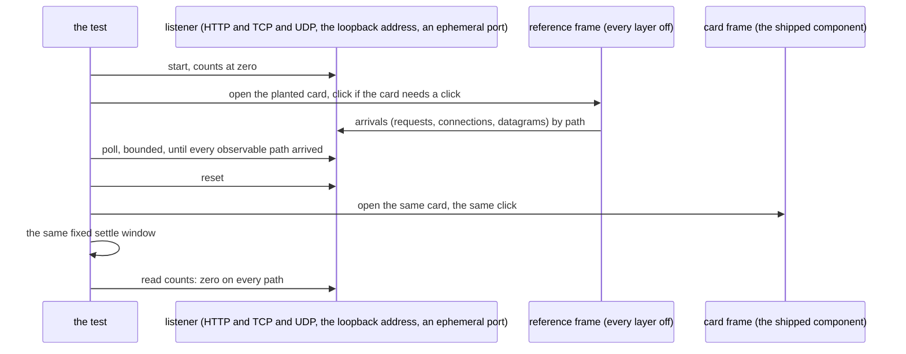

A pair whose reference cannot reach its listener in an engine is in the suite's declared
UNOBSERVABLE table for that engine, with a reason; the table must equal the measured set exactly,
so a probe that went blind fails rather than passing.

## 6. iPhone and iPad channels, as measured

This section amends section 4 with what the iPhone and iPad delivery's planted suite measured
(SPEC-349 A5 to A7). It is appended, not edited in, so section 4 keeps the prediction each
reading confirmed or corrected; where the two differ, this section is the record. The readings
are the `harness` job's `CardProbe` step at 92877de4 (run 37270629304), and they were identical on
the iPhone and the iPad simulator: 27 planted cards and 189 single-layer variants on each. The
card view reached no card's probe on either; for each followed link (`nav-self`, `nav-blank`) it
opened one connection to the listener with no request read, which no layer of this delivery holds
(#677).

| channel | section 4 (blocked by / layer alone) | measured (blocked by / layer alone) | the reading that decided it |
|---|---|---|---|
| `object` | L3 / L3 | L3, L5 / - | the reference view's navigation delegate was asked about two navigations (`allowed=2`): an `<object>` and an `<embed>` of type `text/html` each load as a subframe, which L5 cancels as it does `nested-frame`'s, and no single-layer variant opened the card |
| `nav-data` | L5 / L5 | UNOBSERVABLE | the reference view allowed the click (`allowed=1`) and its text did not change: WebKit refuses a page's own main-frame navigation to a `data:` URL |
| `nav-blank` | L6 / L6 | L5, L6 / - | the reference view's navigation delegate was asked about the new-window action (`allowed=1`) before its UI delegate made the window (`windows=1`); the card view's gate cancels that action, so removing L6 alone opens nothing |
| `preconnect` | measured / measured | L3 / L3 | the reference view opened 1 connection and the card view 0, and removing L3 alone opened it: the rule list covers a preconnect, so there is no residual and the iOS ADR owes no amendment |
| `shadow-link` | measured / measured | L3 / L3 | as `preconnect`: 1 connection from the reference view, 0 from the card view, opened by L3 alone |
| `file` | L7, L3 / - | L7, L3 / - | the reference view's image had a natural width (`fileWidth=1`), and no single-layer variant loaded it |

**UNOBSERVABLE, measured:** `prefetch`, `dns-prefetch` and `nav-data`, where the reference view
reached nothing a probe can see. Section 4 gives `prefetch` L3; on iOS, as on the web, WebKit sent
no prefetch request, so it is declared unobservable with that reason.

**Every card's layer alone, measured.** Removing L3 alone opened `img`, `css-url`, `css-import`,
`font`, `media`, `stylesheet`, `preload`, `preconnect`, `shadow-link` and `base`. Removing L2
alone opened `script-inline`, `event-handler`, `javascript-url` and `webrtc`. Removing L5 alone
opened `external-scheme`. No layer alone opened `meta-refresh`, `nav-self`, `nav-blank`, `form`,
`nested-frame`, `object`, `script-src`, `bridge` or `file`. Every row of section 4 that neither
the table above nor the UNOBSERVABLE set names measured as section 4 declares it.

**Layers with no channel of their own, measured:** L1, L4, L6 and L7. Section 4 declares L1 and
L4. L6 joins them because L5 also holds `nav-blank`, and L7 because L3 also blocks the `file`
card's load; removing any one of the four alone opened nothing. Each stays in the card view as
depth.

**The JS-on measurement, measured.** With page JavaScript on and every other layer on, the
`webrtc` card sent 1 datagram to the UDP listener (`datagrams=1`), and `typeof window.webkit`
read `undefined`: with no message handler, L4 leaves card script no `webkit` object at all. The
reference view, which registers a handler for the `bridge` card, read `object`.

## 7. iPhone and iPad with card scripts on (SPEC-355, ADR-366)

Kind: state machine (the switch's decision), component (the two new layers), data flow (every
script-driven channel and the control that holds it). Read at
`ios/CardIsolation/Sources/CardIsolation/CardWebViewFactory.swift` lines 4-91 and
`ios/CardProbeTests/Planted.swift` lines 224-236 at 05aef786.

The layers L1 to L7 are section 4's. Two join them:

| layer | what it is |
|---|---|
| L8 | a `WKUserScript` at document start, in every frame, in the page's content world, that deletes every global named `^(webkit)?RTC` and `WebTransport` |
| L9 | the store's one proxy configuration: an HTTP CONNECT proxy at the app's loopback `ConnectionHold`, failover off, no excluded domain; the hold answers no byte and closes each connection |

L2 is no longer fixed: it is the verdict of the one switch.

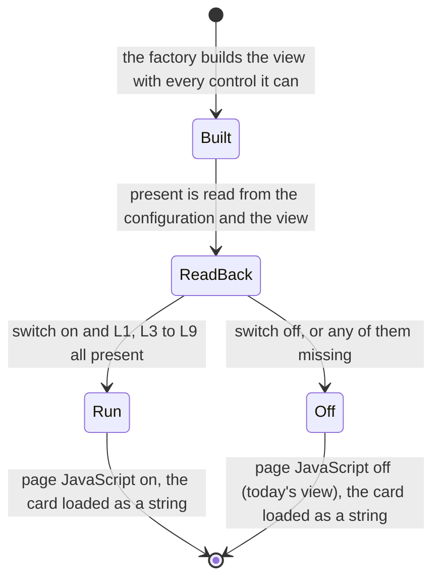

`Built` fails closed before either verdict when the rule list does not compile (SPEC-349 R4): no
view at all. `Off` names the missing controls, which the probe reads.

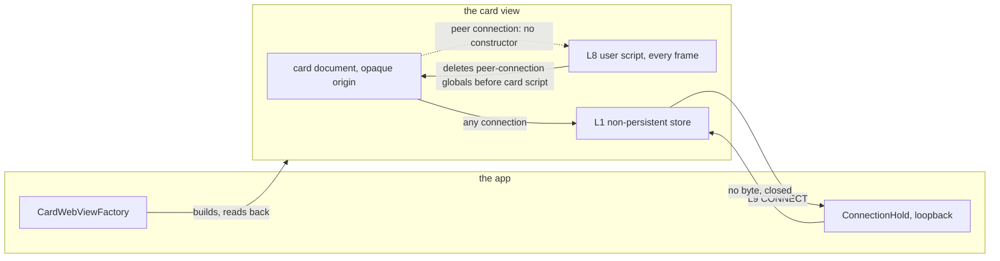

| channel | the planted card (scripts on) | observable | held in the scripted view by (predicted) | control alone (predicted) |
|---|---|---|---|---|
| `script-fetch` | `fetch` of the listener under its id | path | L3, L9 | none |
| `script-xhr` | `XMLHttpRequest` to the listener | path | L3, L9 | none |
| `script-websocket` | a `WebSocket` to the listener | connection | L3, L9 | none |
| `script-eventsource` | an `EventSource` on the listener | path | L3, L9 | none |
| `script-beacon` | `navigator.sendBeacon` to the listener | path | L3, L9 | none |
| `script-image` | a script-made `Image` with the listener's URL | path | L3, L9 | none |
| `script-worker` | a worker from a `blob:` URL that fetches the listener | path | L3, L9 | none |
| `script-link` | a script-added `link rel=preconnect` and `rel=stylesheet` | connection | L3, L9 | none |
| `script-nav` | `location.assign` to the listener, in a loop | connection | L5, L9 | none |
| `script-form` | a script-submitted form to the listener | path | L5, L9 | none |
| `script-open` | `window.open` of the listener | window | L6 | L6 |
| `webrtc-stun` | a peer connection with a STUN server at the UDP listener | datagram | L8 | L8 |
| `webrtc-turn-tcp` | a peer connection with a TURN-over-TCP server at the TCP listener | connection | L8 | L8 |
| `webrtc-blank-frame` | the same, from an appended blank frame's globals | datagram | L8 | L8 |
| `webrtc-srcdoc-frame` | the same, from a frame given `srcdoc` | datagram | L8 | L8 |
| `webrtc-written-frame` | the same, from a frame written by `document.write` | datagram | L8 | L8 |
| `webtransport` | a `WebTransport` to the UDP listener | datagram | L8 | L8, or UNOBSERVABLE when the engine has none (the marker reads `absent`) |
| `lookup` | a static and a script-added `link rel=dns-prefetch` of `<id>.local` | query (the witness) | measured | measured |
| `dialog` | `alert`, `confirm`, `prompt` | the refusal's recorded asks, and `confirm` reading false | L6 | depth |
| `capture` | `getUserMedia` for camera and microphone | the refusal's recorded asks, and the rejection's name | L6 | depth |
| `app-state` | reads the default store's cookie and storage at the planted origin, a file the app wrote, `window.webkit`, a stored credential | the values read, written into its own body | L1, L4, L7 | none |
| `render-script` | a hint toggle that sets its marker | marker and body text | (opens by design) | - |

The `#677` channel, on the scripts-off view: `nav-self` and `nav-blank` open no connection with
L9 present; removed alone, L9 opens one each, and the hold's count reads each refused attempt.

Every scripted card's reference is the scripted view with its own control off, and must reach on
both simulators; `app-state`'s reference is a view on the default store at the planted origin,
which must read every planted value but the credential (no reference can reach a stored
credential; its card's marker proves the attempt ran).

## 8. iPhone and iPad: the containment layer for card scripts (SPEC-361, ADR-372)

Kind: component (the layer's parts and where each lives), state machine (the switch's decision
with the new required set), data flow (every channel a card can open, and the part that closes
it). Read at `ios/CardIsolation/Sources/CardIsolation/CardWebViewFactory.swift`,
`ios/CardIsolation/Sources/CardIsolation/CardScripts.swift` and `ios/CardProbeTests/Planted.swift`
at f10fa8c2, and at the cut's base before the build writes.

The switch defaults off on iOS pending a measured containment layer. This section is that layer.
L1 to L8 are sections 4 and 7's; L9 is retired and its number is not reused. Four parts join:

| layer | what it is | where it lives |
|---|---|---|
| L10 | the link-activation refusal: a `WKUserScript` at document start, in every frame, in a content world the app owns, that cancels the default of every `click` and `auxclick` whose composed path holds a link or whose target can host a shadow root | `LinkActivationRefusal.swift` |
| L11 | the page guard: a `WKUserScript` at document start, in every frame, in the page's world, that refuses `click()` and `dispatchEvent` on a node that is not connected, and every `document.open`, `write` and `writeln` | `PageGuard.swift` |
| L12 | the document policy: a `Content-Security-Policy` `meta` the factory places first in the card's document, admitting only `data:` images, media and fonts and inline style and script | `DocumentPolicy.swift` |
| L13 | the view's link preview off, with L6's context-menu arm offering nothing that opens a link | `CardWebViewFactory.swift`, `WindowRefusal.swift` |

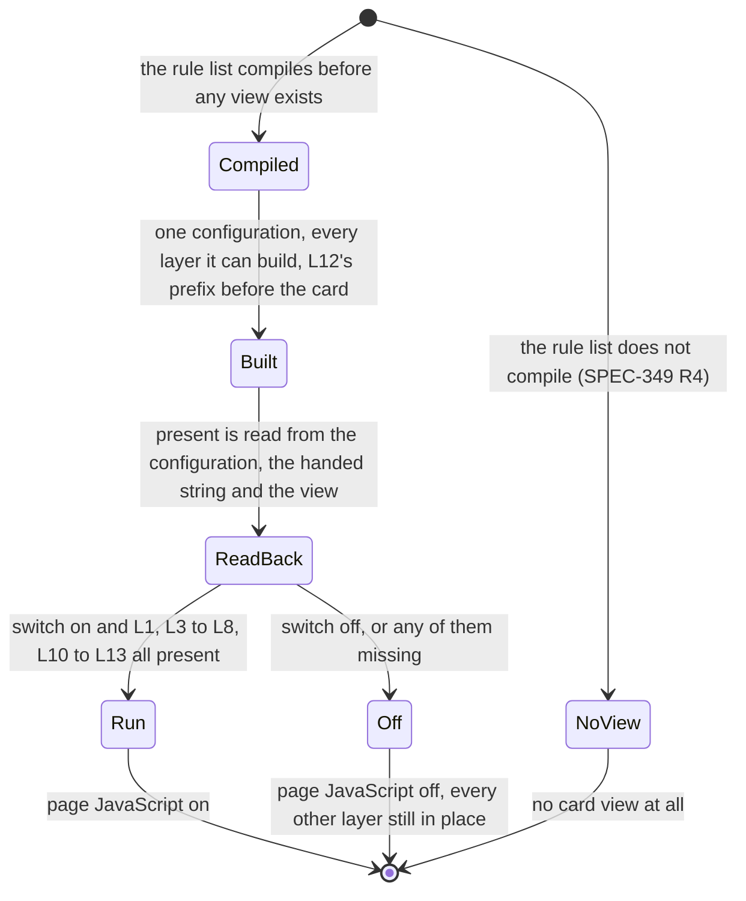

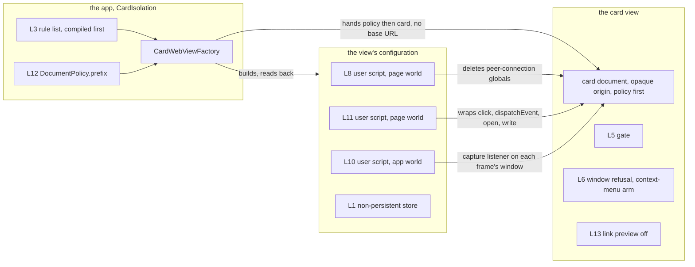

Where each channel closes. A click on a link never reaches `handleClick`, so the engine opens no
early connection, asks no delegate and sends no ping:

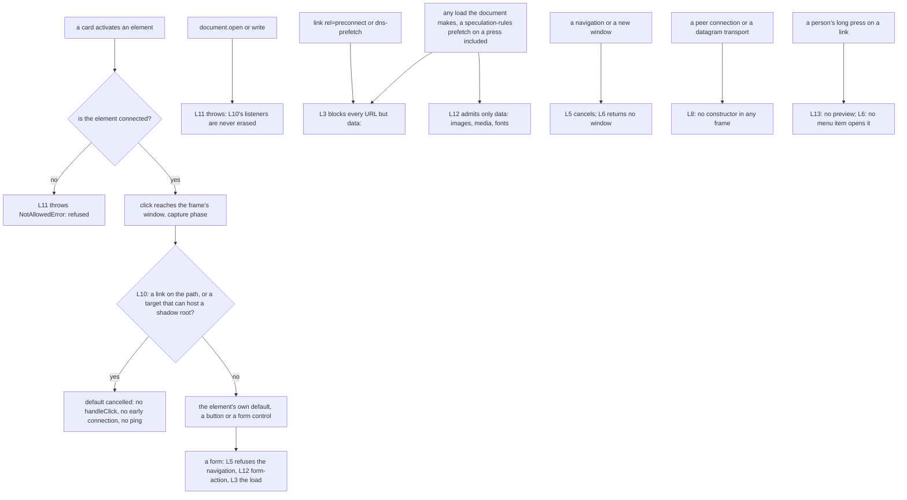

The planted cards that prove it, with scripts on. Held is the set of controls that hold the
channel in the scripted view, which the card's reference removes; alone is the control whose
removal, every other control on, opens it. Both are predicted, as section 7's were; a measurement
that contradicts one is a STOP for the seat.

| card | channel | observable | held (predicted) | alone (predicted) |
|---|---|---|---|---|
| `script-fetch`, `script-xhr`, `script-eventsource`, `script-beacon`, `script-image`, `script-worker` | a script's load | path | L3, L12 | none |
| `script-websocket` | a WebSocket | connection | L3, L12 | none |
| `script-link` | a script-added `preconnect` hint and style sheet | connection | L3, L12 | L3 (the hint) |
| `script-nav` | `location.assign`, in a loop | connection | L3, L5 | none |
| `script-form` | a script-submitted form | path | L3, L5, L12 | none |
| `script-open` | `window.open` | window | L5, L6 | none |
| `webrtc-stun`, `webrtc-turn-tcp`, `webrtc-blank-frame` | a peer connection | datagram, connection | L8 | L8 |
| `webrtc-srcdoc-frame` | the same, from a `srcdoc` frame | datagram | L5, L8 | none |
| `webrtc-written-frame` | the same, from a frame written by `document.write` | datagram | L8, L11 | none |
| `webtransport` | a datagram transport | datagram | L8 | L8, or UNOBSERVABLE when the engine has none |
| `script-click-self` | a connected self link's `click()` | connection | L10 | L10 |
| `script-click-blank` | a connected `_blank` link's `click()` | connection | L10 | L10 |
| `script-enter-key` | an Enter `keydown` dispatched on a focused link | connection | L10 | L10 |
| `script-closed-shadow` | a `_blank` link in a closed shadow root, clicked from inside it | connection | L10 | L10 |
| `script-frame-link` | a `_blank` link in an appended blank frame, clicked | connection | L10 | L10 |
| `script-click-detached` | a detached `_blank` link's `click()` | connection | L11 | L11 |
| `script-dispatch-detached` | a detached link sent a `MouseEvent` click | connection | L11 | L11 |
| `script-written-link` | a frame's document opened, a `_blank` link written and clicked | connection | L10, L11 | none |
| `lookup` | a static and a script-added `dns-prefetch`, and a fetch, of a `.local` name | query (the witness) | L3 | measured |
| `dialog`, `capture` | script dialogs, media capture | the refusal's recorded asks | L6 | depth |
| `app-state` | the app's stores, a file, the bridge, a credential | the values read | L1, L4, L7 | none |
| `render-script` | a hint toggle | marker and body text | (opens by design, under L12) | - |
| `permitted` | a `data:` image, font and audio clip | each loaded, read by the app's script | (loads by design in both views) | - |

The declared sets: `CONTROLS` is L1, L3, L4, L5, L6, L7, L8, L10, L11, L12, L13, and
`DEPTH_SCRIPTED`, the controls that open nothing alone, is L1, L4, L5, L6, L7, L12, L13.

Every planted card of section 5 is also shown in the scripted view, with its planted click, and
must open nothing there. On the scripts-off view, `nav-self` and `nav-blank` open no connection;
from that view with L10 removed (the variant `shippedWithout(.L10)`), each opens one, which is
the planted control proving the suite sees #677's channel. The same two cards from the scripted
view with L10 removed are the scripted view's control.

The card's own permitted loads are its document, handed as a string with no base URL, and
`data:` URLs, which the rule list does not act on and the policy admits only as images, media
and fonts. The `permitted` card proves the layer leaves them; every other card proves it leaves
nothing else.

## 9. The web's browser test matrix (SPEC-398, ADR-412)

Kind: component (each browser configuration, the engines it runs in, the job that runs it, and the
check-run its verdict is read from). Read at DeckStreak `dev` `164ac206`
(`web/app/playwright.config.ts`, `web/app/playwright.card.config.ts`,
`web/app/playwright.engine.config.ts`, `web/app/playwright.study.config.ts`,
`.github/workflows/ci.yml`). SPEC-398 adds Firefox to the card configuration and to the
`card-sandbox` job; every other edge is as measured there. The thick edge is SPEC-398's.

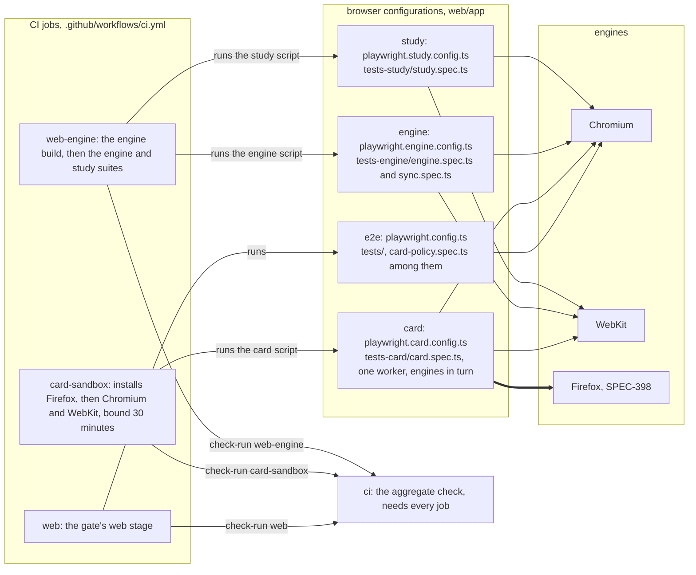

| engine | configuration, projects at | job, at | card-frame tests | engine tests | verdict read as |
|---|---|---|---|---|---|
| Chromium | e2e, no `projects` key (`playwright.config.ts:3-10`) | `web` (`ci.yml:201-253`) | `tests/card-policy.spec.ts:11`, which reads the built page's policy text and does not depend on the engine | none | `web`, then `ci` |
| Chromium, WebKit | card (`playwright.card.config.ts:17-20`) | `card-sandbox` (`ci.yml:268-295`) | `tests-card/card.spec.ts`: the census `:101`, the pairs `:109`, the single-layer variants `:133`, scripts on `:143` and `:158`, the render proof `:185` | none | `card-sandbox`, then `ci` |
| Firefox (SPEC-398) | card, the third project | `card-sandbox`, from its own install step | `tests-card/card.spec.ts`, every test above | none | `card-sandbox`, then `ci` |
| Chromium, WebKit | engine (`playwright.engine.config.ts:36-39`) | `web-engine` (`ci.yml:767-832`) | none | `tests-engine/engine.spec.ts:55`, `:104`, `:132`, `:169`, `:189`, `:214`, `:292`; `tests-engine/sync.spec.ts:99`, `:126`, `:153`, `:177` | `web-engine`, then `ci` |
| Chromium, WebKit | study (`playwright.study.config.ts:19-22`) | `web-engine` (`ci.yml:837-838`) | none | none | `web-engine`, then `ci` |

**Where the card frame's verdict is read.** The check-run `card-sandbox`. Its log prints one census
line per project, `examined 28 planted cards, 28 pairs, 112 variants in <project>`
(`card.spec.ts:103`), so a run that skipped Firefox shows two lines, not three. The upload
`card-sandbox-results` keeps every project's failures whatever the verdict (`ci.yml:289-295`). The
aggregate `ci` check needs `card-sandbox` (`ci.yml:876`).

**How the three engines share the job.** The card configuration runs one worker with no
parallelism (`playwright.card.config.ts:12-13`), so the projects run one after another. Each
project's listeners are that worker's module state, and each pair's settle window comes from the
same engine's reference latency, so a slow engine widens its own windows and no other's.

**What one engine's readings decide.** Section 3's notes name, per engine, each channel its
reference frame cannot reach. Firefox's are measured by its first `card-sandbox` run and noted
there in the form "UNOBSERVABLE in Firefox, measured: ...". A reading in which the card frame
reaches a listener, a single layer opens a set the table does not give it, or the render proof
shows a blank frame, is a new design for every engine, never a note.

**Firefox's first run.** Firefox's reference frame reaches no listener for `preconnect`,
`shadow-link`, `ping` and `webrtc`, so section 3 notes each as unobservable in Firefox; WebKit
observes the first two, and Chromium and WebKit the last two. In Firefox, W2 holds five of the
`img` card's seven forms alone, and its two image-set forms, `img srcset` and `picture source`,
only beside W1 and W4: the engine fetches an image-set candidate ahead of its tree builder as an
image set, for which it does not consult its speculative copy of the frame policy (ADR-412 D6). The
strip of every `srcset` (#771) gives those two forms a layer built for them in every
engine. This section reads Firefox over it, and the `img` row is that delivery's to change.

**Not in the matrix.** The engine and study suites in Firefox (#652; the engine configuration is
open work in #748), the e2e and accessibility suites in Firefox (#652), and a learner's installed
browser with its own preferences (#652).

## 10. iPhone and iPad: the link strip, and the followed link closed (SPEC-392, ADR-406)

Kind: data flow (the card's path from the note to the view on each client, and where the link
strip sits on it) and component (L14, the layer it adds, beside what it does not stop). Read at
`ios/CardIsolation/Sources/CardIsolation/CardWebViewFactory.swift`,
`ios/App/Sources/EngineSession.swift`, `ios/App/Sources/ReviewView.swift`,
`ios/App/Sources/CardFaceView.swift`, `ios/Harness/Sources/CardWebView.swift`,
`ios/CardProbeTests/Planted.swift` and `web/app/src/lib/card/frame-document.ts` at 164ac206, and at
the cut's base before the build writes.

L1 to L13 are sections 4, 7 and 8's; L9 stays retired and its number is not reused. One layer
joins, on iPhone and iPad only:

| layer | what it is | where it lives | what it does NOT stop |
|---|---|---|---|
| L14 | the link strip: every `<link` in the card's text, its four letters in any ASCII case, renamed to `<wbr` before L12's prefix and the load; every other byte kept | `LinkStrip.swift`, called by the factory's `build` (`CardWebViewFactory.swift:47`) | a link a script adds (L3 holds its hint); a link in a document a frame loads (L5); any other element's load (L3, L12); the five characters shown as text, which it renames too |

L14 is no control: it is not in `required`, `CONTROLS`, the read-back (`present`) or `LAYERS`, and
the planted probe composes it only through the variant `referenceWith`, a view the factory does
not build whose layers are the set it names. A renamed tag is a `wbr`, which is void, so it wraps
nothing after it, and which has no attribute of its own, so the renamed tag's attributes grant
nothing.

On iPhone and iPad, from the note to the view. The strip runs inside `build`, before L12's prefix
and L7's string load, so the shipped view is the only view the factory strips:

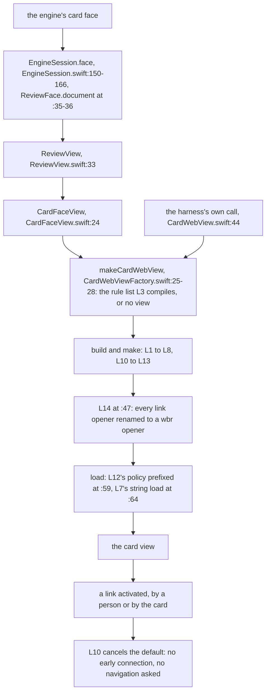

On the web, unchanged: W3 already removes every `link`, `meta`, `base` and `template` before the
frame, and the review refuses a card whose document re-parses with one:

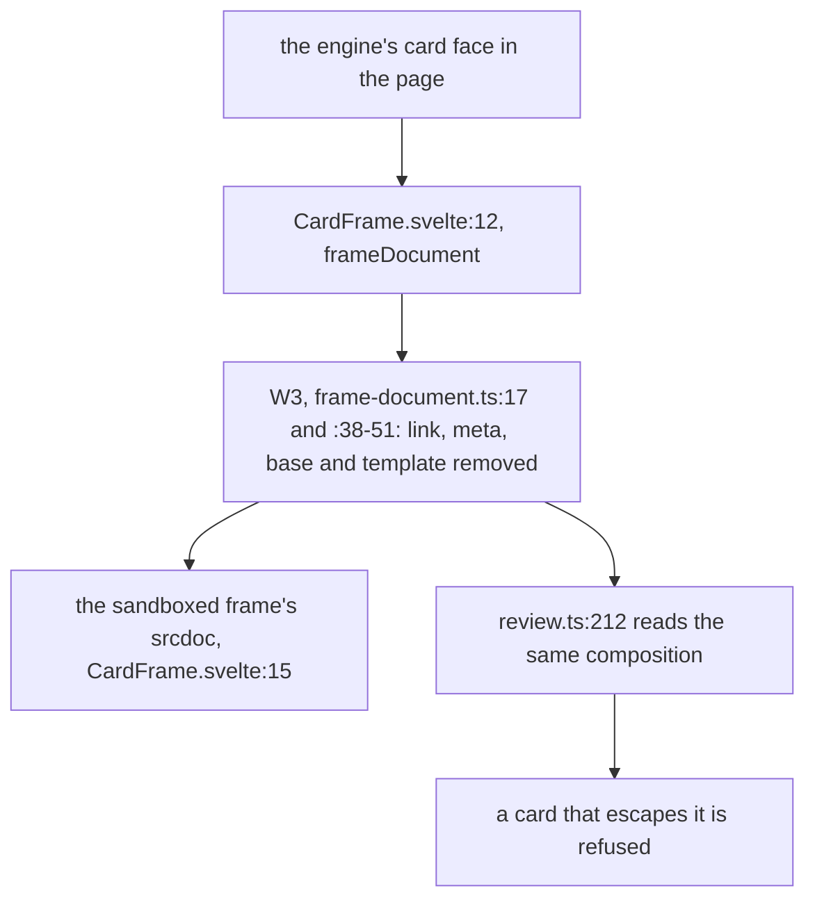

**#677 is closed by this record.** A followed link opens no connection from the card view: L10
cancels a link activation's default before the engine's click handler can start an early
connection, and L11 refuses a detached node's activation, as section 8 built them. SPEC-392's A7
reads zero connections for every planted card from the card view on both simulators, and its
control, `nav-self` and `nav-blank` each opening a connection from `shippedWithout(.L10)`, proves
the suite sees the channel. Section 6's residual paragraph (`:232-234`) and ADR-360 D8's tolerance
of one connection are superseded by this record and stand as history.

The readings SPEC-392 predicts. Each is a prediction until its run; a measurement that contradicts
one is a STOP, reported before the second push:

| criterion | view | cards | predicted reading |
|---|---|---|---|
| A5 | the reference | every card of `PLANTED` | a `link` count above 0 for exactly the cards of `LINKED` (`stylesheet`, `preload`, `prefetch`, `preconnect`, `dns-prefetch`, `shadow-link`) |
| A5 | the card view | every card of `PLANTED` | a `link` count of 0 for every card |
| A6 | the reference | `preconnect`, `preload`, `shadow-link`, `stylesheet` | each reached |
| A6 | `referenceWith([.L14])`, only L14 on | the same four | none reached, and no connection opened |
| A7 | the card view | every planted card | zero connections on both simulators; `nav-self` and `nav-blank` each open one from `shippedWithout(.L10)` |

`LINKED` less `UNOBSERVABLE` is A6's population: `dns-prefetch` and `prefetch` reach no listener
a test owns, so a reading of them proves nothing alone, and L3 still holds their hints.
