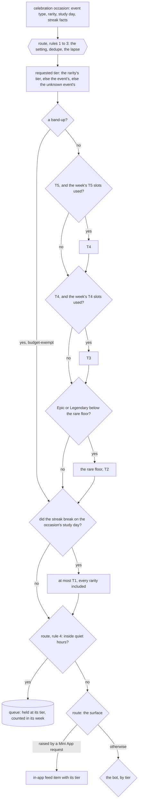
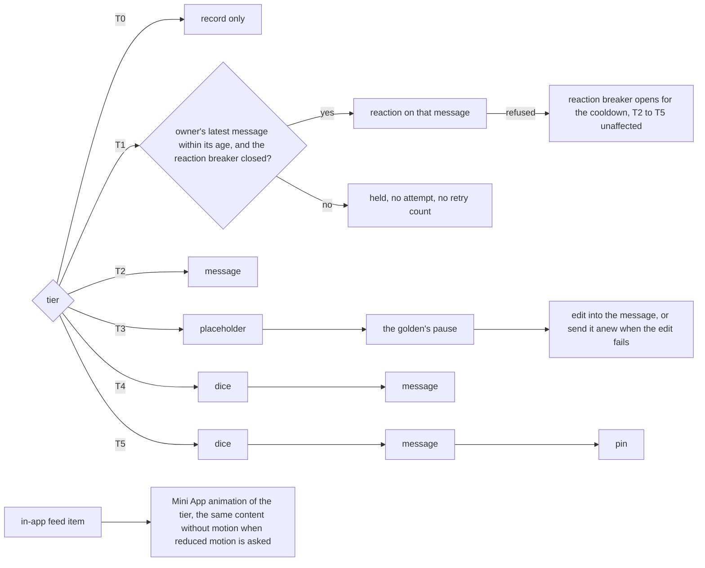
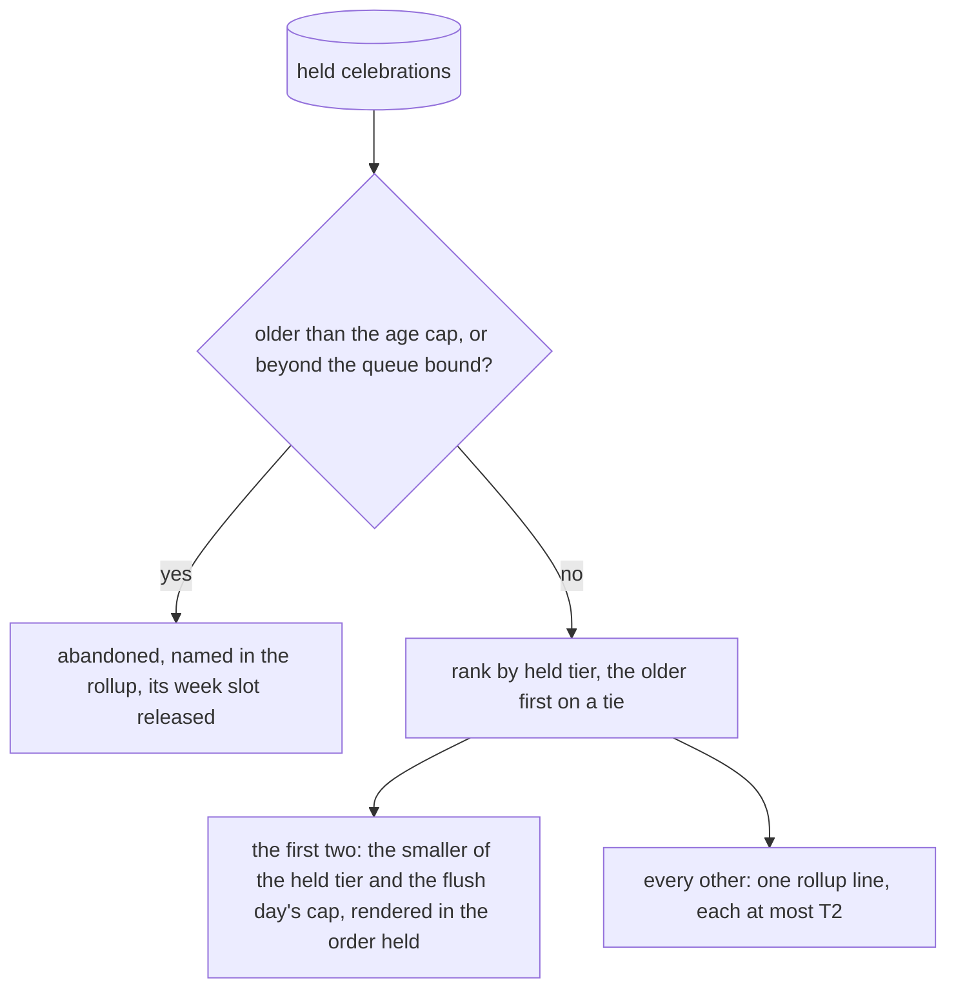

# Schematic: the celebration ladder on the one router

Kind: data flow and decision order. Read at DeckStreak `dev` c3d769b
(`notifications-policy.json`) and at the predecessor's `27ee2bc` (`gamification/ladder.py`,
`pipeline_layers/celebrations.py:CelebrationsLayer.celebrate`, `_streak_broke_today`,
`_react_to_owner` and `flush_deferred_celebrations`,
`database.py:GamifyStore.celebrations_at_or_above`). Added by SPEC-084.

It extends `docs/schematics/notification-router.md`, which draws SPEC-041's decision order. The ladder
sits between that order's third rule (the lapse) and its fourth (quiet hours), so a celebration held
in quiet hours is held at its final tier and counts toward its week.

## The tier of one celebration

The week is the Monday-start week of the occasion's study day, and it counts the celebrations
delivered and the ones still held; an abandoned hold releases its slot.

## Each tier's render

## The flush of held celebrations

The flush runs after each successful sync, outside quiet hours (SPEC-041 R7); the flush day's cap is
the streak-break cap of the study day the flush runs on.
