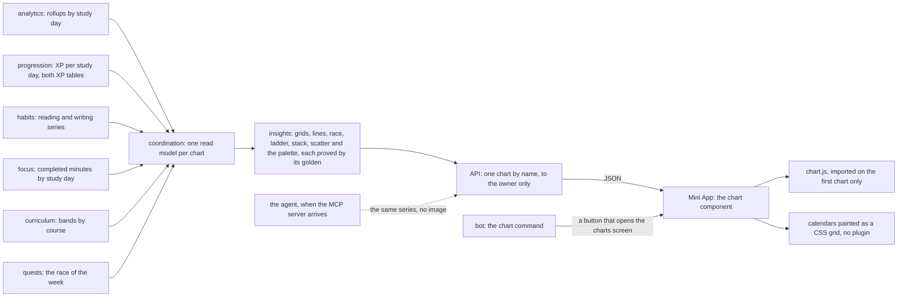
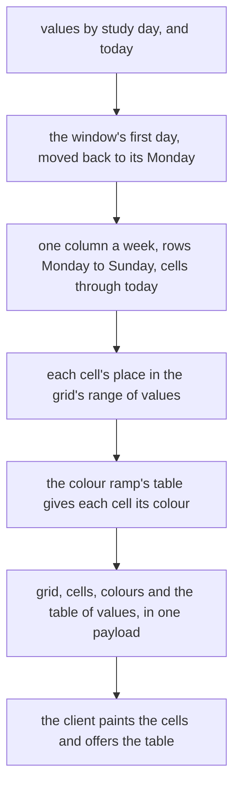

# Schematic: charts, from each owner's series to the client's drawing

Kind: data flow. Read at DeckStreak `dev` c3d769b and at the predecessor's `27ee2bc` (`charts.py`,
`server.py:_CHART_RESOURCES`, `bot.py:CommandBot._send_charts`, `offload.py:run_render_offloaded`).
Added by SPEC-085 (ADR-085). It extends `docs/schematics/data-flow.md`, whose domain contexts are
the owners below: the charts add a read path from them to the Mini App, and no path to the host's
disk or to an image.

## The path

The host renders nothing: no route answers an image, and no crate depends on a plotting or image
library. The predecessor's render rail has no work and is not ported.

## The charts

| chart | the owner's series | drawn as | shown on |
|---|---|---|---|
| review heatmap | reviews per study day (analytics) | calendar grid, gold ramp | `/charts` |
| streak calendar | a study day or not (analytics) | calendar grid, gold ramp | `/charts` |
| XP over time | XP per study day, cumulative (progression) | line with fill | `/charts` |
| reading heatmap | reading minutes per day (habits) | calendar grid, ember ramp | `/habits` |
| writing heatmap | writing languages confirmed per day (habits) | calendar grid, jade ramp | `/habits` |
| weekly reading | minutes per course per week, and the goal (habits) | stacked bars and a goal line | `/habits` |
| reading and retention | weekly minutes against the next week's retention (habits) | scatter by course | `/habits` |
| focus heatmap | completed focus minutes per day (focus) | calendar grid, violet ramp | `/focus` |
| focus over time | completed focus minutes, cumulative (focus) | line with fill | `/focus` |
| Road to C2 | bands and mastery per course (curriculum) | ladder cells and mastery bars | `/progress` |
| race | the owner's week against the ghost's (quests) | two lines | `/quests` |

Not drawn here: the collection atlas (not ported, the owner's decision), the Oracle calibration
(with the prediction markets), the leech breakdown (with leech remediation) and the badge gallery
image (the badges screen lists badges instead).

## A calendar

## Colours

Every chart draws on the predecessor's dark panel, in both Telegram colour schemes, as a figure the
page's own tokens frame. The chart palette is held equal to the golden, apart from the design
tokens, which all resolve to Telegram theme variables (SPEC-028 R5). On the panel, every series
colour and the chart's text reach 3:1, the contrast WCAG 2.2 asks of a chart's marks.
