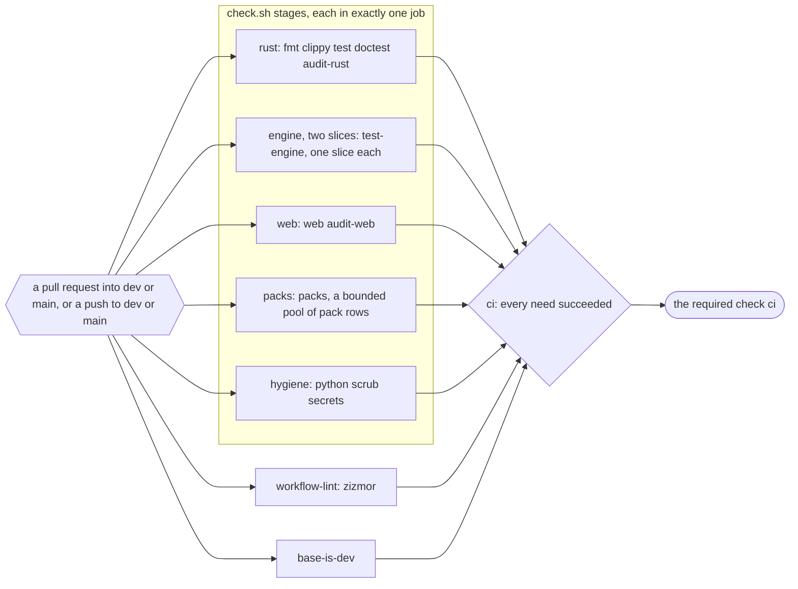
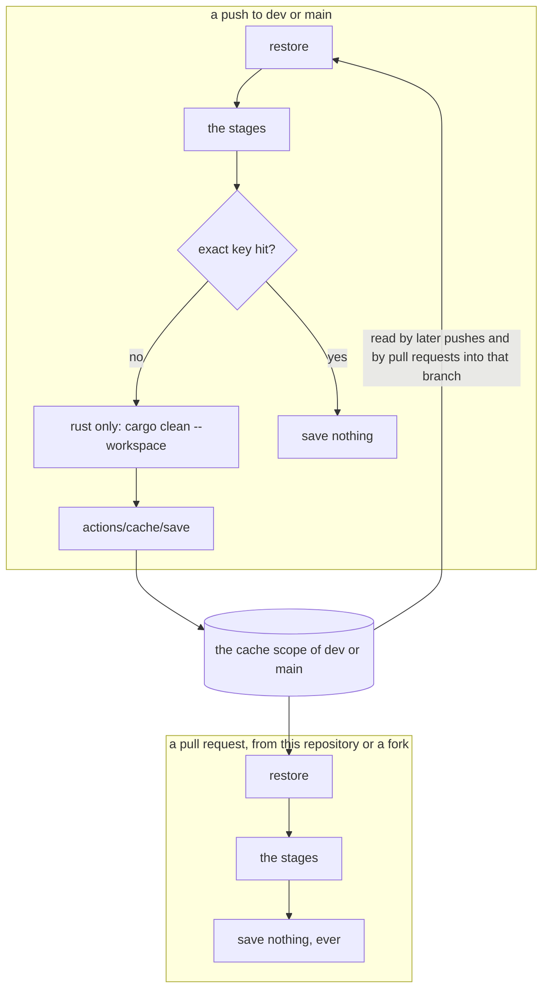
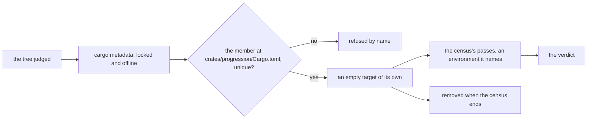
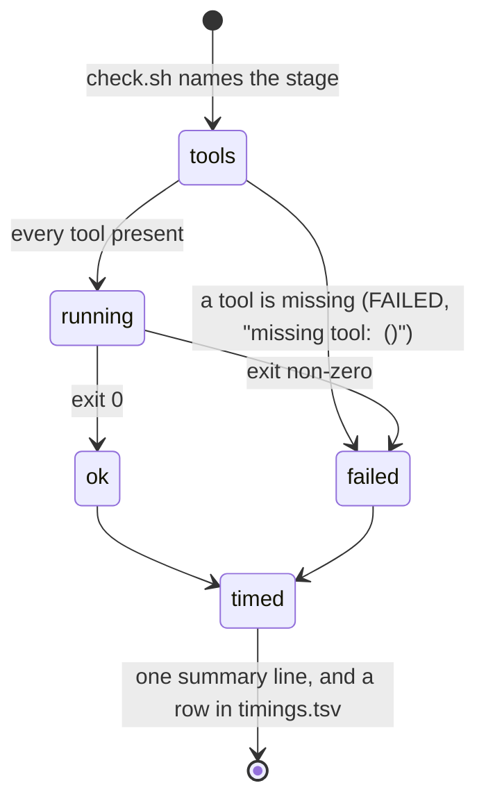
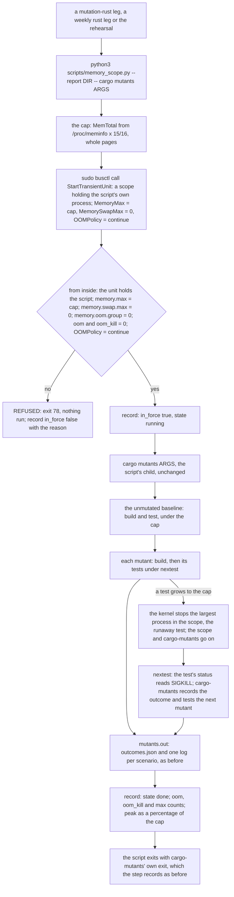
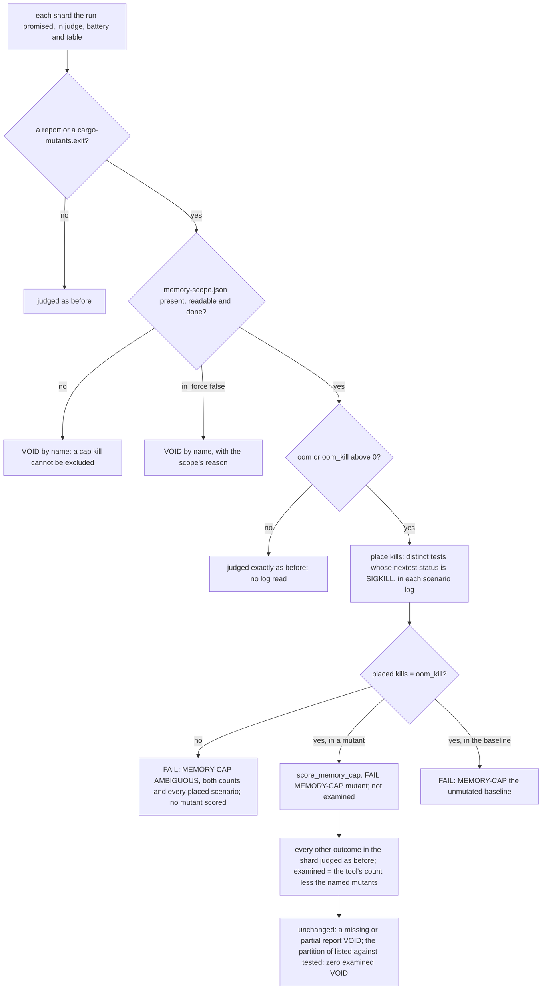
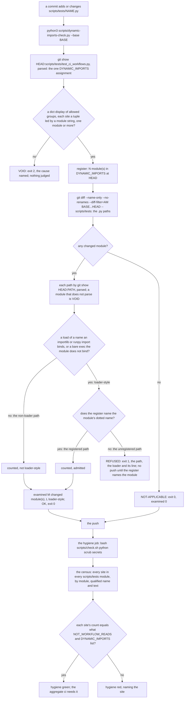

# Schematic: the CI jobs, and the caches each one reads and writes

Kind: component and data flow. Read at DeckStreak `dev` 8f91667 (`.github/workflows/ci.yml`,
`scripts/check.sh`, `scripts/pack-rows.py`), and again at `dev` 63e6671 for SPEC-038's amendment
(section 8), which added the `engine` job. Decided by ADR-055; built by SPEC-038.

## The jobs

The five gate jobs need nothing, so they start together; the run's wall time is the slowest of
them plus the aggregate. Each calls `bash scripts/check.sh <its stages>` once. `hygiene` and `packs`
check out the whole history (`fetch-depth: 0`): `secrets` scans every commit, `scrub` reads every
blob reachable from `HEAD`, and the sdd numbering row reads every branch. `rust`, `engine` and `web`
check out one commit.

## The engine set, split between two stages

Both stages run `cargo nextest run --workspace --locked --no-fail-fast`, and differ only in the
filterset, so their build scopes, features and flags are one; E negated and E itself cover the
workspace once. E holds whole test binaries, SPEC-022's `sync` and `engine_budget`, so a test added
to either goes with it. The local gate with no arguments runs both stages.

In CI the `engine` job runs E in two slices, a matrix leg each: a leg hands `test-engine`
`ENGINE_SLICE=<m>/<N>` (N is the matrix's size) and the stage adds `--partition slice:<m>/<N>`,
nextest's round robin over the one list E selects, so the slices hold every test of E once.
Without `ENGINE_SLICE` the stage runs the whole set.

## The caches

| cache | paths | key | restored by | saved by |
|---|---|---|---|---|
| Rust | `~/.cargo/registry/index/`, `~/.cargo/registry/cache/`, `~/.cargo/git/db/`, `target/` | `rust-<os>-<hash of rust-toolchain.toml>-<hash of Cargo.lock>`, falling back to the same toolchain | `rust`; `engine`, which builds the same workspace scope for its stage; and `hygiene`, whose guard tests build a Rust example | `rust` only, on a push that missed, after `cargo clean --workspace`: two jobs saving one key race |
| pnpm store | the path `pnpm store path` prints | `pnpm-<os>-<hash of pnpm-lock.yaml>`, falling back to any | `web` | `web`, on a push that missed |
| Playwright's browser | `~/.cache/ms-playwright` | `playwright-<os>-<the locked Playwright version>-chromium-headless-shell` | `web` | `web`, on a push that missed, right after the install |

A pull request restores from its base branch's scope and from `main`'s; GitHub confines anything a
pull request might write to its own merge ref, and the workflow never writes from one: every
`actions/cache/save` step is conditioned on a push to `dev` or `main`.

The settle census (SPEC-072 A12, section 14) has no cache of its own, and restores nothing a
verdict reads. Each census compiles in an empty target directory under `target/tmp/settle-census`,
made for that census and removed when it ends, so the Rust cache's `target/` can carry nothing
there that a later census reads, and every census compile in the `rust` job is cold.

## One stage, in whichever job runs it

The stage logs and `timings.tsv` go to `${{ runner.temp }}/check-logs`, outside the checkout, and
each job uploads them as its own artifact, whatever the verdict.

Amendment (2026-09-28): SPEC-056 removed the `packs` job and stage this schematic draws, so
four gate jobs run; every pack is judged on the maintainer's box run (ADR-069).

## The mutants step, inside its memory scope, and the verdict's reading of it (SPEC-196, ADR-199)

A `mutation-rust` leg, a weekly rust leg and the `rehearsal` run `cargo mutants` through `scripts/memory_scope.py`, with the
arguments they ran before. The script puts its own process in a transient scope, checks the cap from inside, and runs
cargo-mutants as its child, so the command keeps the caller's user, groups and environment.

The scope holds the whole cargo-mutants tree, so the kernel's out-of-memory choice is made among our processes, the largest
first, before the machine is under pressure; the runner is outside it. `OOMPolicy=continue` leaves `memory.oom.group` at `0`,
so one process is stopped, never the scope. A listing (`cargo mutants --list`) runs no test and is not wrapped. A mutant the
cap stops is never caught and never a timeout: its leg fails naming it, and every other result in the leg stands. How a
named kill is scored is decided in `score_memory_cap` alone. The timeouts, the listing, the partition and the baseline are
the ones in the sections above; the scope adds a bound on memory and changes no bound on time.

## The dynamic-import register: before the push, and the census in the hygiene job (SPEC-406, ADR-420)

Kind: data flow. Read at DeckStreak `dev` 32f6217 (`scripts/tests/test_ci_workflows.py`,
`.github/workflows/ci.yml`, `scripts/check.sh`, `docs/specs/_TEMPLATE.md`). Decided by ADR-420;
built by SPEC-406.

A module under `scripts/tests` that loads code through `importlib`, `runpy` or `exec` is held to
the `DYNAMIC_IMPORTS` register twice: by `scripts/dynamic-imports-check.py` before the push, at the
module, and by the census in the `hygiene` job after it, at every site with its count. The check
reads only what `HEAD` commits; the census reads the checked-out tree.

| path | what the check reads | its verdict | what the census then reads |
|---|---|---|---|
| registered | a changed module whose syntax tree loads code, and its dotted name among the register's modules | counted, `OK` | each of its sites against the register's count for it |
| unregistered | a changed module whose syntax tree loads code, and no tuple of the register naming it | `REFUSED`, exit 1, before any push | nothing yet: the push waits |
| non-loader | a changed module with no such load, the loader's words in a string or a comment included | counted, `OK` | its sites, if any other dynamic name is among them |

Every site the check counts is one the census counts: `importlib` and `runpy` are not in
`VETTED_MODULES` (`test_ci_workflows.py:4149`), and `exec` is in `BARE_DYNAMIC` (4069-4080). So the
check refuses a module only where the census would refuse it as well, and the census stays the
judge of a registered module that gains a site, of each tuple's text and count, and of every other
dynamic name. The register is the dict at `test_ci_workflows.py:6482-7064`, each group built by
`allowed()` (4779-4782); a module is named as `module_sources()` names it (4510-4518). The census
runs in `stage_python` (`scripts/check.sh:179-195`), the step at `.github/workflows/ci.yml:347-351`
of the `hygiene` job (line 298), which the aggregate `ci` needs (lines 875-878).

The SPEC template's file manifest section (`docs/specs/_TEMPLATE.md`, section 4) tells a delivery
that adds such a load to list `scripts/tests/test_ci_workflows.py` as changed, and names the check.
