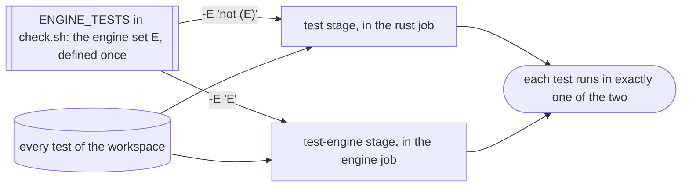
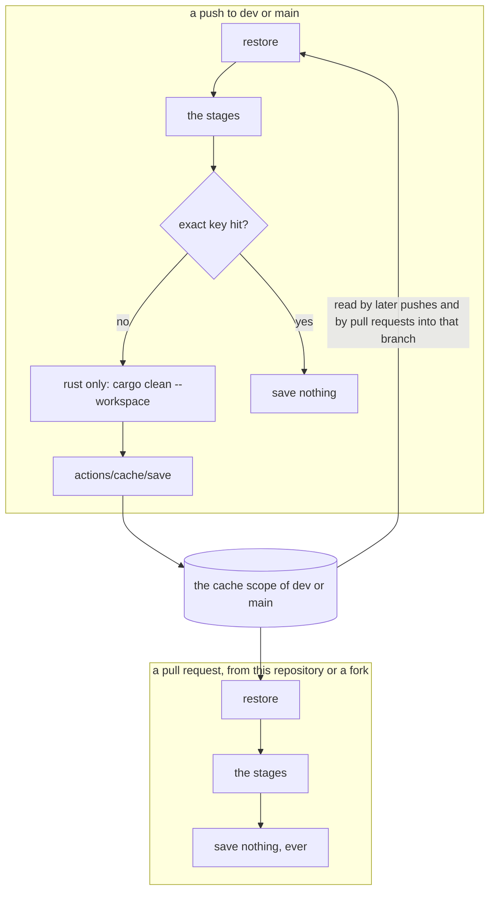
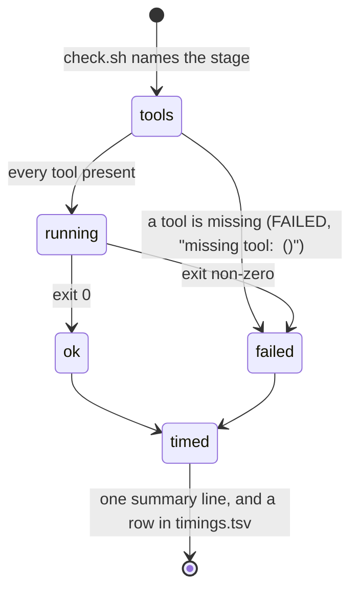
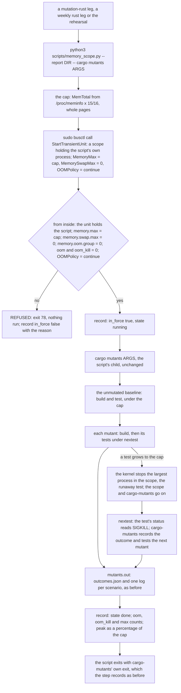
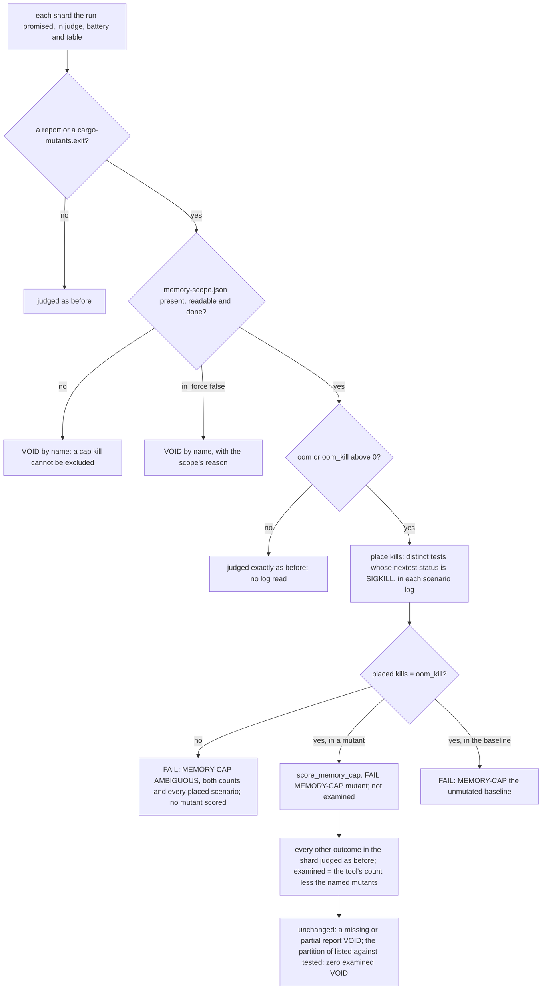

# Schematic: the CI jobs, and the caches each one reads and writes

Kind: component and data flow. Read at DeckStreak `dev` 8f91667 (`.github/workflows/ci.yml`,
`scripts/check.sh`, `scripts/pack-rows.py`), and again at `dev` 63e6671 for SPEC-038's amendment
(section 8), which added the `engine` job. Decided by ADR-055; built by SPEC-038.

## The jobs

The five gate jobs need nothing, so they start together; the run's wall time is the slowest of
them plus the aggregate. Each calls `bash scripts/check.sh <its stages>` once. `hygiene` and `packs`
check out the whole history (`fetch-depth: 0`): `secrets` scans every commit, `scrub` reads every
blob reachable from `HEAD`, and the sdd numbering row reads every branch. `rust`, `engine` and `web`
check out one commit.

## The engine set, split between two stages

Both stages run `cargo nextest run --workspace --locked --no-fail-fast`, and differ only in the
filterset, so their build scopes, features and flags are one; E negated and E itself cover the
workspace once. E holds whole test binaries, SPEC-022's `sync` and `engine_budget`, so a test added
to either goes with it. The local gate with no arguments runs both stages.

In CI the `engine` job runs E in two slices, a matrix leg each: a leg hands `test-engine`
`ENGINE_SLICE=<m>/<N>` (N is the matrix's size) and the stage adds `--partition slice:<m>/<N>`,
nextest's round robin over the one list E selects, so the slices hold every test of E once.
Without `ENGINE_SLICE` the stage runs the whole set.

## The caches

| cache | paths | key | restored by | saved by |
|---|---|---|---|---|
| Rust | `~/.cargo/registry/index/`, `~/.cargo/registry/cache/`, `~/.cargo/git/db/`, `target/` | `rust-<os>-<hash of rust-toolchain.toml>-<hash of Cargo.lock>`, falling back to the same toolchain | `rust`; `engine`, which builds the same workspace scope for its stage; and `hygiene`, whose guard tests build a Rust example | `rust` only, on a push that missed, after `cargo clean --workspace`: two jobs saving one key race |
| pnpm store | the path `pnpm store path` prints | `pnpm-<os>-<hash of pnpm-lock.yaml>`, falling back to any | `web` | `web`, on a push that missed |
| Playwright's browser | `~/.cache/ms-playwright` | `playwright-<os>-<the locked Playwright version>-chromium-headless-shell` | `web` | `web`, on a push that missed, right after the install |

A pull request restores from its base branch's scope and from `main`'s; GitHub confines anything a
pull request might write to its own merge ref, and the workflow never writes from one: every
`actions/cache/save` step is conditioned on a push to `dev` or `main`.

## One stage, in whichever job runs it

The stage logs and `timings.tsv` go to `${{ runner.temp }}/check-logs`, outside the checkout, and
each job uploads them as its own artifact, whatever the verdict.

Amendment (2026-09-28): SPEC-056 removed the `packs` job and stage this schematic draws, so
four gate jobs run; every pack is judged on the maintainer's box run (ADR-069).

## The mutants step, inside its memory scope, and the verdict's reading of it (SPEC-196, ADR-199)

A `mutation-rust` leg, a weekly rust leg and the `rehearsal` run `cargo mutants` through `scripts/memory_scope.py`, with the
arguments they ran before. The script puts its own process in a transient scope, checks the cap from inside, and runs
cargo-mutants as its child, so the command keeps the caller's user, groups and environment.

The scope holds the whole cargo-mutants tree, so the kernel's out-of-memory choice is made among our processes, the largest
first, before the machine is under pressure; the runner is outside it. `OOMPolicy=continue` leaves `memory.oom.group` at `0`,
so one process is stopped, never the scope. A listing (`cargo mutants --list`) runs no test and is not wrapped. A mutant the
cap stops is never caught and never a timeout: its leg fails naming it, and every other result in the leg stands. How a
named kill is scored is decided in `score_memory_cap` alone. The timeouts, the listing, the partition and the baseline are
the ones in the sections above; the scope adds a bound on memory and changes no bound on time.
