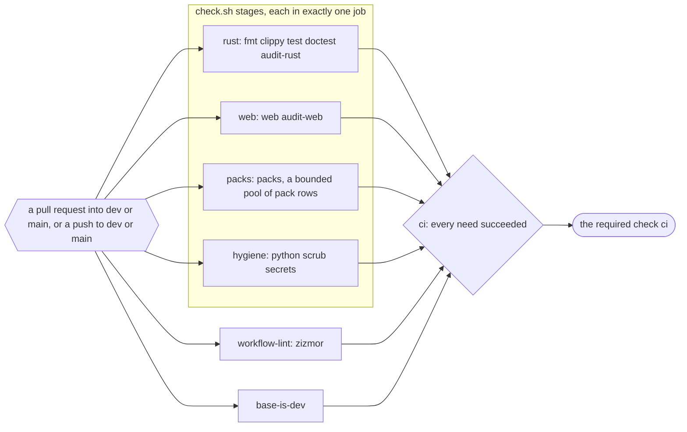
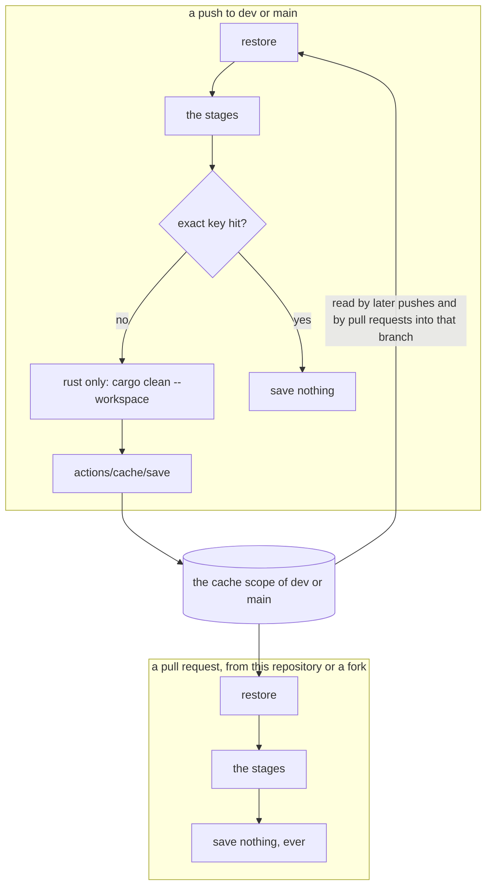
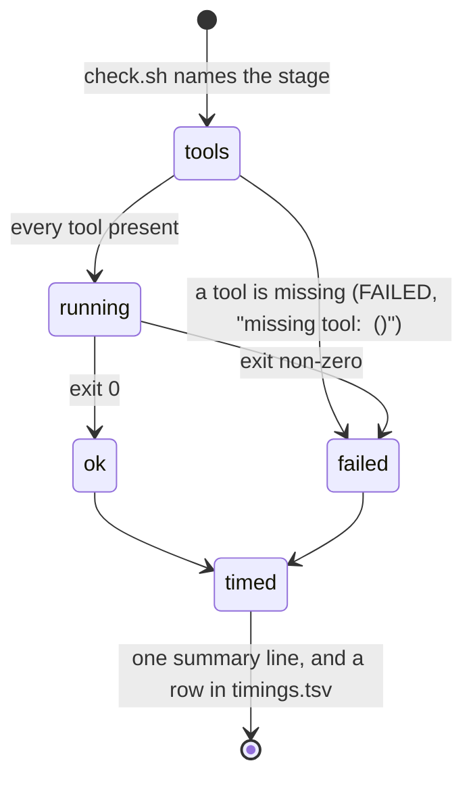

# Schematic: the CI jobs, and the caches each one reads and writes

Kind: component and data flow. Read at DeckStreak `dev` 8f91667 (`.github/workflows/ci.yml`,
`scripts/check.sh`, `scripts/pack-rows.py`). Decided by ADR-055; built by SPEC-038.

## The jobs

The four gate jobs need nothing, so they start together; the run's wall time is the slowest of
them plus the aggregate. Each calls `bash scripts/check.sh <its stages>` once. `hygiene` and `packs`
check out the whole history (`fetch-depth: 0`): `secrets` scans every commit, `scrub` reads every
blob reachable from `HEAD`, and the sdd numbering row reads every branch. `rust` and `web` check out
one commit.

## The caches

| cache | paths | key | restored by | saved by |
|---|---|---|---|---|
| Rust | `~/.cargo/registry/index/`, `~/.cargo/registry/cache/`, `~/.cargo/git/db/`, `target/` | `rust-<os>-<hash of rust-toolchain.toml>-<hash of Cargo.lock>`, falling back to the same toolchain | `rust` | `rust`, on a push that missed, after `cargo clean --workspace` |
| pnpm store | the path `pnpm store path` prints | `pnpm-<os>-<hash of pnpm-lock.yaml>`, falling back to any | `web` | `web`, on a push that missed |
| Playwright's browser | `~/.cache/ms-playwright` | `playwright-<os>-<the locked Playwright version>-chromium-headless-shell` | `web` | `web`, on a push that missed, right after the install |

A pull request restores from its base branch's scope and from `main`'s; GitHub confines anything a
pull request might write to its own merge ref, and the workflow never writes from one: every
`actions/cache/save` step is conditioned on a push to `dev` or `main`.

## One stage, in whichever job runs it

The stage logs and `timings.tsv` go to `${{ runner.temp }}/check-logs`, outside the checkout, and
each job uploads them as its own artifact, whatever the verdict.
