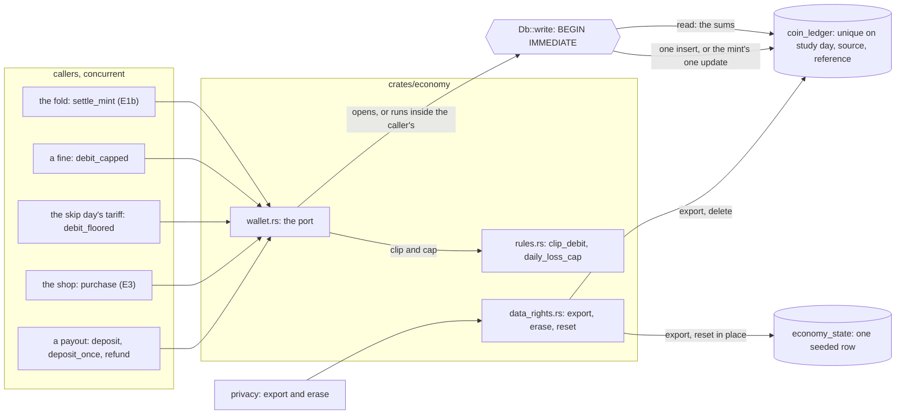
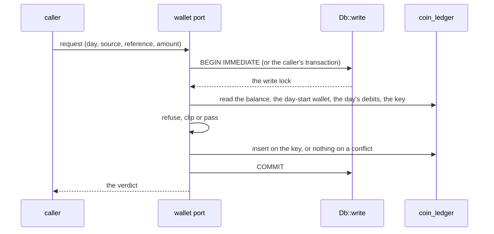
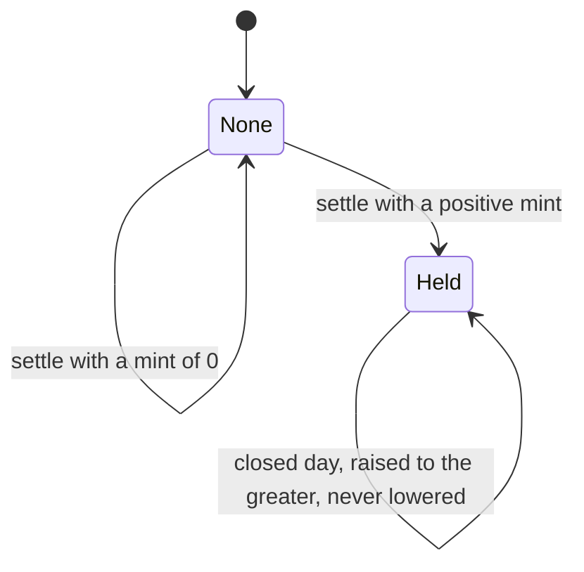

# Schematic: the coin wallet and its ports

Kind: data flow and component. Read at DeckStreak `dev` f7b78a06 (`crates/kernel/src/db.rs`
`Db::write`) and at this branch's `1851ccee` (`crates/economy/src/rules.rs`, `constants.rs`).
Decided by ADR-308; the requirements are SPEC-082's R1 to R8 and R18 (#106).

Every caller reaches `coin_ledger` through one port of `crates/economy/src/wallet.rs`, and every
port is one read and one write inside one `BEGIN IMMEDIATE` transaction from the kernel's base.
The balance is the sum of the ledger's movements, never a stored column.

## One port, in order

No other port's write lands between the read and the insert, because the lock is taken before the
read and held to the commit. A caller that holds a write passes its own `Transaction`, so the
port's read and write join that commit.

## Each port's rule

`floor` is `WALLET_FLOOR` (0). `balance` is the sum of every movement; `start` is the sum of the
movements of earlier study days; `debited` is the sum of the day's negative movements, purchases
included; `remainder` is `daily_loss_cap(start) - debited`.

| port | refuses | clips | writes |
|---|---|---|---|
| `deposit(day, source, reference, amount)` | an amount of 0 or less | nothing | `+amount` on the key, once |
| `deposit_once(day, source, reference, amount)` | an amount of 0 or less | nothing | `+amount`, unless a movement of that source and reference exists on any study day |
| `settle_mint(day, amount, closed)` | a negative amount | the open day's lowering, to `balance - floor` at most | the day's one `mint` movement: inserted when positive, raised to the greater on a closed day, set to the new mint on the open day |
| `purchase(day, source, reference, price)` | a price of 0 or less, or `balance - price < floor` (writes nothing) | never: not by the loss cap (R8) | `-price` on the key, counted in the day's debits |
| `debit_floored(day, source, reference, amount)` | never | `min(amount, max(0, balance - floor))` | `-paid` on the key when the amount is positive |
| `refund(day, source, reference, amount)` | an amount of 0 or less | nothing | `+amount` on the key, once |
| `debit_capped(day, source, reference, requested)` | never | `clip_debit(requested, balance - floor, remainder)`, reporting what was forgiven | `-paid` on the key when the request is positive |

A second call of a held key writes nothing: the insert does nothing on the unique index's
conflict, so the key lives in `migrations/008201_economy_wallet_and_shop.sql`. A debit whose
request is positive writes its movement even when it pays nothing, so a retry finds the key.

## The day's mint

## What crosses each boundary

- The callers pass a study day as `StudyDay`, a source and a reference as text, and a whole amount.
  The wallet answers a verdict or the coins paid, never a row.
- The economy context alone names `coin_ledger` in a query or a migration
  (`crates/economy/tests/wallet_census.rs`), and the privacy context reaches both tables only
  through the economy data-rights port.
