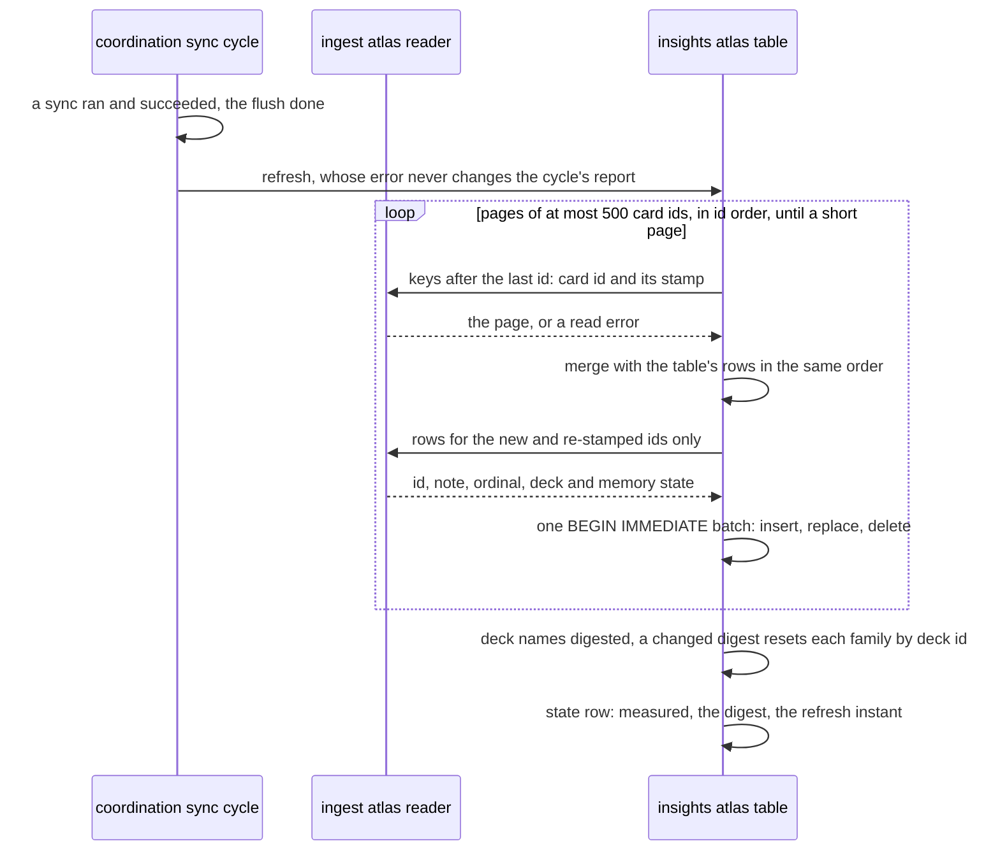
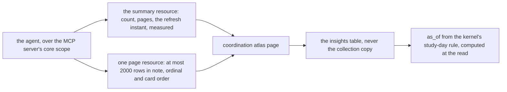

# Schematic: the collection atlas, refreshed after each sync and read in pages

Kind: sequence and decision flow. Read at DeckStreak `dev` 5216bcf (ADR-009, ADR-085,
`docs/schematics/sync-cycle-and-change-gate.md`, `docs/schematics/charts-from-json-series.md`), and
at the predecessor's `27ee2bc` for the behaviour it ports (`charts.py:read_collection_atlas`,
`_deck_family`). Added by SPEC-120 (ADR-120). It adds one step after the sync cycle's flush, and
one read path from insights to the agent beside the charts' path to the Mini App; it rewrites
neither.

## The refresh

A stamp that went backwards, as a card changed offline on another device does, differs from the
stored stamp and is read again; an unchanged stamp is never read. A read error keeps the rows and
marks the series unmeasured until the next refresh.

## The read

An unmeasured series answers a count of 0 and no rows, never an empty collection. No route draws
it and nothing publishes it: the agent reads it as data.
