# Schematic: the context map as components

Kind: component. Read at DeckStreak `dev` 164ac20690e0d6d0385474d04663d14df5781e19.
Its sources are the fence in `docs/CONTEXT-MAP.md` and every `crates/*/Cargo.toml`.

The binding record is the fence in `docs/CONTEXT-MAP.md`; this diagram draws it by layer. Every
directory under `crates/` is one node, named by its directory: a node id spells a hyphen as an
underscore, and its label keeps the directory's name. A crate's role is its line in the fence.

An arrow is one dependency its crate's manifest names under `[dependencies]` or
`[build-dependencies]`, or under a target's table of either name, and the fence names the same
edge. A `[dev-dependencies]` entry is not an edge. Each arrow is its own line, from one crate to
one crate.

The layers are declared top to bottom, and every arrow leaves its layer for a later one, so every
arrow points down. `scripts/tests/test_context_map_schematic.py` holds the drawing to the
manifests and the fence (SPEC-394, ADR-408).

```mermaid
flowchart TB
  subgraph root[composition root]
    daemon
  end
  subgraph adapters[adapters]
    api
    bot
    mcp
    push
    ffi
    web_engine["web-engine"]
  end
  subgraph app[application]
    coordination
  end
  subgraph domain[domain contexts]
    analytics
    progression
    streaks
    curriculum
    economy
    quests
    habits
    focus
    discipline
    markets
    notifications
    readings
    insights
    publishing
    privacy
  end
  subgraph acl[anti-corruption layers]
    ingest
    vault
    identity
    agent
  end
  subgraph foundations[no workspace dependency]
    kernel
    xp
    engine_core["engine-core"]
    fsrs7
  end

  daemon --> kernel
  daemon --> ingest
  daemon --> identity
  daemon --> analytics
  daemon --> progression
  daemon --> streaks
  daemon --> curriculum
  daemon --> economy
  daemon --> quests
  daemon --> habits
  daemon --> focus
  daemon --> discipline
  daemon --> markets
  daemon --> notifications
  daemon --> readings
  daemon --> vault
  daemon --> agent
  daemon --> insights
  daemon --> publishing
  daemon --> privacy
  daemon --> coordination
  daemon --> api
  daemon --> bot
  daemon --> mcp

  api --> kernel
  api --> identity
  api --> notifications
  api --> coordination

  bot --> kernel
  bot --> identity
  bot --> notifications
  bot --> coordination

  mcp --> kernel
  mcp --> coordination

  push --> kernel

  ffi --> engine_core

  web_engine --> engine_core

  coordination --> kernel
  coordination --> ingest
  coordination --> identity
  coordination --> analytics
  coordination --> progression
  coordination --> streaks
  coordination --> curriculum
  coordination --> economy
  coordination --> quests
  coordination --> habits
  coordination --> focus
  coordination --> discipline
  coordination --> markets
  coordination --> notifications
  coordination --> readings
  coordination --> vault
  coordination --> agent
  coordination --> insights
  coordination --> publishing
  coordination --> privacy

  analytics --> kernel
  analytics --> ingest
  progression --> kernel
  progression --> ingest
  progression --> xp
  streaks --> kernel
  curriculum --> kernel
  curriculum --> ingest
  economy --> kernel
  quests --> kernel
  quests --> ingest
  habits --> kernel
  focus --> kernel
  discipline --> kernel
  discipline --> ingest
  markets --> kernel
  notifications --> kernel
  readings --> kernel
  readings --> ingest
  insights --> kernel
  insights --> ingest
  publishing --> kernel
  privacy --> kernel

  ingest --> kernel
  vault --> kernel
  identity --> kernel
  agent --> kernel
```

The daemon composes none of `ffi`, `web-engine` and `push`. A native client links `ffi` into its
own binary and the web client runs `web-engine`, each over `engine-core`; `push` joins the daemon
when native push carries the one router (#640). The clients' edges to `xp` are #639's.

`fsrs7` depends on no workspace crate, and no crate depends on it.

`deck-streak-migration` is planned in the fence and has no directory under `crates/`, so it is not
drawn until the delivery that builds it.

The web client's code under `web/app` and the native harness under `ios/` are outside the crate
graph: the fence lists each as depending on nothing internal.
