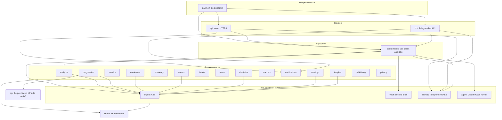

# Schematic: the context map as components

Kind: component. Read at DeckStreak `main` 769ee62 (`docs/CONTEXT-MAP.md`, `crates/*/Cargo.toml`).
The binding record is the fence in docs/CONTEXT-MAP.md; this diagram draws it by layer. An arrow
is a Cargo dependency, and it points down only.

The XP crate was drawn by SPEC-360; the clients' edges to it are #639's.

The Mini App (`web/app`) is outside the crate graph: it reaches `api` over HTTPS only.
