# Schematic: one run of a scheduled job, and the cron-fire ledger it keeps

Kind: state machine. Read at DeckStreak `main` e05dfa5 (ADR-010, ADR-011,
`docs/schematics/deployment.md`), and at the predecessor's `27ee2bc` for the semantics it ports
(`database.py:GamifyStore.claim_cron_fire`, `release_cron_fire`, `record_cron_fire`,
`scheduler.py:run_startup_catchup`, `pipeline_layers/ops.py:OpsLayer._check_deadman`). Decided by
ADR-027; built by SPEC-027.

```mermaid
stateDiagram-v2
  [*] --> Scheduled: the job's timer fires (or Persistent= at activation)
  Scheduled --> Syncing: syncs_first (waits at most SYNC_GUARD_WAIT_SECS for the lock)
  Scheduled --> Lateness: not syncs_first
  Syncing --> Lateness: sync done, failed, or skipped (never gates the job)
  Lateness --> Missed: catch_up and more than CATCHUP_MAX_LATE_MIN late
  Missed --> [*]: record missed (unless evidence says the fire has a verdict), exit 0
  Lateness --> Claiming: once a day
  Lateness --> Acting: repeats within the day (no claim)
  Claiming --> Skipped: an attempt is already recorded for (job, fire date)
  Skipped --> [*]: exit 0
  Claiming --> Acting: claim written BEFORE the job acts
  Acting --> Recorded: ok or error recorded, last_fire_at advanced
  Recorded --> Released: returned not delivered AND the notifier saw an attempt with no message id
  Released --> [*]: claim undone; the next activation may try within the window
  Recorded --> Paging: a transition (first error of a streak, third sync failure, sync dead, drift)
  Paging --> [*]: exit 1, the unit fails, OnFailure= sends the one alert
  Recorded --> [*]: exit 0
```

| counter or column | advanced by | counts as an attempt for the claim |
|---|---|---|
| `catchup_count` | a successful claim | yes |
| `ok_count` | a recorded success | yes |
| `error_count` | a recorded error | yes |
| `missed_count` | a recorded miss | no |
| `last_fire_at` | ok, error or catchup only | not applicable |

`cron_fires` is exempt from export and erase: an erase must never re-arm the double-send guard.
