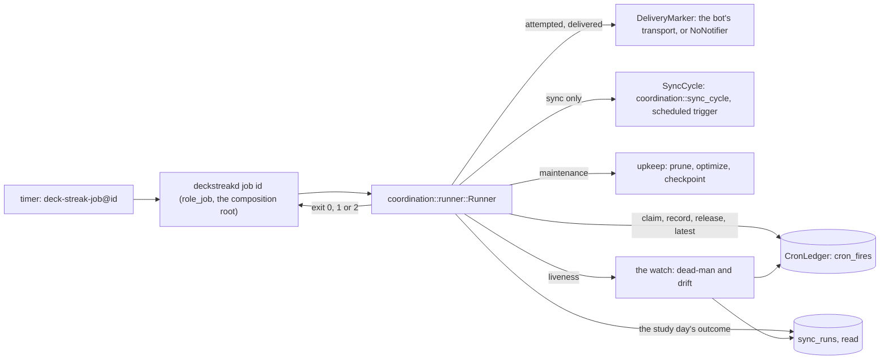

# Schematic: one run of a scheduled job, and the cron-fire ledger it keeps

Kind: state machine and component diagram. Read at DeckStreak `main` e05dfa5 (ADR-010, ADR-011,
`docs/schematics/deployment.md`), and at the predecessor's `27ee2bc` for the semantics it ports
(`database.py:GamifyStore.claim_cron_fire`, `release_cron_fire`, `record_cron_fire`,
`scheduler.py:run_startup_catchup`, `pipeline_layers/ops.py:OpsLayer._check_deadman`). Decided by
ADR-027 and ADR-037 (no job syncs first: only `sync` syncs, once per study day, and every other job
reads the study day's sync outcome); built by SPEC-027, whose delivery drew the component view and
the paging rules below.

## One run

```mermaid
stateDiagram-v2
  [*] --> Scheduled: the job's timer fires (or Persistent= at activation, or a manual start)
  Scheduled --> Window: catch_up, look at the fires of now's local calendar day
  Scheduled --> Fire: no catch_up, the latest scheduled instant at or before now
  Window --> NothingElapsed: no fire of the day has elapsed yet
  NothingElapsed --> [*]: exit 0, nothing written
  Window --> Missed: more than CATCHUP_MAX_LATE_MIN late
  Missed --> [*]: record missed (suppressed when a once-a-day fire already has a row), exit 0
  Window --> Fire: at most CATCHUP_MAX_LATE_MIN late
  Fire --> Claiming: once a day, sync included (its fire date is the study day it runs in)
  Fire --> Acting: repeats within the day (no claim)
  Claiming --> Skipped: an attempt is already recorded for (job, fire date)
  Skipped --> [*]: exit 0
  Claiming --> Acting: claim written BEFORE the job acts
  Acting --> Recorded: ok or error recorded, last_fire_at advanced
  Recorded --> Released: not delivered AND the notifier saw an attempt with no message id
  Released --> [*]: claim undone; a later activation may try within the window
  Recorded --> Paging: a transition (below)
  Paging --> [*]: exit 1, the unit fails, OnFailure= sends the one alert
  Recorded --> [*]: exit 0
```

| counter or column | advanced by | counts as an attempt for the claim |
|---|---|---|
| `catchup_count` | a successful claim | yes |
| `ok_count` | a recorded success | yes |
| `error_count` | a recorded error | yes |
| `missed_count` | a recorded miss | no |
| `last_fire_at` | ok, error or catchup only | not applicable |

`cron_fires` is exempt from export and erase: an erase must never re-arm the double-send guard.

## The runner and its ports

The composition root builds the ports; the runner decides. `sync` is the only job that reaches the
`SyncCycle`, and the syncer behind it is built only when `sync` runs, so the other jobs start without
the sync's settings.

## What pages, and why each pages once

| transition | read from | once per |
|---|---|---|
| the first error of a job's error streak, a failed scheduled sync included | the job's last recorded outcome before the run | episode: a repeat only logs until the job succeeds |
| the first check to find the sync dead: no success for one study day plus the catch-up window (30 hours), or never a success and the first recorded attempt older than the boot grace | `sync_runs`, and the watch's previous check in the ledger | episode: the previous check had not found it dead |
| the first check to see a maintenance fire more than 30 minutes off its slot | the maintenance fire's `last_fire_at`, and the watch's previous check | fire date: the previous check came before the fire |

An owner-triggered sync never pages: its reply shows the owner, and the runner runs only the
scheduled one.
