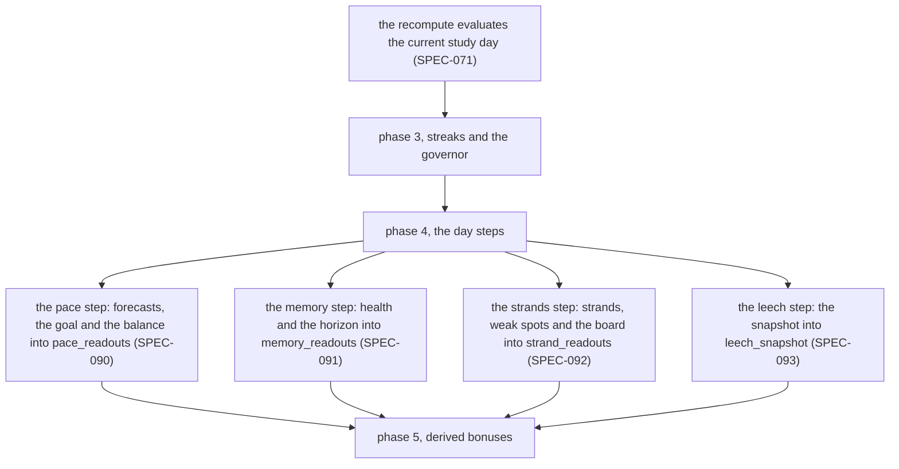
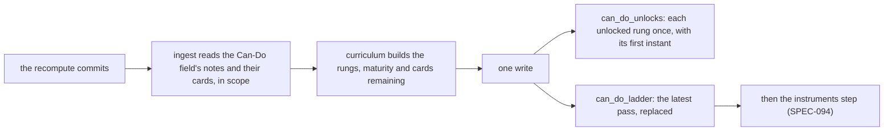

# Schematic: curriculum's readouts at the current study day, and the Can-Do pass after it

Kind: data flow. Read at DeckStreak `dev` dd98601 (`crates/curriculum/src/` holds only `lib.rs`)
and at the predecessor's `27ee2bc` (`velocity.py`, `cross_language.py`, `coaching.py`, `horizon.py`,
`strands.py`, `lsat.py`, `leeches.py` and `cando.py:unlock_pass`). Decided by ADR-091 (curriculum's
readouts are computed in the current study day's step and stored as the latest) and ADR-099 (the
Can-Do pass runs after each sync's recompute and records each unlock once). Added by SPEC-091;
SPEC-090, SPEC-092 and SPEC-093 register their steps on it, and SPEC-099 adds the pass. It extends
`docs/schematics/recompute-settles-each-study-day.md` (phase 4 of the fold) and changes none of it.

## Phase 4 of the current study day

Each step runs in the current study day's recompute only, never when an owed day settles, and
replaces its rows in one write. Coordination passes each step what it needs from other contexts
(analytics' rollups, ingest's cards, each home deck's course); curriculum reads no other context's
table. Before the first recompute every readout reads as pending, and a route or command serves the
stored readout without a read.

## After the recompute commits

The pass runs through the offload, off the fold's write path. A failed read replaces the ladder with
the failure and records no unlock; the unlocks already recorded stay. A rung that falls back stays
in `can_do_unlocks` and is listed as locked too.
