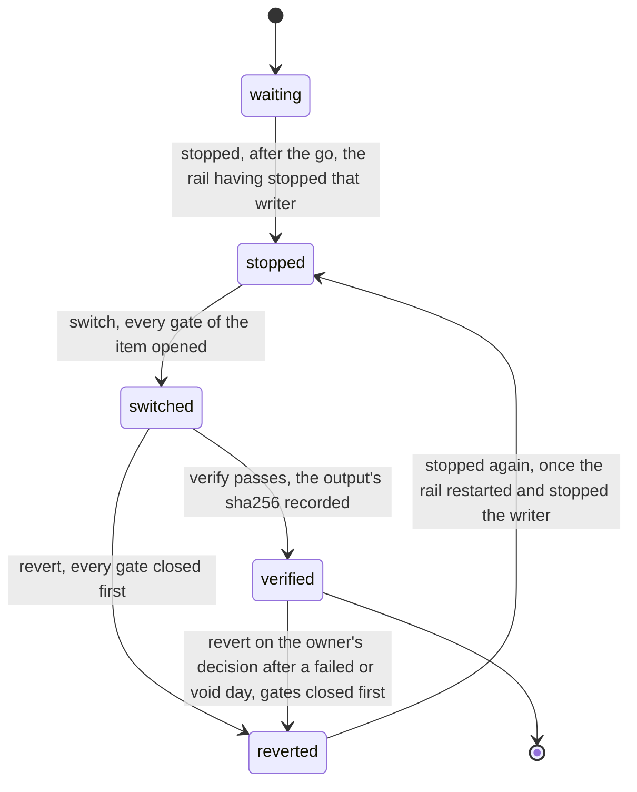
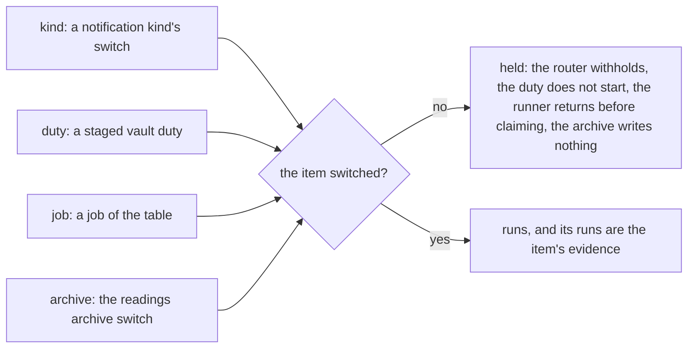
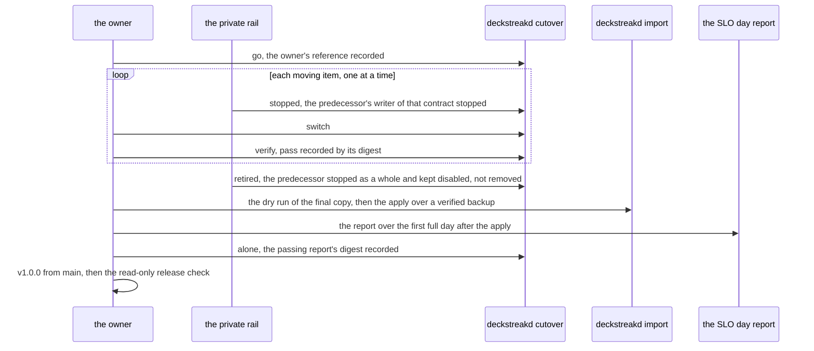

# Schematic: the cutover checklist, one item at a time, and the order after the owner's go

Kind: state machine and sequence. Read at DeckStreak `dev` (ADR-011, ADR-034, ADR-037,
docs/schematics/notification-router.md, docs/schematics/vault-write-paths.md,
docs/schematics/cron-fire-ledger-and-catch-up.md, docs/schematics/alert-and-slo-path.md). Added
by the W8 plan for SPEC-143, SPEC-144, SPEC-145 and SPEC-146; ADR-143, ADR-144 and ADR-145 decide
it. Every step after the go names the owner gate #164. DeckStreak never stops the predecessor:
the predecessor stops, and the private rail (#41) carries it out; DeckStreak records that it did.

## One item of the checklist

An item is a notification kind, a vault contract or a job that DeckStreak and the predecessor
would both write. Its gates stay closed until it switches, so each contract has one writer at every
step (ADR-011). Only one item is in flight (stopped or switched, not yet verified or reverted).

A refusal writes nothing: `no_go` for a stop before the go, `go_recorded` for a second go,
`unknown_item` for an item the checklist does not list, `not_movable` for a stop of a
DeckStreak-only item or a verified one, `in_flight` for a stop while an item is in flight,
`not_stopped` and `not_switched` out of order, and `output_exists` for a verification whose output
file exists. A verified item reverts only on the owner's decision (#164). A switch set by hand
before its item switched is drift, and a drift fails every verification.

## What a closed gate holds

## The order after the go (#164)

A failed or void day is the owner's decision (#164): the ways back are the import's rollback and
an item's revert. The predecessor's removal waits for the owner's own approval.
