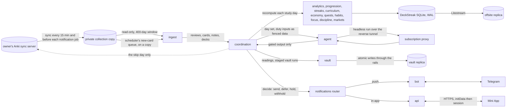

# Schematic: data flow, from the sync server to the owner

Kind: data flow. Read at DeckStreak `main` 769ee62, and at the predecessor's `27ee2bc` for the
ingest path it ports (`sync.py:AnkiSyncer`, `anki_reader.py:read_collection`,
`pipeline_layers/preread.py:PreReadLayer.run_preread_generation`).

What crosses each boundary:

| boundary | what crosses | guard |
|---|---|---|
| sync server to copy | the collection, by Anki's own sync | never an upload except the skip day |
| copy to ingest | read-only rows | `mode=ro`; the change gate skips an unchanged cycle |
| coordination to agent | card text, vault notes, the learner's writing | fenced as untrusted data; the agent holds no tool that reaches out |
| agent to coordination | a duty's output | the packs' blocking classes; a red output is withheld |
| coordination to vault | staged runs | create, update, move only; the rails; atomic writes |
| router to surfaces | messages | one router: budgets, dedupe, quiet hours, the holdout |
| Mini App to API | requests | `initData` validated and pinned to the owner, then a session |
