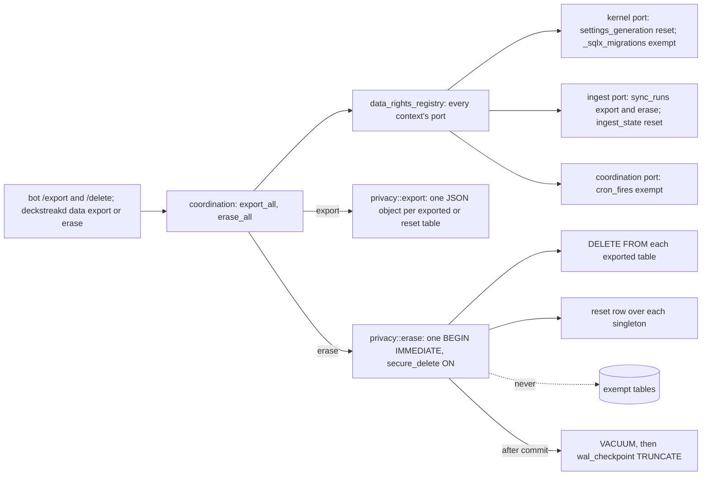

# Schematic: export and erase over every context's data-rights port

Kind: data flow. Read at DeckStreak `main` e05dfa5 (ADR-008, CHARTER 13, the privacy-gdpr pack), and
at the predecessor's `27ee2bc` for the invariant it ports (`database.py:GamifyStore.dump_all`,
`erase_all_user_data`, `_ERASE_SINGLETONS`). Built by SPEC-021 over the port SPEC-020 defines.

| table | port | export | erase |
|---|---|---|---|
| `sync_runs` | ingest | yes | `DELETE FROM` |
| `ingest_state` | ingest | yes | reset in place |
| `settings_generation` | kernel | yes | reset in place |
| `cron_fires` | coordination | no | never: an erase must not re-arm the double-send guard |
| `_sqlx_migrations` | kernel | no | never: the schema-version table |

What an erase cannot reach, and the policy says so: the Litestream replica (its window), the journal
(its window), the private collection copy (the owner's own Anki data, restored by the next sync), and
the cron-fire ledger (pruned after 90 days).
