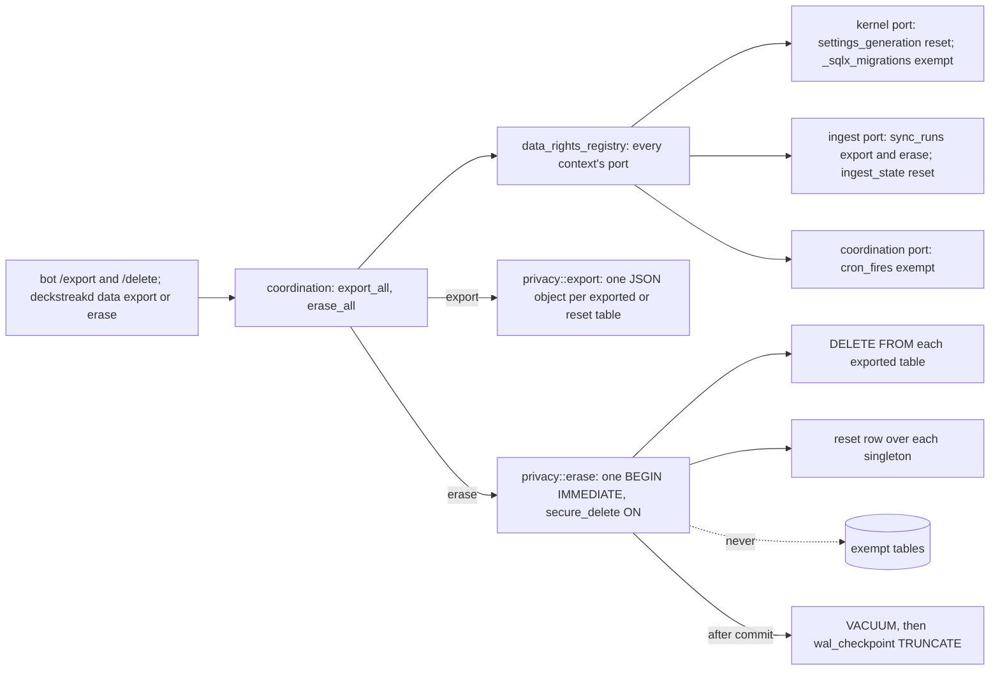
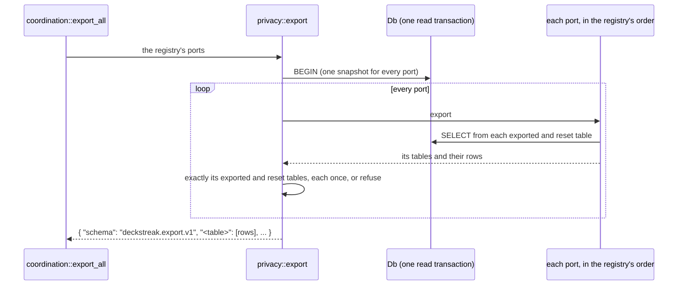
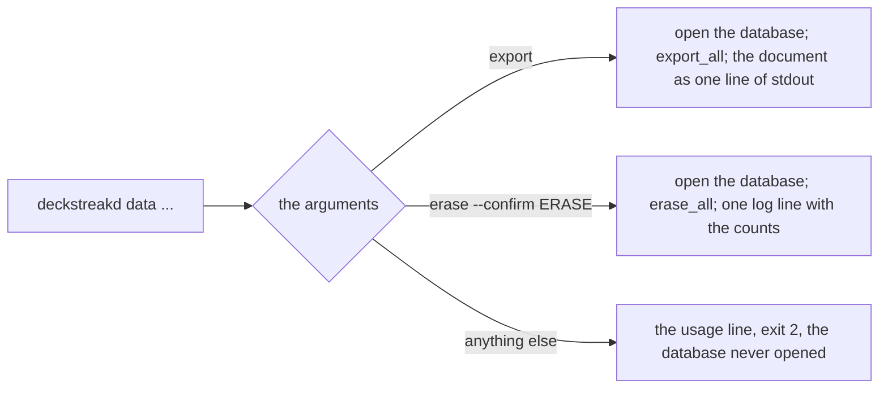

# Schematic: export and erase over every context's data-rights port

Kind: data flow. Read at DeckStreak `main` e05dfa5 (ADR-008, CHARTER 13, the privacy-gdpr pack), and
at the predecessor's `27ee2bc` for the invariant it ports (`database.py:GamifyStore.dump_all`,
`erase_all_user_data`, `_ERASE_SINGLETONS`). Built by SPEC-021 over the port SPEC-020 defines; the
delivery drew the erase's order, its checks and its two kinds of failure below.



| table | port | export | erase |
|---|---|---|---|
| `sync_runs` | ingest | yes | `DELETE FROM` |
| `ingest_state` | ingest | yes | reset in place |
| `settings_generation` | kernel | yes | reset in place |
| `cron_fires` | coordination | no | never: an erase must not re-arm the double-send guard |
| `_sqlx_migrations` | kernel | no | never: the schema-version table |

What an erase cannot reach, and the policy says so: the Litestream replica (its window), the journal
(its window), the private collection copy (the owner's own Anki data, restored by the next sync), and
the cron-fire ledger (pruned after 90 days).

## The declarations are checked before anything runs

Both use cases first read every port's declaration. The engine refuses, before it reads or writes a
row, a declaration the kernel refuses, a table two ports declare (their export keys would collide and
their erases could disagree), and a table named `schema`, the export's own key.

## The export



A port whose export omits a table it declares exported, returns one it does not, or returns one twice
is refused by the port's context and the table: the owner is told, never handed a partial copy.

## The erase

```mermaid
sequenceDiagram
  participant uc as coordination::erase_all
  participant pv as privacy::erase
  participant db as Db
  participant p as each port, in the registry's order
  uc->>pv: the registry's ports
  pv->>db: BEGIN IMMEDIATE (Db::write)
  pv->>db: PRAGMA secure_delete = ON, refused unless it answers 1
  loop every port
    pv->>p: erase
    p->>db: DELETE FROM each exported table; the reset row over each singleton
  end
  loop every port
    pv->>p: export, inside the same transaction
    pv->>pv: each exported table empty; each singleton one row holding its reset values
  end
  pv->>db: COMMIT
  pv->>db: VACUUM
  pv->>db: PRAGMA wal_checkpoint(TRUNCATE)
  pv-->>uc: the tables emptied, reset and kept, and whether a reader held the log
```

| where it stops | what the owner has | the refusal |
|---|---|---|
| a declaration is refused | nothing ran | the context and the table |
| secure_delete does not turn on | nothing erased: the transaction is dropped | secure_delete is off |
| a port's erase or export fails | nothing erased: the transaction is dropped, so every port's work rolls back | the port's context and its cause |
| a port left a table its declaration clears or resets | nothing erased: the transaction is dropped | the context and the table |
| the commit fails | nothing erased | the database's cause |
| the VACUUM or the checkpoint fails | erased, and the freed bytes may stay until the next compaction | the compaction's cause, named apart from the others |

A checkpoint that meets a reader (Litestream holds one while it copies the log) reports busy and is
not an error: the erase is committed and its own pages carry no erased byte, because secure_delete
zeroed them; the older frames that still hold erased values leave the log at the next `maintenance`
checkpoint (SPEC-027), and the report says the log was held.

## The `data` role



The export's line is the one line of standard output that does not open with a journal priority,
so a copy redirected to a file is the document alone when the run succeeds.
