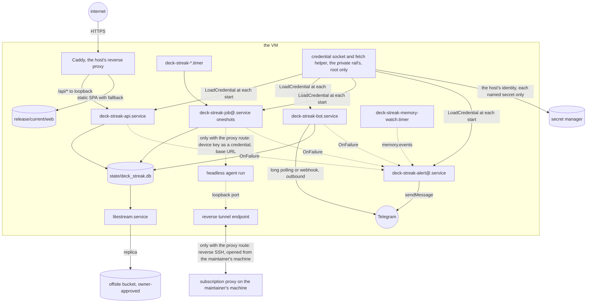
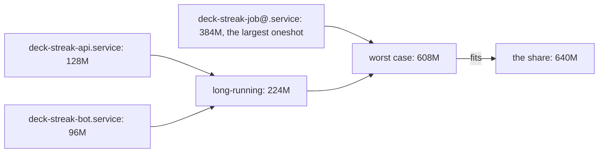
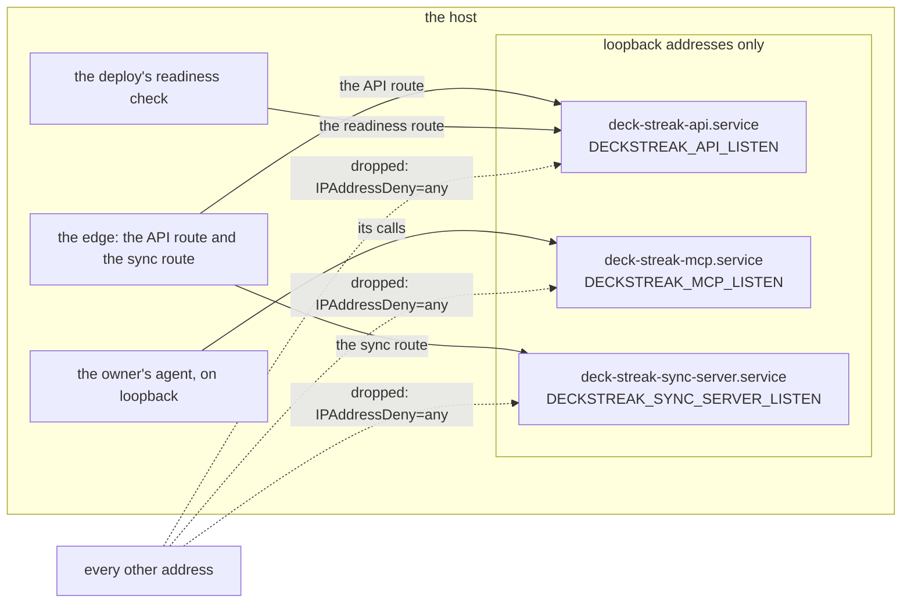

# Schematic: deployment on the host

Kind: component (deployment). Read at DeckStreak `main` 769ee62 (ADR-007, ADR-010, ADR-015); the
budget per unit is SPEC-032's (ADR-032). Every
concrete host name, address and secret name is private configuration; the units are templates in
`deploy/`. Credentials reach every unit from the private rail's credential socket at each start
(ADR-038), and the agent's path exists only when the owner enables the proxy route (ADR-054).

| unit | type | binds | reads secrets from | `MemoryHigh` / `MemoryMax` (ADR-032) |
|---|---|---|---|---|
| `deck-streak-api.service` | notify, watchdog | loopback only | `LoadCredential=` from the credential socket (ADR-038) | 96M / 128M |
| `deck-streak-bot.service` | notify, watchdog | none (outbound) | `LoadCredential=` from the credential socket (ADR-038) | 64M / 96M |
| `deck-streak-job@<id>.service` + `.timer` | oneshot | none | `LoadCredential=` from the credential socket (ADR-038) | 320M / 384M |
| `deck-streak-alert@.service` | oneshot | none | `LoadCredential=` from the credential socket (ADR-038) | 32M / 48M |
| `deck-streak-slo.service` + `.timer` | oneshot | none | none | 48M / 64M |
| `deck-streak-memory-watch.service` + `.timer` | oneshot | none | none | 32M / 48M |
| the credential socket and its fetch helper | the private rail's (#41), root only | the socket path | the secret manager, with the host's identity | the rail's |
| the reverse tunnel, only with the proxy route (ADR-054) | a user unit on the maintainer's machine | the host's loopback | the maintainer's key, never on the host | none on the host |

Releases live side by side under `releases/<tag>/`, and `current` switches by an atomic rename.

## The budget per unit (SPEC-032, ADR-032)

DeckStreak's share of the host is `"memory": "640M"` and `"cpus": 2`, in `deploy/host-budget.json`,
which records each unit's `memory_high` and `memory_max`; every unit's `MemoryHigh=` and
`MemoryMax=` equal its entry. The file holds the units SPEC-032 ships, and SPEC-031 adds the alert
unit, the SLO evaluator and the memory watch with the numbers above. The worst case the share must
hold is every long-running unit at its ceiling while the largest oneshot runs:

Each unit throttles at its own `MemoryHigh=` and is killed at its own `MemoryMax=`, so a job's
spike fails the job alone, and `OnFailure=` pages it through the alert unit.

## Each loopback listener's peers (SPEC-395, ADR-409)

Kind: component. Read at DeckStreak `dev` 164ac206: every `path:line` below is read there, and the
two lists in the API's and the MCP server's units are what SPEC-395 adds after their address
families. Each service below listens on a loopback address alone, named by its setting in
`deploy/deck-streak.env.example`, and its unit holds `IPAddressAllow=localhost` and
`IPAddressDeny=any`: its packets to and from a loopback address of either family pass, and every
other packet it sends or receives is dropped. `scripts/tests/test_loopback_peers.py` holds the lists
(SPEC-395 A1) and the population, every `DECKSTREAK_*_LISTEN` setting (SPEC-395 A2).

| unit | listens on | its allowed peers (inbound) | outbound peers | its lists |
|---|---|---|---|---|
| `deck-streak-api.service` | `DECKSTREAK_API_LISTEN` (`deploy/deck-streak.env.example:34`), a loopback address | the edge's API route (`deploy/README.md:54-55`) and the deploy's readiness check (`deploy/README.md:194-195`) | none: its IP families carry its listener alone (`deploy/systemd/deck-streak-api.service:51`) | `IPAddressAllow=localhost`, `IPAddressDeny=any` (SPEC-395 R1) |
| `deck-streak-mcp.service` | `DECKSTREAK_MCP_LISTEN` (`deploy/deck-streak.env.example:39`), a loopback address | the owner's agent (`deploy/systemd/deck-streak-mcp.service:1-2`, `deploy/README.md:16`) | none: its IP families carry its listener alone (`deploy/systemd/deck-streak-mcp.service:54`) | `IPAddressAllow=localhost`, `IPAddressDeny=any` (SPEC-395 R1) |
| `deck-streak-sync-server.service` | `DECKSTREAK_SYNC_SERVER_LISTEN` (`deploy/deck-streak.env.example:45`), a loopback address | the edge's sync route (`deploy/README.md:55-57`) | none (`deploy/systemd/deck-streak-sync-server.service:59`) | `IPAddressAllow=localhost`, `IPAddressDeny=any` (`deploy/systemd/deck-streak-sync-server.service:63-64`; SPEC-340 R8) |

The lists match addresses, never ports. Each listener's bind is its own setting, held to a loopback
address, and the units that reach off the host (the bot and the job and alert templates) keep their
deny of the host's identity endpoint (SPEC-354), outside this section.
