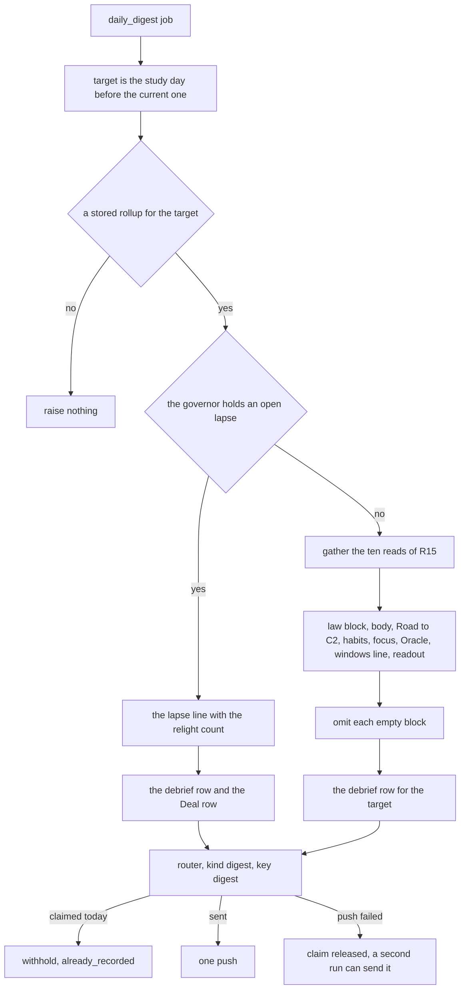
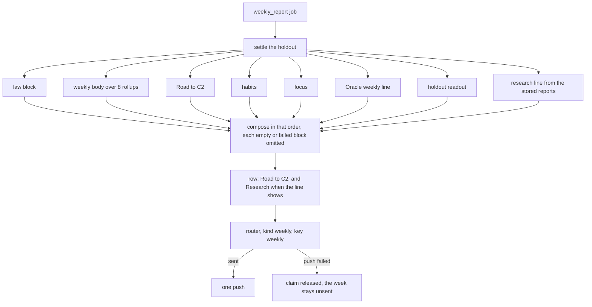
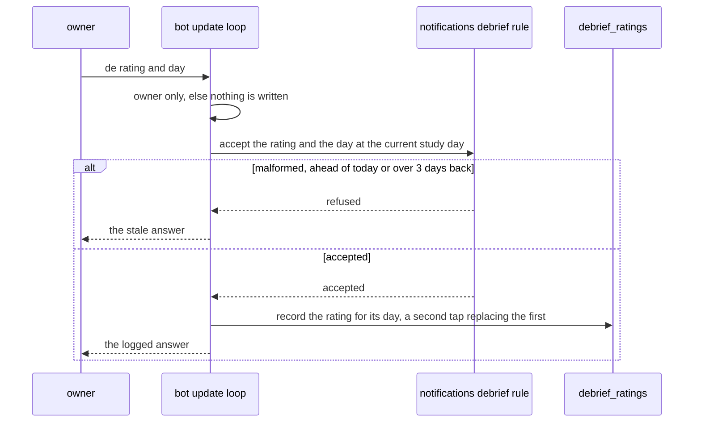

# Schematic: the digest, the weekly report and the debrief

Kind: data flow and sequence. Read at DeckStreak `dev` c8d8a30 and at the predecessor's `27ee2bc`
(`pipeline_layers/digests.py:DigestsLayer`'s `run_daily_digest` and `run_weekly_report`,
`telegram.py:render_daily_digest` and `render_weekly`, `bot.py:CommandBot._callback_debrief` and
`database.py:GamifyStore.session_debrief_readout_line`). Added by the W5 architect turn, under
ADR-108 (the weekly report names this week's stored instrument reports and splices none). SPEC-101
builds it.

It extends five accepted schematics without changing them: `docs/schematics/notification-router.md`
(the decision each message goes through), `docs/schematics/cron-fire-ledger-and-catch-up.md` (the
two jobs' fires and the digest's catch-up), `docs/schematics/bot-update-loop.md` (the loop that
answers a debrief tap), `docs/schematics/insights-instrument-frame.md` (the stored reports the
weekly report names) and `docs/schematics/nudge-coordinator-and-holdout.md` (the holdout the weekly
report settles and reads).

## The digest

The job `daily_digest` runs at the digest hour, minute 6. Coordination gathers each context's
read and passes plain values; notifications renders the text and raises one occasion.

- The body, the Oracle block, the windows line and the debrief row read the target; the law block,
  Road to C2, the habits, the focus, the streak and the level read the current study day, as the
  predecessor's digest does.
- A day never recorded renders no card or queue line, never a zero.

## The weekly report

The job `weekly_report` runs on Sundays at the digest hour, minute 11, without catch-up.

- Each block's read runs on its own: a failed read omits its block, is logged by the block's name,
  and never stops the report.
- The research line names this week's stored reports by registry id, marking a failed read; the
  report runs no instrument.

## A debrief tap

- The readout counts the rated days, and below 42 names the days still needed; it never names a
  percentage.
