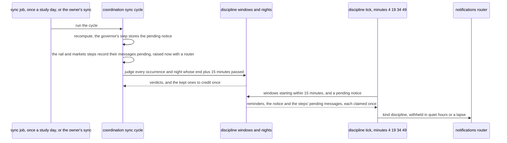
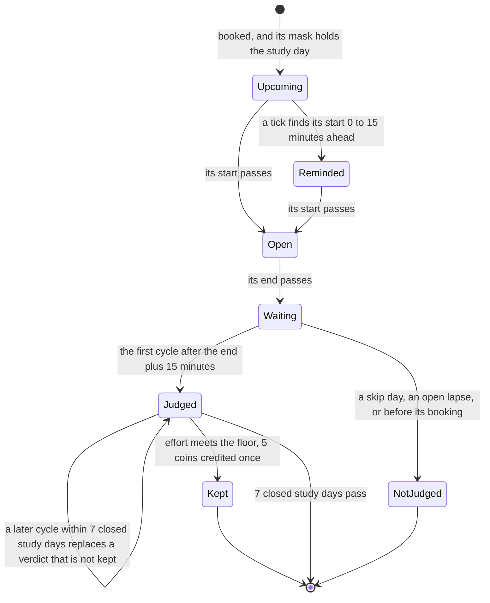
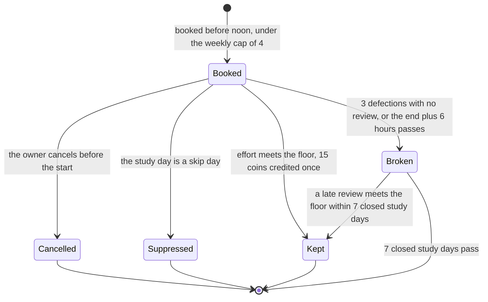
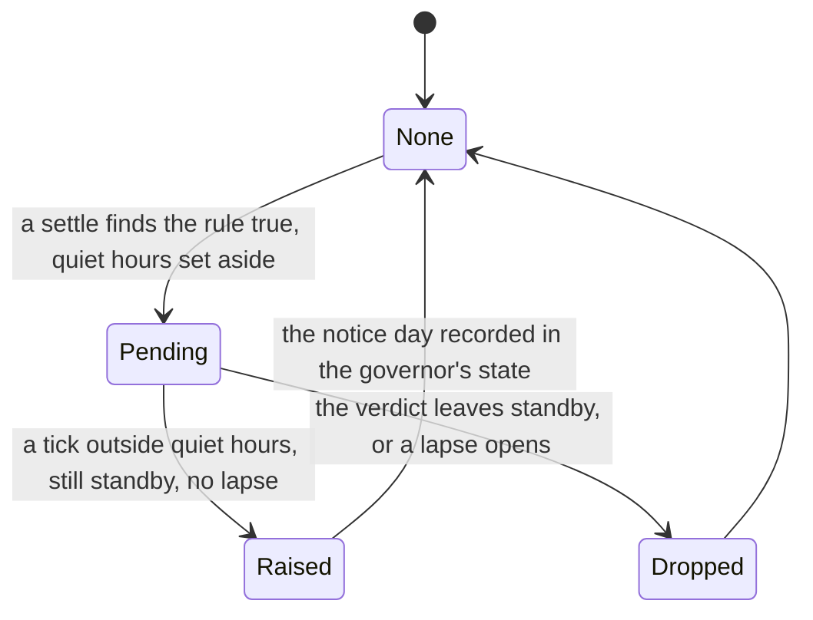

# Schematic: discipline's two clocks, a window's life and the standby notice

Kind: state machine and sequence. Read at DeckStreak `dev` 26263de and at the predecessor's
`27ee2bc` (`windows.py:evaluate`, `pipeline_layers/committed_windows.py`'s
`CommittedWindowsLayer._evaluate_windows` and `_window_reminders`,
`pipeline_layers/discipline.py:DisciplineLayer._settle_hardmode`, and
`pipeline_layers/governor.py:GovernorLayer._update_governor`). Added by the W5 architect turn,
under ADR-105 (a quarter-hourly tick that reads no reviews) and ADR-104 (a verdict settles after
its evidence window). SPEC-105 builds it.

It extends four accepted schematics without changing them:
`docs/schematics/cron-fire-ledger-and-catch-up.md` (the job table and its timers, which gain a
quarter-hourly kind), `docs/schematics/sync-cycle-and-change-gate.md` (the cycle whose recompute
each deadline forces), `docs/schematics/streaks-and-governor-state-machine.md` (the verdict that
enters standby) and `docs/schematics/notification-router.md` (quiet hours withhold a nudge). The
fine's life is `docs/schematics/fine-verdict-and-refund.md`.

## Two clocks

Discipline runs on two clocks. The sync cycle reads reviews and judges; the tick reads none and
only speaks.

- No arrow from the tick reaches ingest: it reads no review, and it never syncs (ADR-037).
- The tick's four minutes are one quarter-hourly schedule of the job table; a zone offset that is a
  multiple of 15 minutes maps the set onto itself.

## One window occurrence

- **Judged** holds `token_effort`, `amber` or `red`; none of them fines, and `red` only records the
  rail's defections inside the window, each already judged by the rail.
- **Kept** is final: a later cycle never replaces it, and its coins are never taken back.

## A hard-mode night

## The standby notice

- The rule is SPEC-076's `standby_notice`: it enters standby from a settled day that was not
  standby, outside a lapse, and not within 7 days of the last notice.
- Raising and recording happen in one write, so two ticks at once raise one notice.
