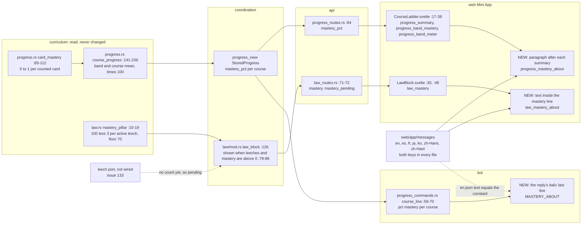
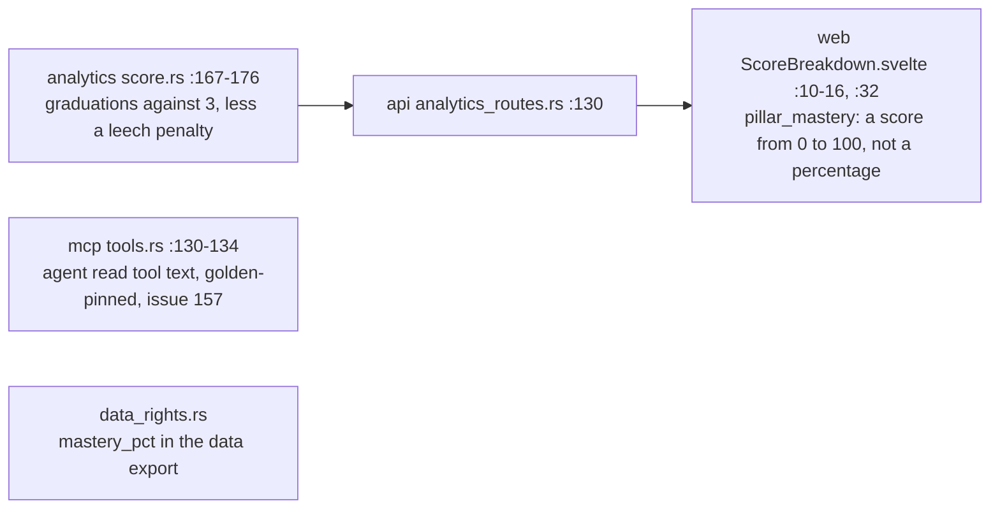

# Each mastery figure, from its computation to its plain description

The data flow of SPEC-408 (ADR-422): each mastery figure the learner sees, from the function that computes it, through the store, the route and the view, to every surface that shows it, and the sentence that now stands beside it. Every `path:line` citation was read at commit `a68db18a`. Nodes marked NEW are what SPEC-408 adds; everything else exists at that commit.

## Data flow

## The surfaces that are not changed

The score pillar is a third measure, shown as a score rather than a percentage. ADR-422 D7 keeps it as it is. The agent read tool and the data export are read by machines, not shown to a reader (ADR-422 D3).

## Each figure, its sentence and what pins it

| figure | computed by | shown on | its sentence's key | locales | pinned by |
|---|---|---|---|---|---|
| course mastery, per course and per band | `card_mastery`, averaged by `course_progress` | Road to C2 (summary and band cells), the bot's progress reply | `progress_mastery_about`, and the bot's `MASTERY_ABOUT`, equal to its English text | all seven | A2 (Road to C2), A3 (every locale), A4 (the bot, its golden and the bot role) |
| law mastery | `mastery_pillar` | the law block's mastery line, when it is shown | `law_mastery_about` | all seven | A1 (the law block), A3 (every locale), A5 (its figures equal the pillar's) |

## Where each sentence sits

- **Road to C2:** `section[aria-labelledby=course-<code>]` holds `h3`, then `p[data-course-summary]`, then the NEW `p[data-mastery-about=course]`, then the band list. It appears once per course.
- **Law block:** `ul` holds `li[data-line=mastery]`, which holds the figure text and then the NEW `span[data-mastery-about=law]`. The pending list holds no sentence.
- **Bot:** the reply is "Road to C2" in bold, one line per course, then the NEW italic course sentence. The no-course and failed replies are unchanged.
