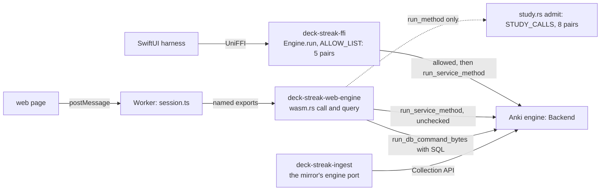
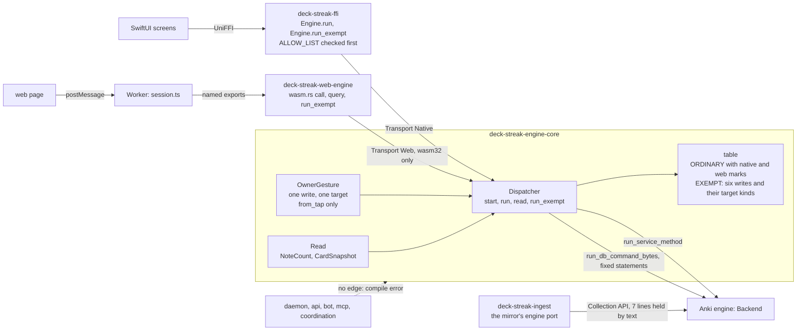
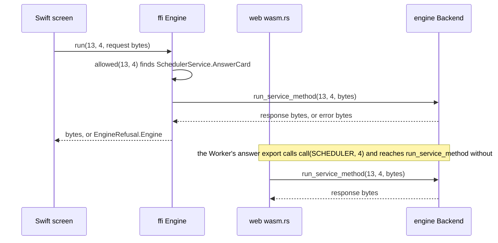
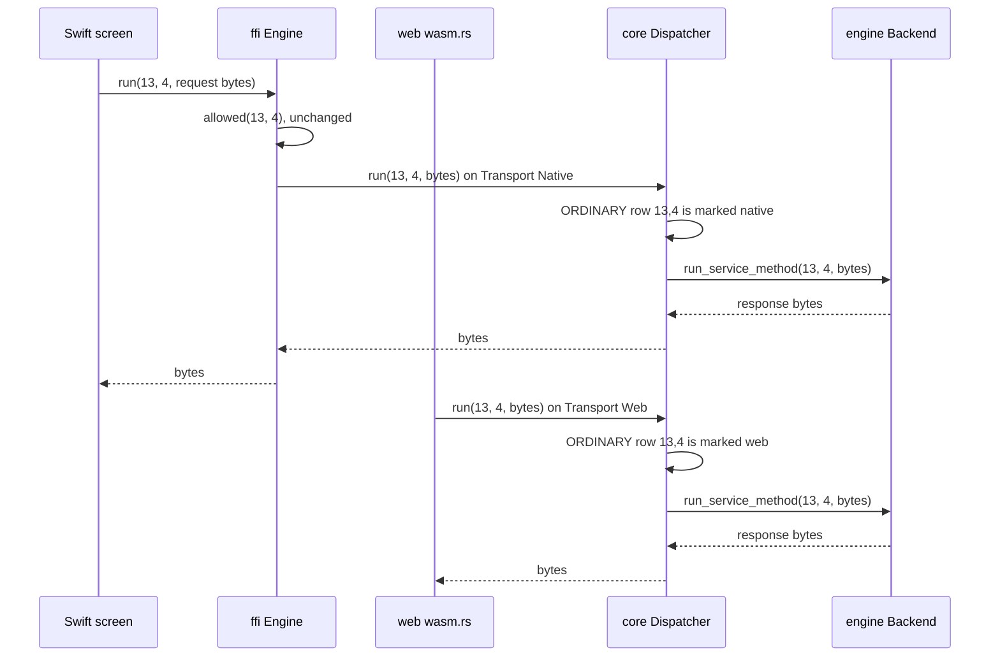
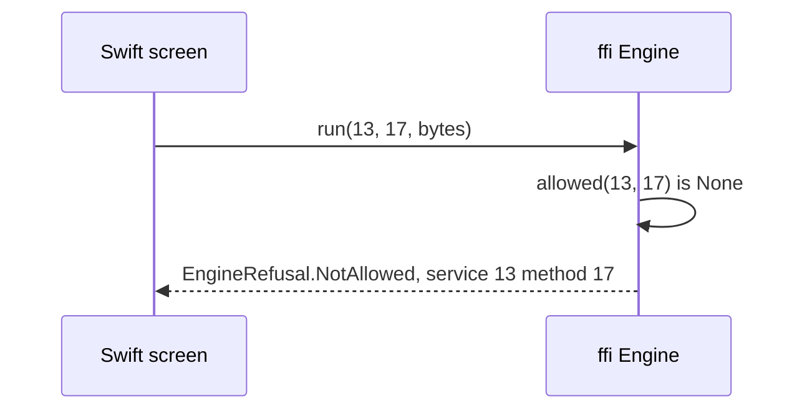
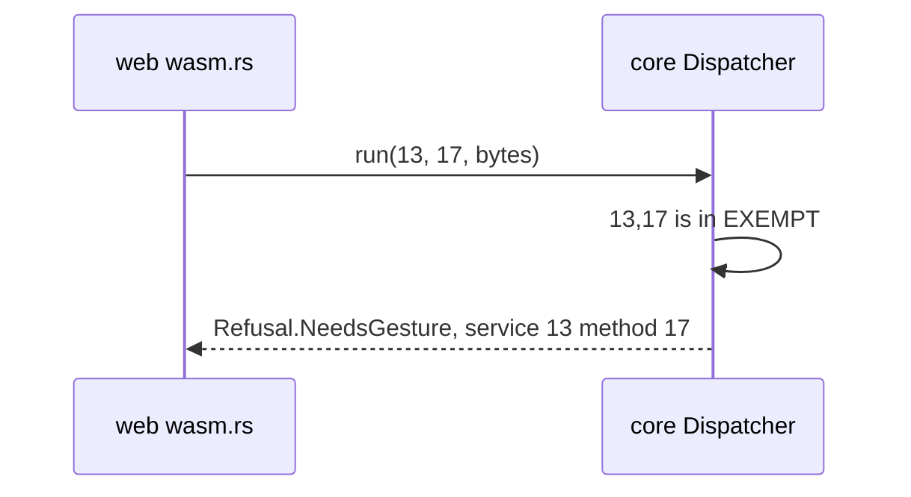
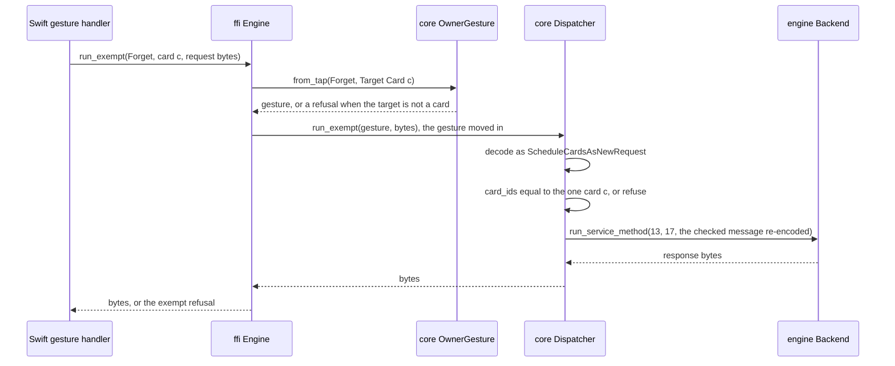
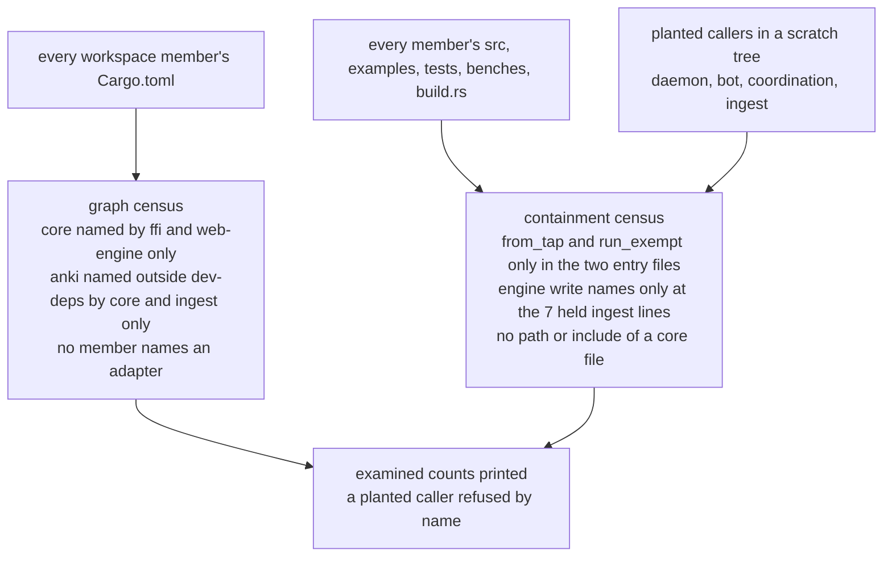

# The engine core: one dispatcher for both clients, and the owner-gesture token

Component diagram and call paths for SPEC-345 and ADR-356. Every `path:line` citation was read
at `dev` `1eec0870e67e801fc3aa279318219d6986116ec7`; the engine's at the pinned fork rev
`c538de55a23e695234e794029fce0dafff2d36a9`.

## Components, before

At `dev`, each adapter holds the engine's `Backend` itself, and the web engine's named exports
reach it without consulting its own table (`crates/web-engine/src/wasm.rs:61-68`, `:74-86`).

## Components, after

The core is the only client-side holder of the engine. Only the two adapters may depend on it, so
only they can name `OwnerGesture::from_tap`; a crate without the edge fails to compile, and the
graph census refuses the edge.

| unit | owns | may not |
|---|---|---|
| `deck-streak-engine-core` | the `Backend`, the ordinary and exempt tables, `OwnerGesture`, the fixed reads | depend on any DeckStreak crate; declare a feature or a `staticlib` |
| `deck-streak-ffi` | the native transport, its allow-list, `EngineRefusal`, the native exempt entry | name `anki` outside its tests |
| `deck-streak-web-engine` | the browser transport, its study calls, the `wasm32` exports | name the core or the engine in its native build |
| `deck-streak-ingest` | the mirror's port over the engine's `Collection` API | add an engine write line the containment census does not hold |
| every other member | nothing of the engine | name the core, the engine or an adapter |

## An ordinary call: AnswerCard, (13,4)

Before, on each transport:

After:

A pair the transport's column lacks returns `Refusal.NotAllowed` before the engine is reached; the
native adapter's own `allowed()` refuses it first, with the text `tests/refusal_text.rs` pins.

## An exempt call: Forget, (13,17)

Before: no exempt path exists. The native allow-list refuses (13,17) as `NotAllowed`; the web engine
has no export for it, and `run_method` refuses it (`crates/web-engine/tests/study.rs:81`). Any crate
that names `anki` could still call the engine's `Collection` API for it directly.

After part 1: the ordinary path holds it for a gesture.

After part 2: the owner's tap, through the adapter's one exempt entry.

A request whose `card_ids` is empty, names another card, or names `c` and another is refused at the
check, and the engine never sees it. A daemon, bot, coordination or API caller has no edge to the
core, so it cannot name `from_tap` at all; the containment census refuses an added edge, a
`#[path]` or `include!` of a core file, and a new engine write line, each by name.

## The containment census's population

