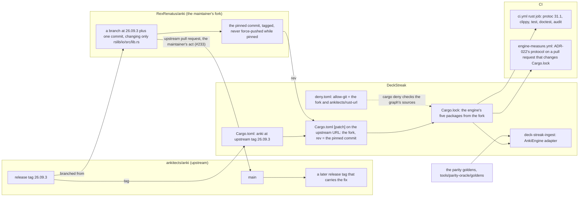
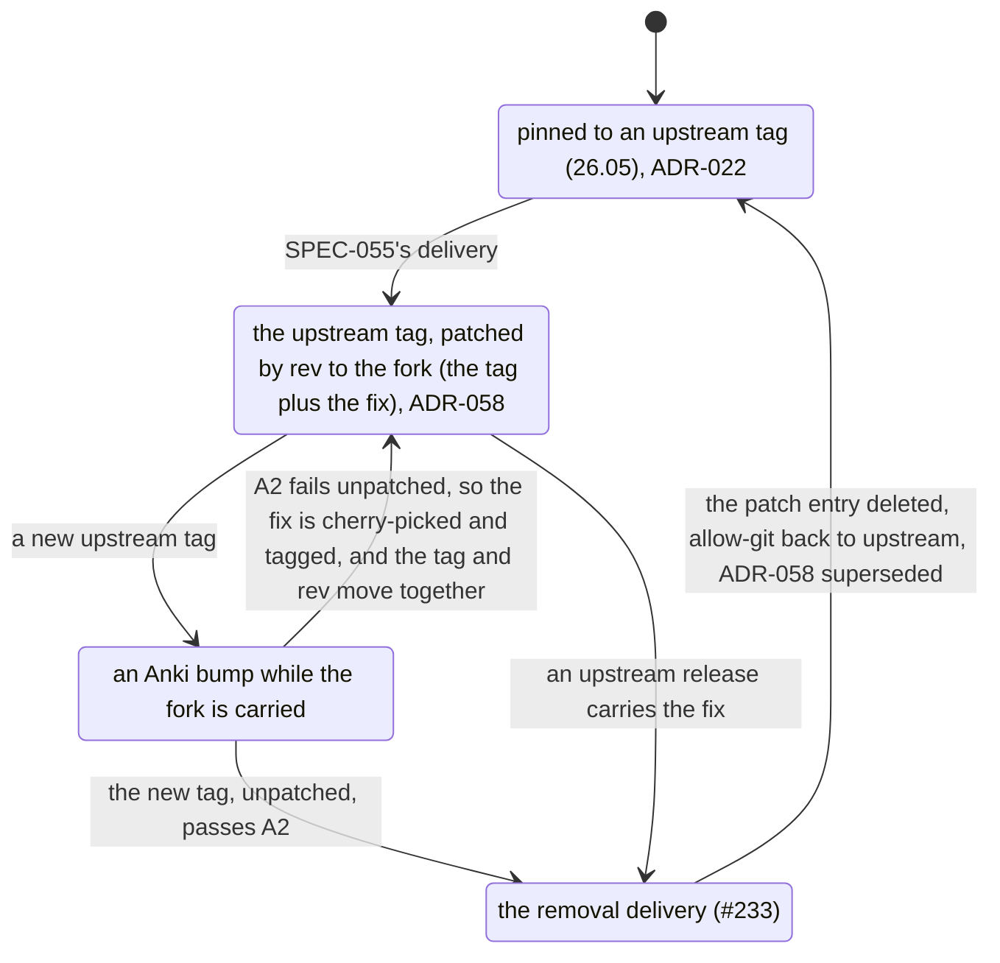

# Schematic: the engine pin's lifecycle, from an upstream tag to a patched fork and back

Kind: component and data flow, then a state machine. Read at DeckStreak `dev` c0dbf2a
(`Cargo.toml`, `deny.toml`, `.github/workflows/ci.yml`, `.github/workflows/engine-measure.yml`,
`tools/parity-oracle/`) and at Anki's tags `26.05` and `26.09.3`. Decided by ADR-058, which amends
ADR-022's pin rule; built by SPEC-055.

## Where the engine comes from, and what reads the pin

The goldens do not depend on the engine: the generator never imports it (SPEC-055 §1).

## The pin's states

Every transition into a pinned state re-runs ADR-022's protocol in `engine-measure.yml` and
SPEC-022's criteria.

## What each check guards

| check | when it runs | what it proves |
|---|---|---|
| SPEC-055 A1 | the gate's python stage | the dependency names the upstream tag, the `[patch]` entry points at a commit of the fork by `rev`, the lockfile's engine packages come from that commit, and `allow-git` is exactly the fork and `rust-url` |
| SPEC-055 A2 | the gate's python stage, against the workspace's own target | a second build of `deck-streak-ingest` compiles nothing: the pinned commit carries the fix. Unpatched, the same test is the removal check |
| SPEC-055 A3 | the gate's python stage | every advisory exception and allowed git source in `deny.toml` is still in the graph |
| SPEC-055 A5 | the gate's python stage | ADR-058 records the pinned commit, its one-file difference from the tag, and what it saves |
| SPEC-022 A1 | the gate's python stage | ADR-009's Confirmation names the pinned tag, and its latest record holds ADR-022's budgets |
| ADR-022's protocol | `engine-measure.yml`, on the pull request that changes `Cargo.lock` | every budget holds at the new pin |
| SPEC-022 A15, A16 | the gate's test stage | the recording server sees no upload and no local change at the new pin |
