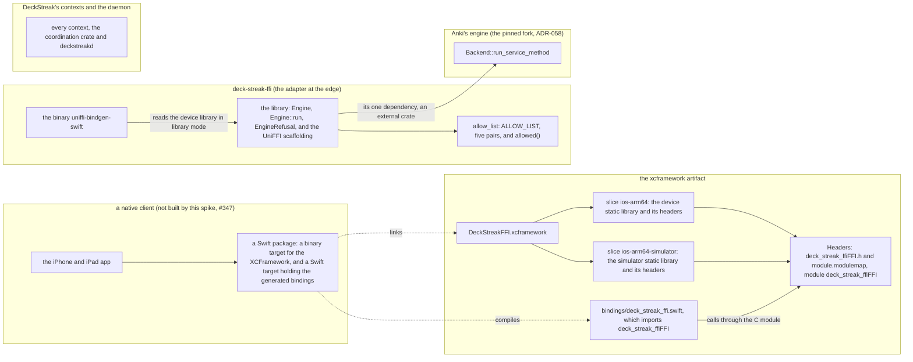
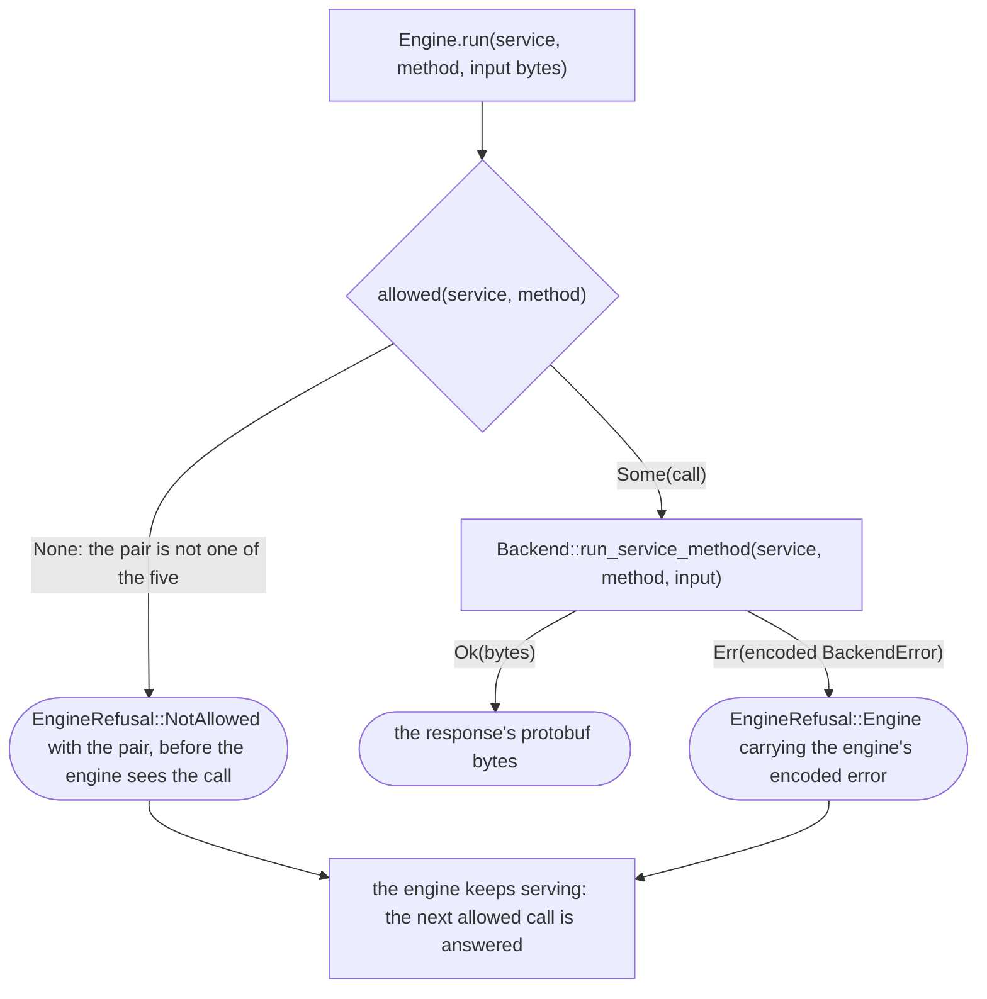
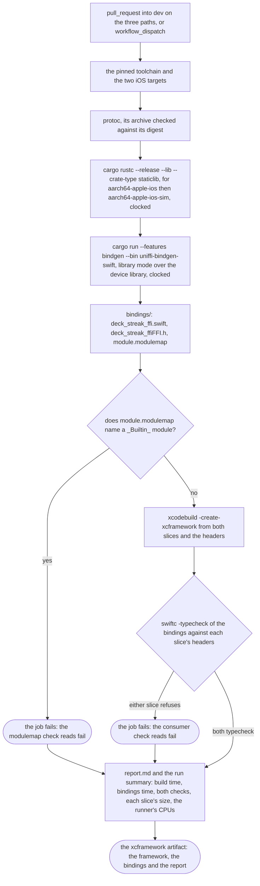
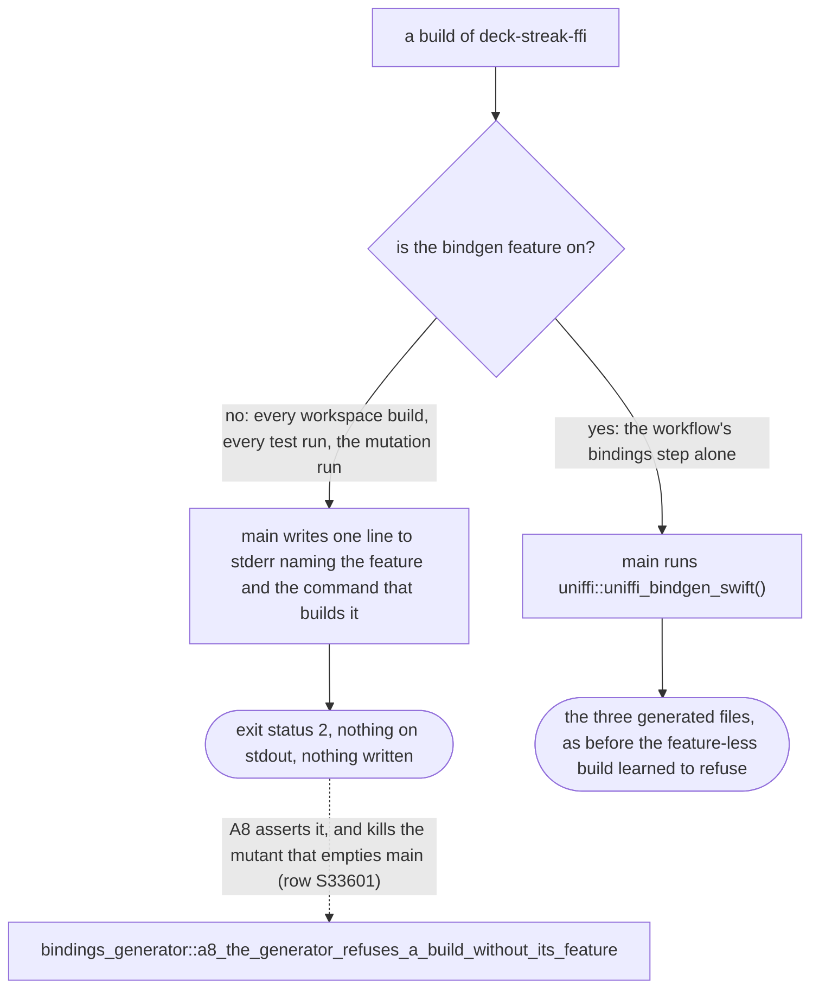
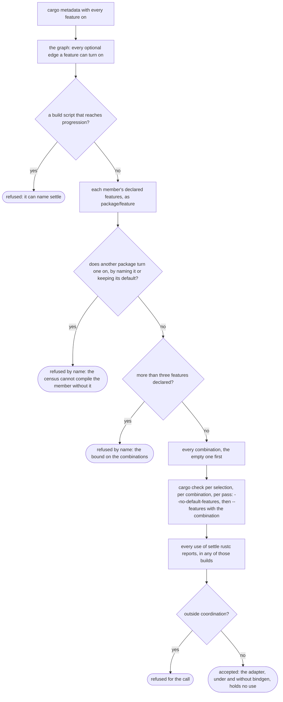

# Schematic: the FFI adapter, its XCFramework build and the Swift package that would consume it

Kind: component, then two data flows (one call, one build), then the generator's two builds. Read
at DeckStreak `spike/ffi-umbrella-336` (`crates/ffi/Cargo.toml`, `crates/ffi/src/lib.rs`,
`crates/ffi/src/allow_list.rs`, `crates/ffi/src/engine.rs`,
`crates/ffi/src/bin/uniffi-bindgen-swift.rs`, `crates/ffi/tests/bindings_generator.rs`,
`.github/workflows/xcframework.yml`, `docs/CONTEXT-MAP.md`). Decided by ADR-345; built by
SPEC-336. The Swift package is drawn, dashed, as the consumer the framework is shaped for: SPEC-336
section 5 writes no Swift, no Xcode project and no client (#347).

## The components, and the one edge the adapter has

`deck-streak-ffi` depends on the engine and on no crate of this workspace (R4, ADR-345 D1). The
daemon does not compose it: a native client links it into its own binary.

No arrow joins `ds` and `ffi`: the context map's line for the adapter reads `depends on: nothing`,
and the ddd probe holds the manifest equal to it.

## One call, from the client to the engine and back

The five pairs: (3, 0) `OpenCollection`, (7, 13) `GetDeckNames`, (13, 3) `GetQueuedCards`,
(13, 4) `AnswerCard` and (3, 8) `Undo` (R2). A1 to A6 round-trip each one, and refuse four
unlisted pairs, on a synthetic collection the test builds.

## One build of the XCFramework

`xcframework.yml` runs on a pull request into `dev` that changes `crates/ffi/**`, `Cargo.lock` or
the workflow itself, and on a dispatch, on a macOS runner the hardening test admits to this file
alone (R9, A7). Every step that fails stops the job; the report and the upload run regardless.

## The generator's two builds

The generator is the adapter's own binary, so its bindings come from the bindings crate the library
links (ADR-345 D3). Every build of the crate builds the binary, and only the `bindgen` feature puts
the generator's code in it (ADR-345 D5, R10).

Neither arm is a function of its own: `main` holds both, each a statement behind its `cfg`, so
cargo-mutants lists one mutant for the binary, `replace main with ()`, and the default-feature
mutation run builds the arm that mutant changes. A function behind `cfg(feature = "bindgen")` would
be listed, never built, and read missed.

## The settle census and the adapter's feature

The settle census is progression's test of its own invariant, that only coordination settles
(SPEC-072, ADR-197). It refused every member that declared a feature, because it compiled none,
so the adapter's `bindgen` feature made it refuse the real tree. It now compiles every build the
members' features allow (ADR-345 D6, R11) and judges the adapter's code as it judges any member's.

A member whose feature another package turns on is refused rather than compiled, because that
feature is on in every workspace build, so code under its absence would be compiled in no pass,
though a build of the member alone compiles it. The census admits no member by name.

## Amendment: where the build is triggered (SPEC-344, ADR-355)

The pull-request trigger described under "One build of the XCFramework" now lives in
`apple-on-change.yml`, which calls `xcframework.yml` and also watches `ios/**`, `Cargo.toml` and
`rust-toolchain.toml`. A run on every release tag is added by `apple-on-tag.yml`, which calls the
same job body. `xcframework.yml` itself takes `workflow_call` and `workflow_dispatch`. See
`apple-build-on-change-and-on-tag.md`.

## Amendment: the call's spelling (SPEC-344, ADR-355)

The CCALL and TCALL labels and the edge label above read `uses $/.github/workflows/xcframework.yml`
and `"$/.github/workflows/FILE"`, the self-repository form; their endpoints are unchanged.
