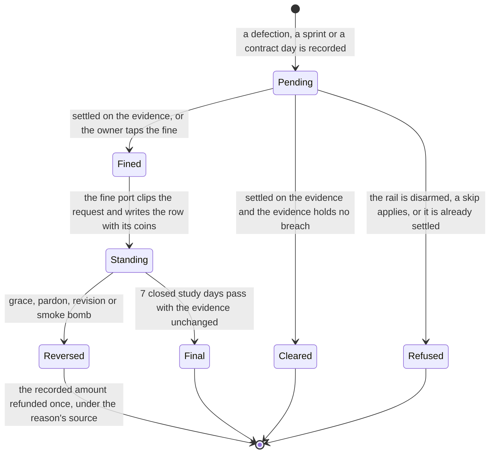
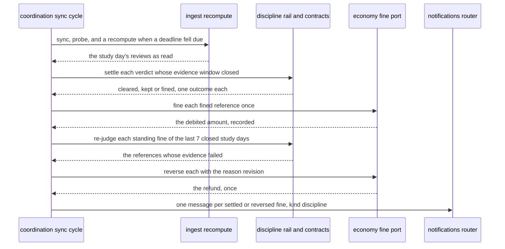

# Schematic: a fine's verdict, its settlement, its revision and its one refund

Kind: state machine and sequence. Read at DeckStreak `dev` 26263de and at the predecessor's
`27ee2bc` (`pipeline_layers/tripwire.py:TripwireLayer.book_defection_fine`,
`_resolve_sprints_and_fines`, `_grace_defection`, `confess`,
`pipeline_layers/discipline.py:DisciplineLayer._settle_contracts` and `pardon_latest_breach`,
`pipeline_layers/economy.py:EconomyLayer._debit_fine`, and `database.py:GamifyStore.insert_penalty`
and `reverse_penalty`). Added by the W5 architect turn, under ADR-103 (one fine port) and ADR-104
(a verdict is provisional until its evidence settles).

It extends three accepted schematics without changing them:
`docs/schematics/sync-cycle-and-change-gate.md` (the cycle whose recompute each deadline forces,
SPEC-023 R10 and R12), `docs/schematics/streaks-and-governor-state-machine.md` (the governor whose
armed state licenses every fine) and `docs/schematics/skip-day-record-and-effects.md` (the skip
that clears a study day's fines). The wallet's clip and cap are SPEC-082's.

## One fine's life

A fine starts as a verdict of a discipline feature and ends standing or reversed. Its row is
economy's (SPEC-103); what makes it stand or fall is its feature's (SPEC-104, SPEC-106, SPEC-108).

- **Pending** lasts until the first sync cycle that begins after the evidence window: a sprint's
  deadline plus 15 minutes, an unanswered defection's instant plus 45 minutes, a contract day's
  close. Nothing is fined while a verdict is pending.
- **Standing** records the debited amount, which may be 0 when the loss cap or the floor forgives
  the whole request. A reversal refunds the recorded amount, so it never mints coins.
- **Reversed** is terminal: a retried verdict of the same reference writes nothing (SPEC-103 R7).
  The rung, a chest lock and a surcharge the fine set stand after it.

## Settlement and revision in one sync cycle

- The recompute runs because each open deadline is registered with the obligation port, so a
  cycle that finds no change in the collection still serves it.
- The order within the rail's step is the settlement, the revision, the de-escalation, the canary
  and the free spin's confirmation (SPEC-104 R21). A contract day settles in the same step
  (SPEC-106).

## Who reverses a fine

| reason | coin source | raised by | when |
|---|---|---|---|
| `grace` | `grace_refund` | the rail (SPEC-104) | the defection's app was closed within 60 seconds |
| `revision` | `revision_refund` | the rail and the contracts (SPEC-104, SPEC-106) | the evidence failed within 7 closed study days |
| `pardon` | `pardon_refund` | the contracts (SPEC-106) | the owner's monthly pardon of a breach within 48 hours |
| `smoke_bomb` | `smoke_bomb_refund` | the smoke bomb (SPEC-108) | the owner spends a bomb on a study night with standing fines |
