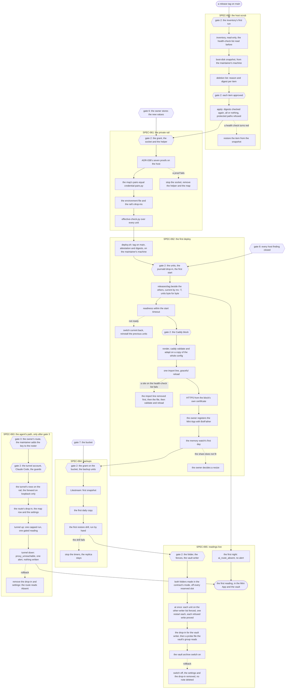
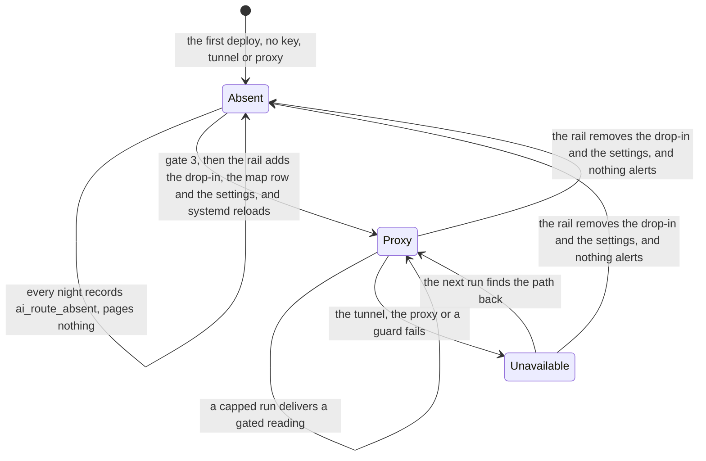
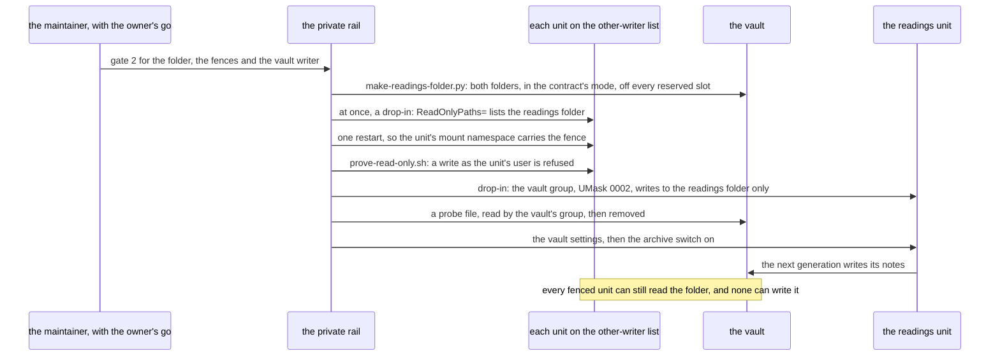

# Schematic: the first deploy, gate by gate

Kind: sequence and data flow. Read at DeckStreak `dev` 16ed8e2, with this change's own edits of
SPEC-053, ADR-053 and RELEASING.md. It draws W2's six units (SPEC-060 to SPEC-065) in the order they
run, every owner gate they wait for, the rehearsal each gate sees before it says go, and the
rollback of every change. The exact commands, names, paths and the private rail's lists are in the
maintainer's private gate packet; this page names each step only. What each step reads:

| step | reads | path:line |
|---|---|---|
| gates | every first-time change on the host is an owner gate | `docs/decisions/ADR-010-deployment-backup-and-secrets.md:20` |
| no-AI first deploy | the first deploy needs no key, tunnel or proxy; the agent's path and the first live reading wait for gate 3 | `docs/decisions/ADR-054-the-ai-route-is-optional-and-no-ai-mode-is-the-default.md:64-67` |
| side by side | side by side, contract by contract, until the owner's go at cutover | `docs/decisions/ADR-011-cutover-side-by-side.md:29-34` |
| credentials | the seven rehearsal proofs on the host | `docs/decisions/ADR-038-credentials-come-from-the-secret-manager-at-unit-start.md:86-94` |
| the grant | the host's grant, on each named secret only, decided at gate 2 | `docs/decisions/ADR-038-credentials-come-from-the-secret-manager-at-unit-start.md:64` |
| the Caddy block | one site block, the API on loopback | `docs/decisions/ADR-007-hosting-and-https-behind-a-caddy-site-block.md:31-38` |
| the Caddy template | its placeholders and headers | `docs/specs/SPEC-032-deploy-templates.md:63-72` |
| the neutral values | the rail replaces them at deploy | `docs/decisions/ADR-032-deploy-templates-and-the-host-budget.md:30` |
| the deploy | tag on `main`, digests, side by side, `current`, readiness | `RELEASING.md:63-74` |
| the tunnel and the key | owner gates 3 and 2 | `docs/decisions/ADR-015-ai-agent-runtime-and-proxy-reach.md:42-43` |
| the route's drop-in | the route setting, the base URL and the key's credential line | `docs/specs/planned/SPEC-053-readings-jobs.md:87-92` |
| one writer | the vault archive switch stays off until the owner's go makes DeckStreak the readings folder's one writer; SPEC-053 R8 cites ADR-065, which decides how | `docs/decisions/ADR-053-readings-slots-settle-after-sync-and-one-writer.md:49-51`, `docs/specs/planned/SPEC-053-readings-jobs.md:80-84` |
| the folder | the adapter refuses a missing or unwritable readings folder and never creates it | `docs/specs/SPEC-042-vault-adapter-core-and-readings-date-tree.md:40-44` |
| the replica | Litestream 0.5, 24 h interval, 48 h retention, inside `P3D` | `docs/specs/SPEC-021-data-rights-export-and-erase.md:67-69` |
| the drill's debt | the restore drill proves the replica | `docs/specs/SPEC-027-scheduler-and-cron-fire-ledger.md:225-227` |
| the disk's debt | the headroom a full download needs is the inventory's to measure | `docs/specs/SPEC-022-ingest-sync-engine-spike-and-sync.md:257-259` |
| the runner's live proof | the agent's path is the runner's live proof | `docs/decisions/ADR-043-shell-runner-pack-gate-and-duty-caps.md:58-59` |

## 1. The order of W2

Hexagons are owner gates; dotted arrows are rollbacks. Gate 8 comes before the first deploy: every
host finding tracked privately is closed first (#167). Gate 3's branch (SPEC-063) runs when the
owner chooses the subscription route, and nothing before it waits on it. "The health-check list",
"the reserved slots" and "the other-writer list" are the private rail's lists.

## 2. The AI route lands without a redeploy

The release installed by SPEC-062 already carries the runner and the readings unit; only the rail's
drop-in and settings change which state the unit starts in (SPEC-063 R9).

| state | the unit loads | a night records | pages |
|---|---|---|---|
| Absent | no device key | `ai_route_absent` per topic | never |
| Proxy | `agent-device-key` from the socket | a gated reading, or a closed failure | once per failed run |
| Unavailable | `agent-device-key` from the socket | `unavailable` with its closed cause, nothing written | once per failed run |

## 3. One writer of the readings folder

## 4. Every gate, its rehearsal and its rollback

| gate | issue | what W2 asks of it | the rehearsal it sees first | the rollback |
|---|---|---|---|---|
| 2 | #161 | the inventory, the snapshot, each deletion (SPEC-060) | the inventory's commands; the list's digests | restore from the snapshot |
| 2 | #161 | the grant, the socket, the helper, the drop-ins (SPEC-061) | ADR-038's seven proofs; the pairs; the effective check | remove the socket, the helper, the map and the drop-ins |
| 2 | #161 | the units, the journald drop-in, the first start, the Caddy block (SPEC-062) | `systemd-analyze` over the units; `caddy validate` and `caddy adapt` on a copy | `deploy/rollback.sh`; the Caddy import line, then the file |
| 2 | #161 | the backup units and the first drill (SPEC-064) | the bucket's settings read back; the first drill by hand | stop the timers |
| 2 | #161 | the folder, the fences, the vault writer, the switch (SPEC-065) | the folder's modes; each refused write; the probe read by the vault's group | the switch off; a fence's drop-in removed |
| 2 | #161 | the tunnel account, Claude Code, the guards (SPEC-063) | `sshd -t` and `sshd -T -C`; the tunnel's rows; the guard check | remove the account's key and the drop-in; remove the package |
| 3 | #162 | the route, and the key in the roster (SPEC-063) | the live proof, tunnel up and tunnel down | the route's drop-in removed; the maintainer removes the key |
| 6 | #165 | the owner's user id, and the device key (SPEC-061, SPEC-063) | each secret's existence, by name | the owner disables the version |
| 7 | #166 | the bucket (SPEC-064) | public access prevention, uniform access, no public principal, soft delete off | delete the empty bucket |
| 8 | #167 | every host finding tracked privately closed before the first deploy (SPEC-062), and no name carrying the host's address used while any is open | each close-out with its measurement, in the maintainer's private notes | none: the deploy waits |
