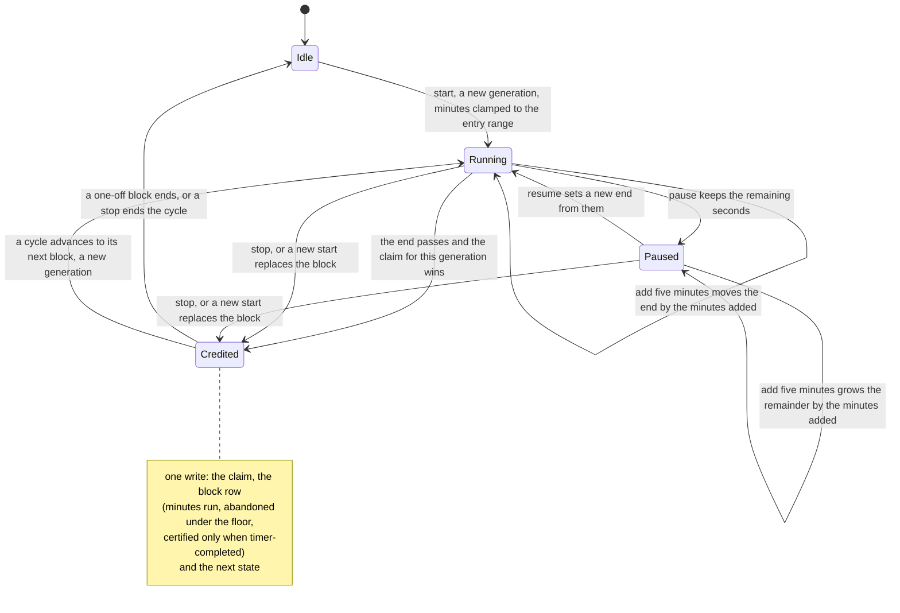
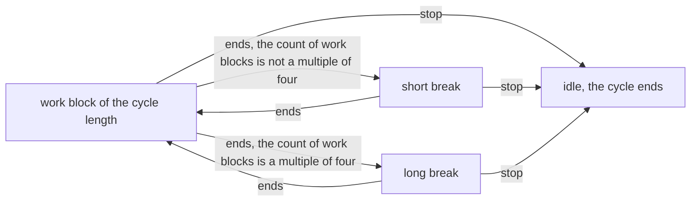
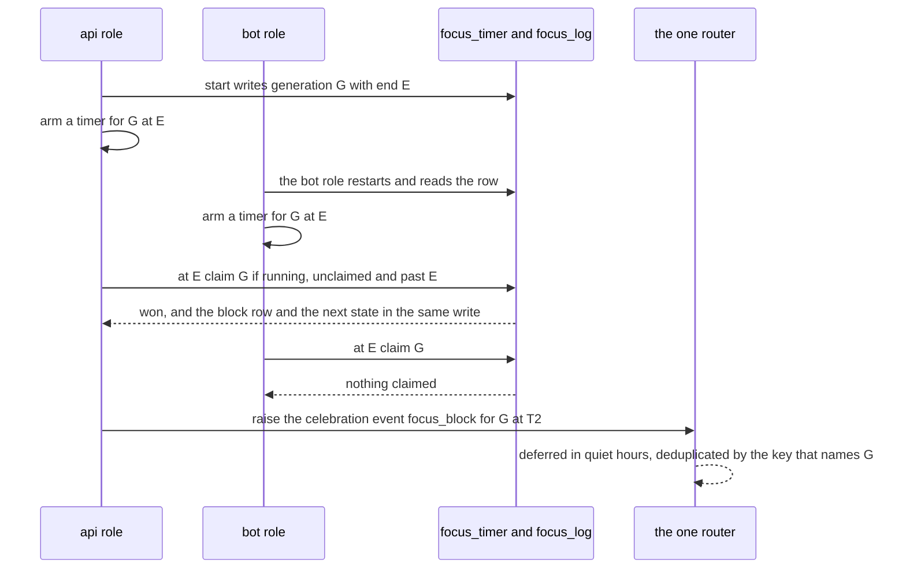
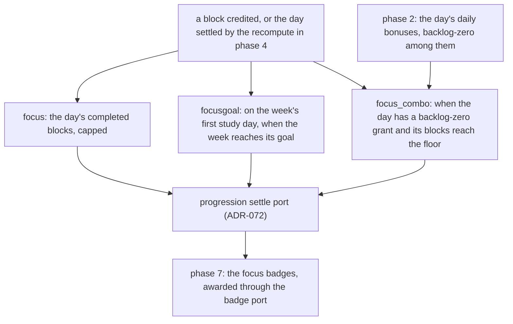

# Schematic: the focus timer, its claim and its cycle

Kind: state machine. Read at DeckStreak `dev` c3d769b and at the predecessor's `27ee2bc`
(`focus.py`; `bot.py:CommandBot`'s focus methods, from `start_focus` to `_rearm_focus_timer`;
`pipeline_layers/focus.py:FocusLayer`; `database.py:GamifyStore.mark_focus_timer_fired`). Added by
SPEC-079 (ADR-079).

## The timer row

One row, `focus_timer`. Every start writes a new generation (`block`), so a timer armed for an older
generation can claim nothing. The claim, the block's `focus_log` row and the next state commit in
one write, so "claimed" is never a resting state: the row leaves it in the same transaction.

## The cycle

Lengths and rule from `goldens/focus_cycle_advance.json` and `goldens/focus.constants.json`.

## Two roles, one block

Each long-running role arms a timer for the running block when it starts and whenever it writes the
row. Both may fire; the claim decides.

## What a role does at start

The predecessor's restart decision (`goldens/focus_rearm.json`), under ADR-079's one-write claim:

| the row | the role |
|---|---|
| idle | arms nothing |
| paused | arms nothing; resume arms |
| running, end already passed | claims and credits the block once (the catch-up), then advances a cycle |
| running, end still ahead | arms a timer for the rest |
| claimed but not credited | cannot occur: the claim and the credit are one write |

## Focus XP, after each block and at each recompute

The recompute's focus XP step is registered in phase 4 of SPEC-071's fold, after phase 2 settles the
day's daily bonuses, and its focus badge step in phase 7.

