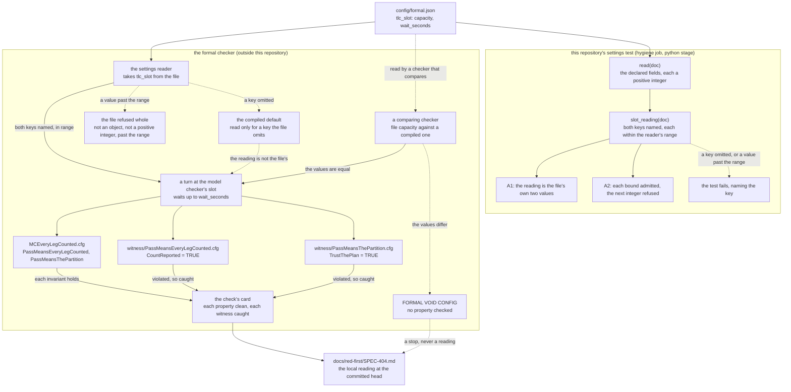

# The formal check's settings: from the settings file to the witness kill

- **Kind:** data flow.
- **Read at:** the development branch's commit `32f6217`; every `path:line` below is at that commit.
- **Decided by:** ADR-418 (SPEC-404, issue #703). It amends nothing; SPEC-295 and ADR-295 keep their
  own sections and gain the insert-only notes SPEC-404 R3 names.

## The flow

The settings file is the one place the slot setting is stated. Two readers take it: the formal
checker, outside this repository, which turns it into the model checker's slot and runs the model
and its witnesses; and this repository's settings test, which holds the file to the reading the
checker's reader takes. Solid edges are the agree path; dotted edges are the ways the two readings
can part, each ending where it is observed.

## Agree and disagree

| case | the settings test | the formal checker | observed by |
|---|---|---|---|
| both keys named, each a positive integer within the reader's range | admits it; the slot reading is the file's own two values | reads the file's own two values, takes a turn, runs the model and both witnesses | A1 and A2 green; the local check's card |
| `tlc_slot` or one of its keys omitted | refuses it by the slot rule, naming what the file does not name | reads its compiled default for the omitted key, so the reading is no longer the file's | A1, before any check runs |
| a value past the reader's range (a capacity above 4294967295, a wait above 18446744073709551615) | refuses it by the slot rule's range arm, naming the key | refuses the file whole; no model runs | A2, before any check runs |
| a value that is not a positive integer | refuses it by `read`, as before this delivery | refuses the file whole | SPEC-295's planted faults |
| a checker that compares the file's capacity with a compiled value that differs | admits the file | reads `FORMAL VOID CONFIG`; no property is checked | only the local check (SPEC-404 section 4), which stops on it |

## Where each step lives

| step | where, at `32f6217` |
|---|---|
| the setting | `config/formal.json:26-29` |
| the test's expected table, field table and integer rule | `scripts/tests/test_formal_config.py:45`, `:58-59`, `:125-126` |
| the test's reader | `scripts/tests/test_formal_config.py:150-189` (`read`) |
| the slot rule | `scripts/tests/test_formal_config.py`, `slot_reading`, added by SPEC-404 |
| the job that runs the test | `.github/workflows/ci.yml:298` (`hygiene`), its step at `:351`; `scripts/check.sh:178-195` (the `python` stage, discovery at `:186`) |
| the model and its configuration | `formal/tla/EveryLegCounted/EveryLegCounted.tla`, `formal/tla/EveryLegCounted/MCEveryLegCounted.cfg` |
| the witnesses | `formal/tla/EveryLegCounted/witness/PassMeansEveryLegCounted.cfg`, `formal/tla/EveryLegCounted/witness/PassMeansThePartition.cfg` |
| the entry's register lines | `formal/tla/EveryLegCounted/EveryLegCounted.tla:68-77` |
| the row on the setting | `S29530` in `scripts/mutation-rows.d/S29500-S29599.json` |
| the rows on the slot rule | `scripts/mutation-rows.d/S40400-S40499.json`, added by SPEC-404 |

The formal check is a local check: a search of `.github/workflows/` at `32f6217` for `formal` finds
no line. So the checker's half of this flow is read only by a local check, and its reading is recorded
in `docs/red-first/SPEC-404.md`.
