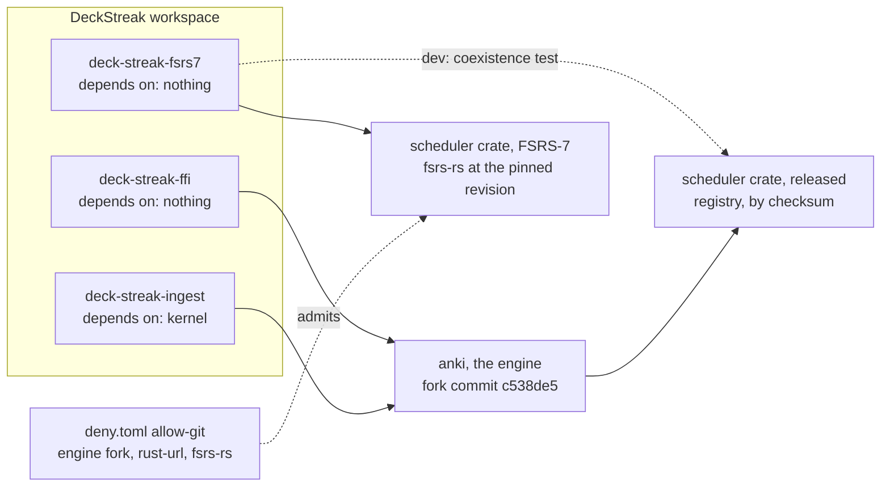
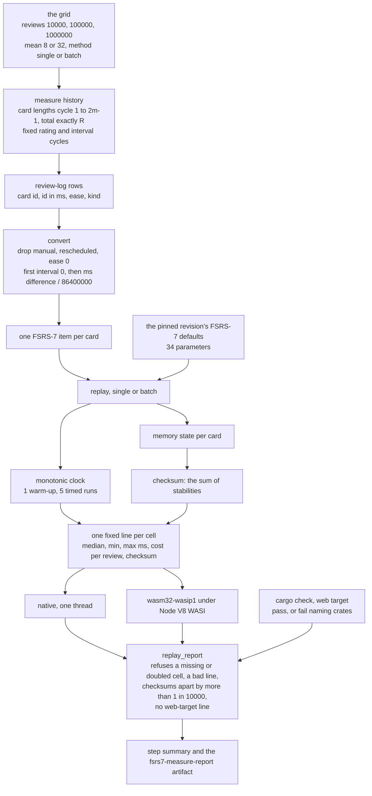
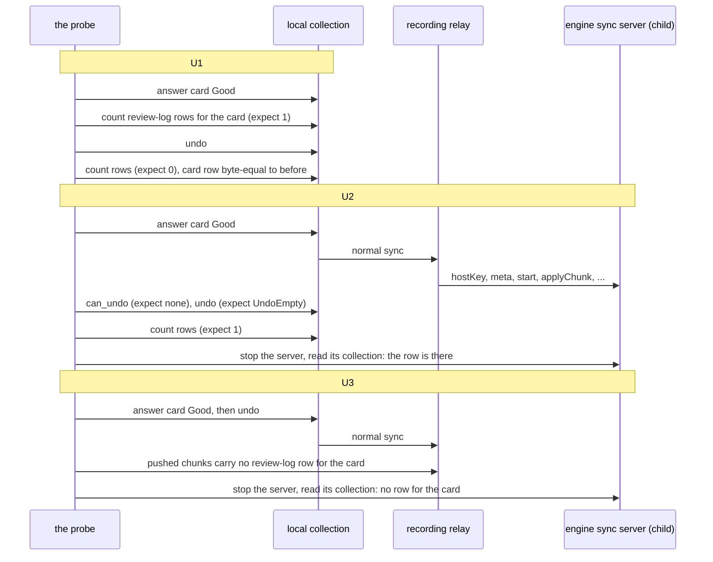
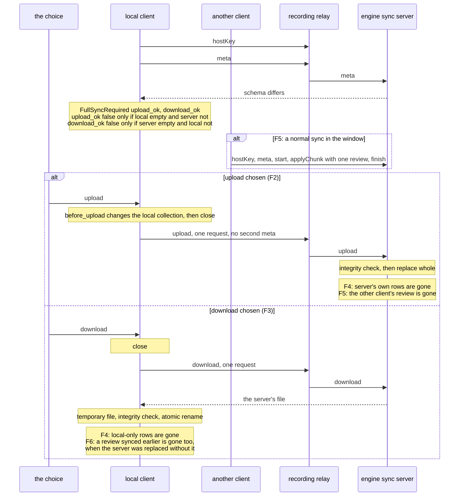
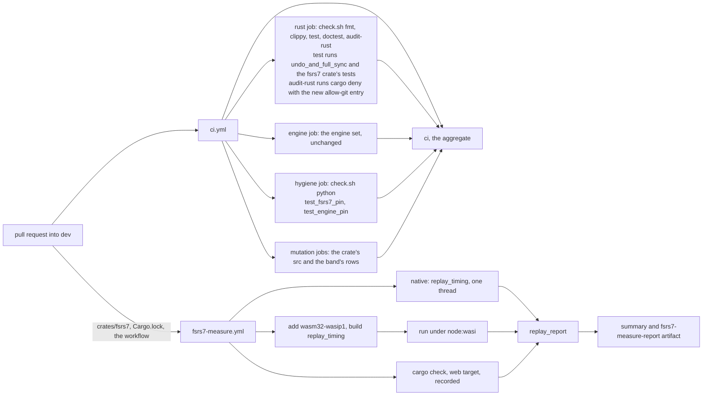

# FSRS-7 replay, the undo probe and the full-sync choice path (SPEC-342, ADR-353)

Read at DeckStreak `dev` 1eec0870 and at the engine's fork commit c538de5, the commit the workspace's
`[patch]` entry pins. Every `rslib/...:line` below is read at c538de5, whose native code at each of
those lines is the earlier pin's, 57382da (ADR-058's note). The pinned FSRS-7 revision is
`4bc0a0979f95dd01cc653031b6f2a01429e4c32b`, and its facts are re-read there by the build
(ADR-353).

## 1. Where the crate sits (component)

The scheduler crate is a context with no DeckStreak edge. Its one external dependency is the
pinned revision, and the engine keeps the released crate. Dev-dependencies are drawn dotted: they
are not context edges.

## 2. The replay (data flow)

History goes in. Memory state, a checksum and timings come out. Within a card, the history is
taken in id order.

## 3. The undo probe (sequence)

U1 runs with no server. U2 and U3 run against the engine's own server, started by the test; the
recording relay sits in front of it. The engine's undo of an answer removes its row
(`rslib/src/revlog/undo.rs:14-17`). A normal sync empties the queue as it starts
(`rslib/src/sync/collection/normal.rs:85-86`, `rslib/src/undo/mod.rs:228`).

## 4. The full-sync choice path (sequence)

The choice is offered at the `meta` answer (`rslib/src/sync/collection/meta.rs:70-78`). The
upload changes the local collection, closes it, and sends one request
(`rslib/src/sync/collection/upload.rs:44-69`). The server checks integrity and replaces its
collection (`rslib/src/sync/collection/upload.rs:73-104`). The download closes the local
collection, fetches to a temporary file, checks it and renames it into place
(`rslib/src/sync/collection/download.rs:21-44`).

What the probe records for the choice's TLA+ model, which the full-sync choice's own delivery
writes first (SPEC-334 section 9):
- the actions, as the requests each choice sends (F2, F3);
- the window, the gap between the `meta` answer and the write, where nothing re-checks the
  server (F5);
- the losses, as id differences, not counts of unsynced rows (F4, F6).

## 5. The CI job graph

`fsrs7-measure.yml` is a workflow of its own, after `engine-measure.yml`'s pattern:
- a read-only token;
- actions pinned by full commit;
- no secret;
- the pull request's concurrency group.

It compiles neither the engine nor protoc, so it needs neither. `ci.yml` changes no job: the
probes enter the `test` stage, and the crate enters every stage that runs over the workspace.
