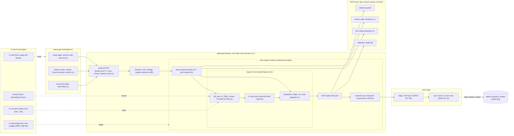
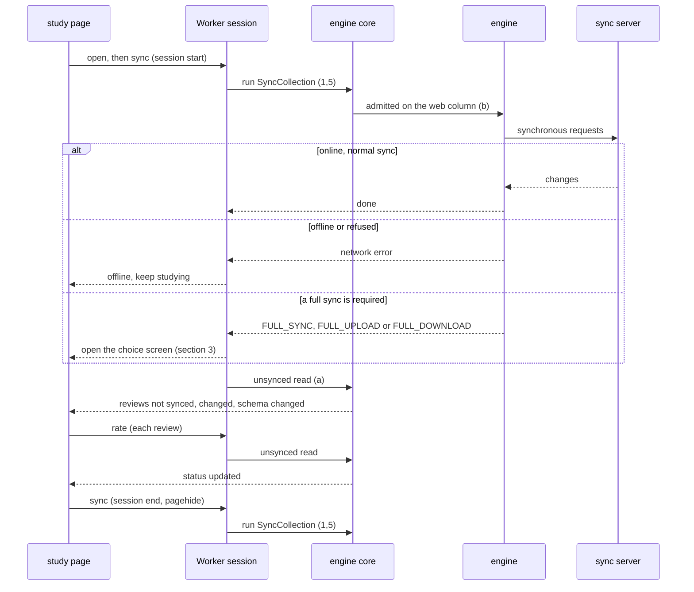
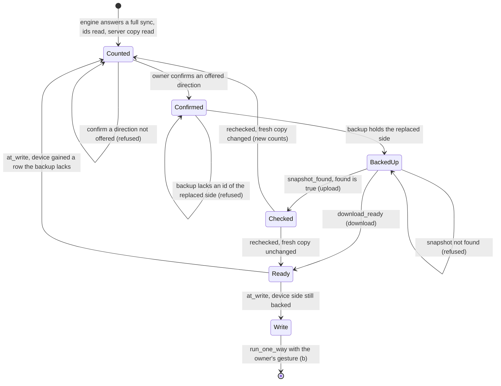
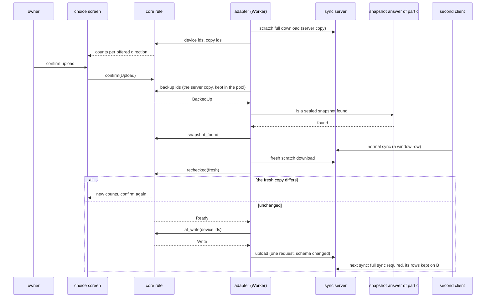

# Schematic: the full-sync choice and the web sync screens

SPEC-357, ADR-368, issue #631. Every `path:line` below was read at DeckStreak `dev` `adb19bbd`,
and every engine path in the fork at its pin, commit `c538de55`. Parts are marked (a) to (d): part
a builds the model, the rule and the core's reads; parts b to d are excluded in SPEC-357 section 5
(#631).

## 1. Components

The page renders and forwards the owner's taps; the Worker owns the session, its Web Lock and its
storage; the core owns every rule both clients share; the model covers the core's rule.

The iOS client (#633) replaces only the page, the Worker, the web engine and the OPFS pool with
its own screens, adapter (`crates/ffi`) and container; the core and the model are the same files.

## 2. A session's sync (part c, on parts a and b)

A sync never blocks study: a refused sync leaves the collection as it was, and the status names
what is unsynced until a later sync succeeds.

## 3. The choice's states (part a's rule; the model's program counter)

Cancel at any state before `Write` leaves both sides untouched. `Write` has no public constructor:
only `Ready::at_write` makes one.

## 4. An upload's order (the model's actions)

The row the second client syncs before the re-check is counted (the fresh copy differs). A row it
syncs after the re-check and before the upload is overwritten on the server, stays on the second
client, and that client's next sync is forced to a full sync by the upload's schema change
(`rslib/src/collection/mod.rs:192-203`). That is `CountsCoverTheUpload` and
`AWindowSyncIsNotSilent`.

## 5. The model's shape (`formal/tla/FullSyncChoice`, part a)

| variable | holds |
|---|---|
| `local`, `server`, `other` | review ids on the device, on the server, on the second client |
| `pending` | the second client's reviews not yet synced |
| `backup`, `copy`, `snap` | review ids in the backup, the scratch server copy and the newest sealed snapshot (or none) |
| `pc`, `dir`, `counted` | the choice's state, its direction, and the ids the counts showed as lost |
| `held` | the ids the write's last check reads: the counted device side, and the backup's ids once the backup is accepted |
| `made`, `window`, `lostUncounted`, `lostUnbacked`, `needFull`, `snapFound`, `uploadedNoSnap` | history: every review made, rows the second client synced after the re-check, what a write removed uncounted or unbacked, whether the second client must make a full sync, whether this choice found a snapshot, whether an upload ran without one |

| action | step |
|---|---|
| `AReview(r)`, `BReview(r)` | a review on the device, on the second client |
| `BSync` | the second client's normal sync, atomic; disabled once it must make a full sync |
| `Snapshot` | the daily window seals the server's rows |
| `Count`, `Confirm(d)`, `Backup`, `SnapCheck`, `Rechecked`, `DownloadReady`, `AtWriteRefused`, `Write` | the choice, one step each, guarded by the switches below; `Rechecked` and `AtWriteRefused` return to new counts |
| `Cancel` | the owner's Cancel at any step before the write; nothing is written |
| `Finished` | stutter once the choice is done or refused |

| switch (TRUE in `MCFullSyncChoice.cfg`) | FALSE in witness | kills |
|---|---|---|
| `BackupFirst` | `a-download-before-its-backup` | `BackupBeforeReplace` |
| `SnapshotFirst` | `an-upload-with-no-snapshot-found` | `SnapshotBeforeUpload` |
| `Recheck` | `an-upload-with-no-re-check` | `CountsCoverTheUpload` |
| `SchemaBump` | `an-upload-that-keeps-the-servers-schema` | `AWindowSyncIsNotSilent` |
| `VerifyAtWrite` | `a-write-that-does-not-re-read-the-device` | `NoReviewLost` |
