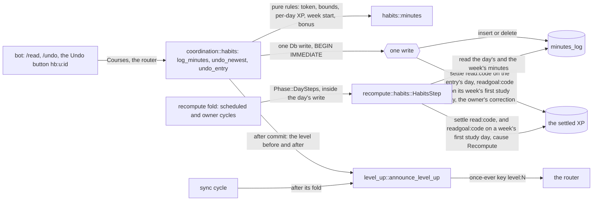
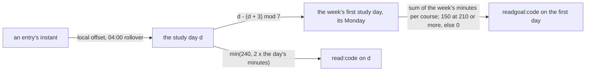
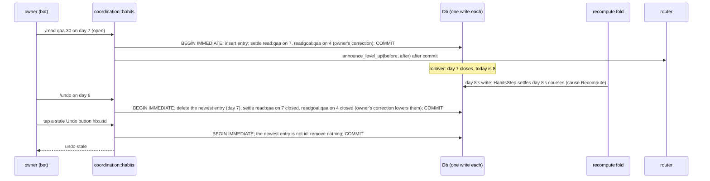
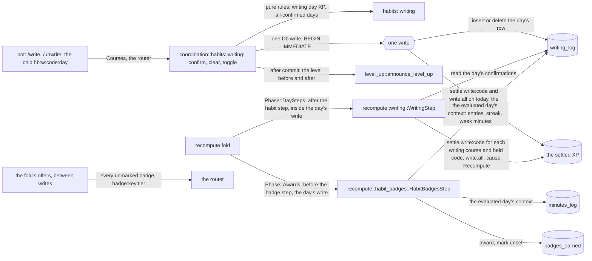
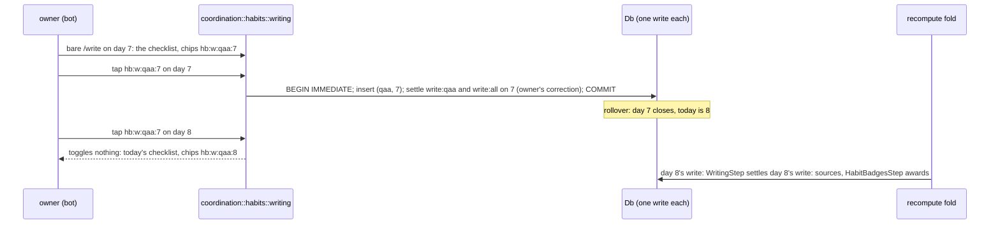

# Schematic: habit XP settles from its log

Kind: data flow and sequence. Read at DeckStreak `dev` 02758d4 (`crates/progression/src/settle.rs`,
`crates/coordination/src/recompute/mod.rs` and `recompute/xp.rs`, `crates/coordination/src/level_up.rs`,
`crates/daemon/src/wiring.rs`, `crates/daemon/src/role_bot.rs`) and at the predecessor's `27ee2bc` for
what it ports (`pipeline_layers/habits.py:HabitsLayer.record_reading`, `undo_last_reading`,
`_recompute_reading_xp`). Decided by ADR-078, beside ADR-071 and ADR-072. Added by SPEC-078 part
078a.

## 1. Who writes the log and its XP

`settle` admits a habit source only through `is_derived`: one of the nine derived names, or the
prefix `read:` or `readgoal:` followed by a valid course code; anything else is refused before a
write. Two actors write `minutes_log` and the habit settles: the owner's use cases and the fold's
habit step. Both run inside one write, so they serialise. Two actors may raise a level-up, the habit
use case and the sync cycle, and the router's once-ever key lets only the first through.

## 2. The study week

Epoch day 0 was a Thursday, so `(d + 3) mod 7` is 0 on a Monday. An entry at local Monday 03:59 is
on the Sunday study day and belongs to the week before.

## 3. An entry, an undo across the rollover, and a fold run

The undo lowers day 7's closed amounts in the write that removed the entry. Were the settle a write
of its own and it failed, the fold could never lower day 7 again: a recompute keeps the larger amount
on a closed day (ADR-072). The model `formal/tla/HabitXpFollowsItsLog/` checks this interleaving, and
its witness `an-undo-whose-settle-is-a-write-of-its-own` is that failure.

## 4. Part 078b: the writing toggle, the writing step and the habit badges step

Added by SPEC-078 part 078b (section 13), decided by ADR-078's amendment of 2026-10-03. Read at
DeckStreak `dev` cff914e (`crates/coordination/src/habits/minutes.rs`, `recompute/habits.rs`,
`recompute/badges.rs`, `crates/daemon/src/wiring.rs`) and at the predecessor's `27ee2bc` for what it
ports (`habits.py:writing_day_xp`, `writing_streak`, `evaluate_habit_badges`).

Two actors write `writing_log` and the `write:` settles: the owner's toggle and the fold's writing
step, each inside one write, so they serialise. The habit badges step awards inside the fold's day
write and never celebrates; the offers that already drain `badges_earned` celebrate each award once
through the router.

The model `formal/tla/HabitXpFollowsItsLog/` checks the toggle's one write
(`WritingXpFollowsItsConfirmations`, whose witness is a settle written apart from its toggle) and
the chip's day (`AChipTogglesOnlyItsOwnDay`, whose witness is a chip that toggles the day it is
tapped on).
