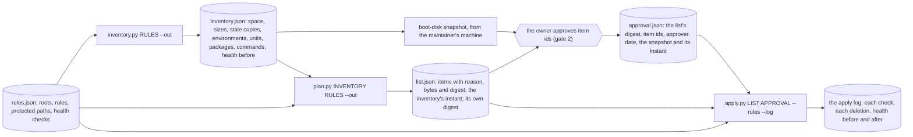
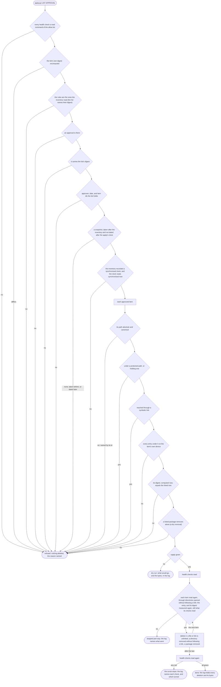

# Schematic: the host scrub, inventory to apply

Kind: data flow, and the order of the apply's refusals. Read at DeckStreak `dev` 24b04d3 (SPEC-060,
ADR-060, ADR-010, ADR-059). Built by SPEC-060. `docs/schematics/first-deploy-and-gates.md` draws the
scrub at the level of the owner's gates (gate 2, #161); this page draws the three tools, the files
they pass between them, and every check that stands before a deletion. The rules, the inventory,
the list, the approval and the log live in a directory the private rail names, never in this
repository (R8); the repository holds the tools and `deploy/host-scrub/rules.example.json`.

| step | reads | where |
|---|---|---|
| the inventory reads, and changes nothing | its own allow list of read commands, each under `nice` and `ionice -c3` | SPEC-060 R1, R2 |
| the rules | roots, backup retention, protected paths, packages, health checks | SPEC-060 R3, R7, R9 |
| the list | one item per path (or per listed package), each with its reason and digest | SPEC-060 R4 |
| the backup | one boot-disk snapshot, taken after the inventory, named by the approval | SPEC-060 R5 |
| the apply | all or nothing, before its first deletion | SPEC-060 R6, R7 |
| the health checks | read before the inventory and after each apply | SPEC-060 R9 |

## 1. The files between the tools

The plan reads each candidate's content to digest it, so it runs where the candidates are; the
inventory and the plan write their one output each, and the apply writes only its log until
`--apply` is given.

## 2. The apply's checks, in order

Every check below runs before the first deletion. One failure refuses the whole run, names the item
and the reason, and deletes nothing (R6, R7). The rules are the ones the inventory read, bound by
their digest, which is taken over the very bytes the apply parsed them from in one read (A10), and
the health checks run through the inventory's read allow list alone; the changing commands the
apply admits run only for a listed package's item.

The health read before the first deletion lies between the checks and the deletions, so each
deletion reads its item again, digest included, immediately before it deletes (SPEC-060 §7). The
inventory refuses the same clock reading before it writes anything.

## 3. The digest

A file's digest is SHA-256 over one line, `path NUL size NUL mtime_ns NUL mode NUL content`, where
`mode` is `st_mode` in octal and `content` is the hex SHA-256 of the file's bytes (of the link's
target for a symbolic link, empty for anything else). A directory's digest is SHA-256 over the
sorted lines of every entry under it, the directory itself included, joined by newlines. A listed
package's digest is SHA-256 over its name, architecture, version and state. The list's own digest
is SHA-256 over the list written as canonical JSON without its `digest` field, and the approval
carries it.
