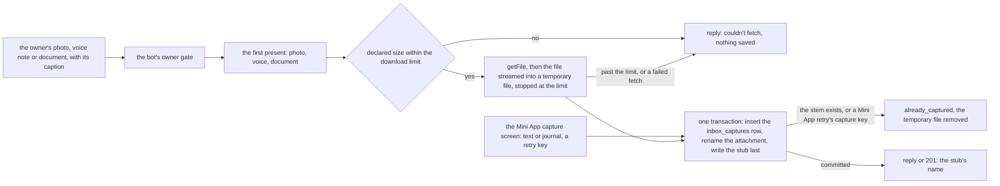
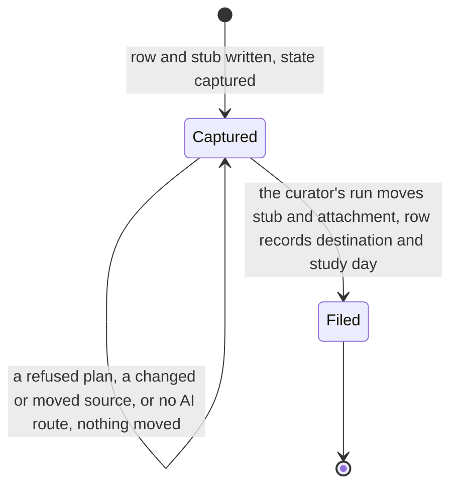
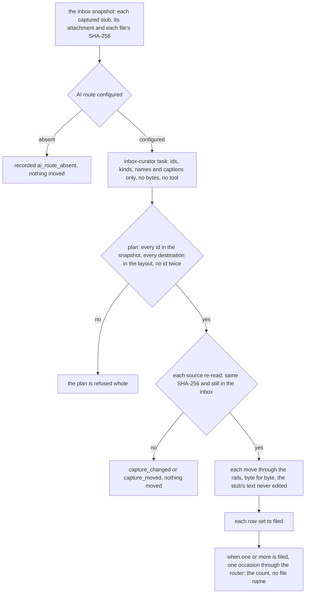

# Schematic: a capture, from the owner's message to its place in the vault

Kind: data flow and state machine. Read at DeckStreak `dev` 5216bcf (ADR-042, ADR-054,
`docs/schematics/vault-write-paths.md`, `docs/schematics/bot-update-loop.md`,
`docs/schematics/notification-router.md`), and at the predecessor's `27ee2bc` for the behaviour it
ports (`bot.py:CommandBot._maybe_capture_media`, `_capture_file`,
`vault_bridge.py:save_inbox_capture`). Added by SPEC-118 (ADR-118) and SPEC-116 (ADR-116). It adds
to `vault-write-paths.md` one writer (the capture, streamed through the atomic writer) and one
mover (the curator's filing); it rewrites neither of the paths drawn there.

## The capture

The stub is written after its attachment, inside the same transaction as its row, so the curator
never sees a stub without its file, and a capture is written once however often it is retried.
A Mini App retry is matched by its capture key, so a retry after UTC midnight, whose stem would
carry the next day, still answers the first name (ADR-118's capture-key amendment).

## A capture's states

## The curation

An erase deletes the rows and never a vault file: the vault is the owner's own folder.
