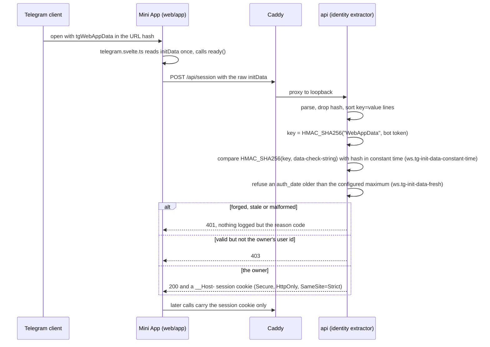

# Schematic: the Mini App's authentication sequence

Kind: sequence. Read at DeckStreak `main` 769ee62 (ADR-006). The rows the web-security pack reads
are named on the step they judge.

initData is never trusted from `initDataUnsafe`, never stored raw (privacy-gdpr
`telegram-minimised`), and never logged (observability `obs.no-secret-fields`).
