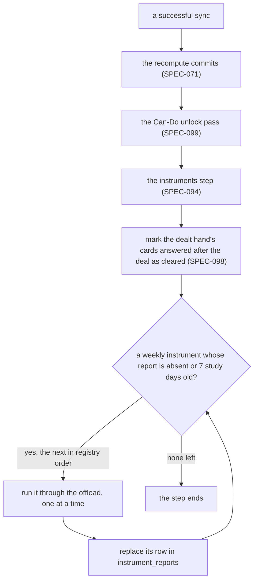
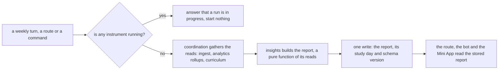
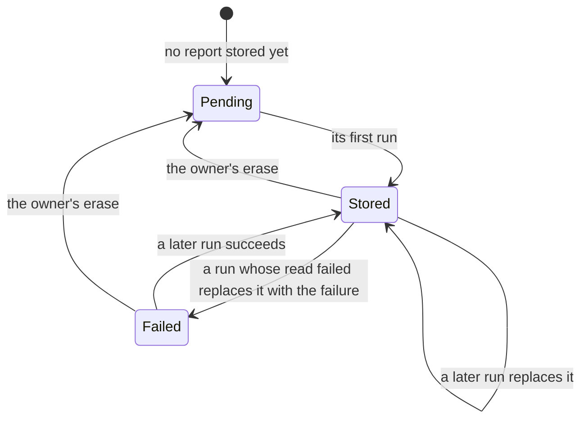

# Schematic: the insights instruments run on one frame

Kind: data flow and state machine. Read at DeckStreak `dev` dd98601 (`crates/insights/src/` holds
only `lib.rs`; `crates/coordination/src/sync_cycle.rs`) and at the predecessor's `27ee2bc`
(`pipeline_layers/read_api.py:ReadApiLayer`, `bot.py:CommandBot`, each instrument's
`build_*_report`). Decided by ADR-094 (the frame), ADR-095 (the reads keep the scope) and ADR-096
(the owner's note conventions). Added by SPEC-094; SPEC-095 to SPEC-098 register their instruments
on it. It extends `docs/schematics/data-flow.md` (the insights box) and
`docs/schematics/sync-cycle-and-change-gate.md` (what runs after a recompute), and changes neither.

## After a sync

The registry order puts the Docket after the Echo Test, the Price of a Day Off and Bench II, so it
folds their reports of the same run (SPEC-095). The cleared marks read only the sync's own study
events. A failure of one instrument is stored as its report's failed read and never stops the next.

## One instrument run

## One instrument's report

A registry row marked inert never runs and never shows. The instruments' reads are ingest's
(ADR-095): every read keeps SPEC-023's scope, a read of answers keeps its window's floor, and a set
of ids ever reviewed or a lag reads the whole scoped log. The weekly report (#130) reads the stored
reports through the one router; W4 sends none.
