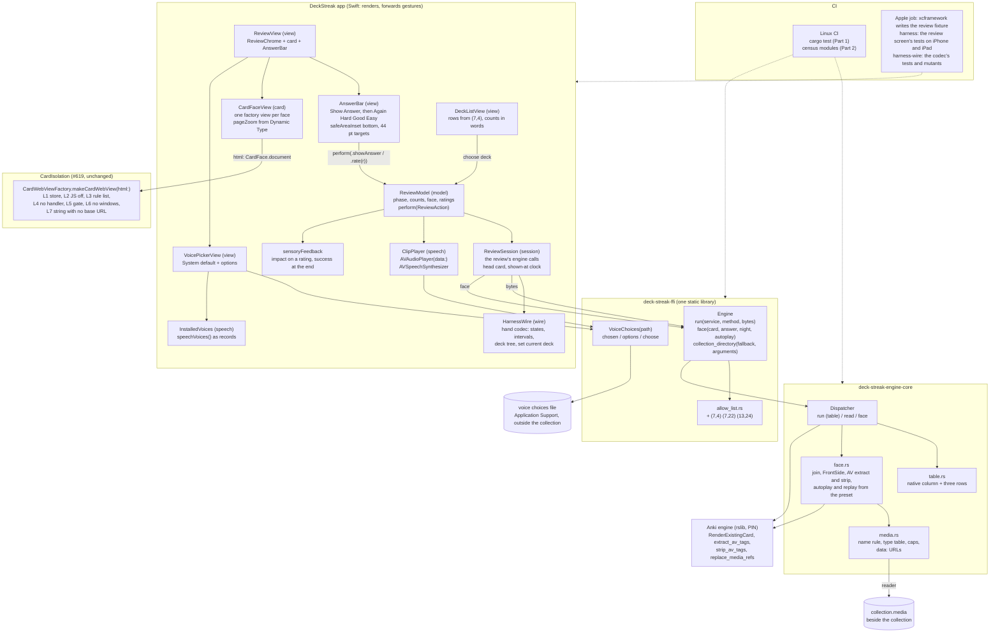
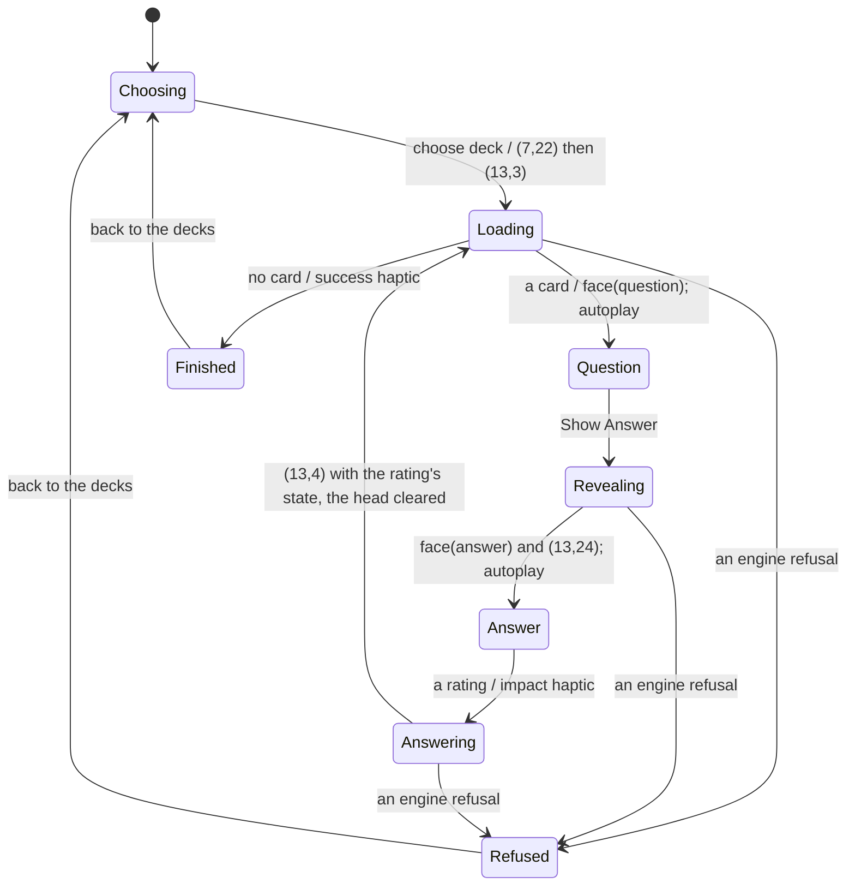
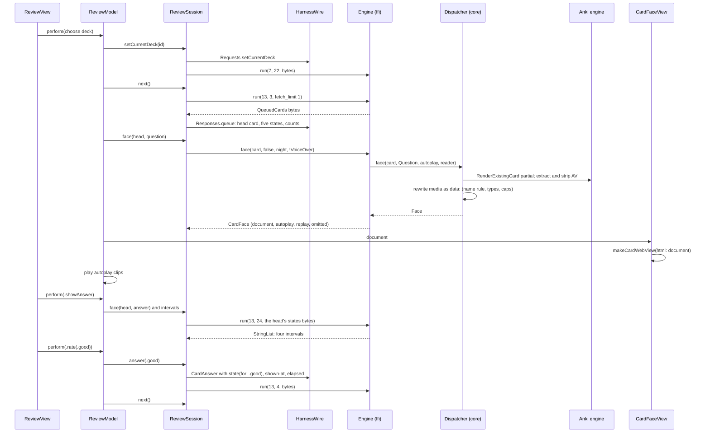
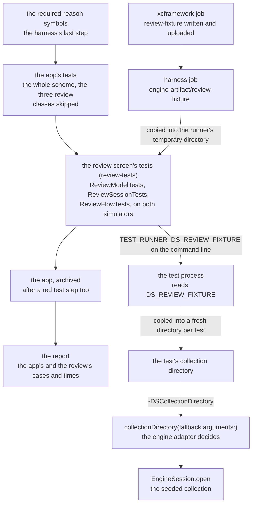
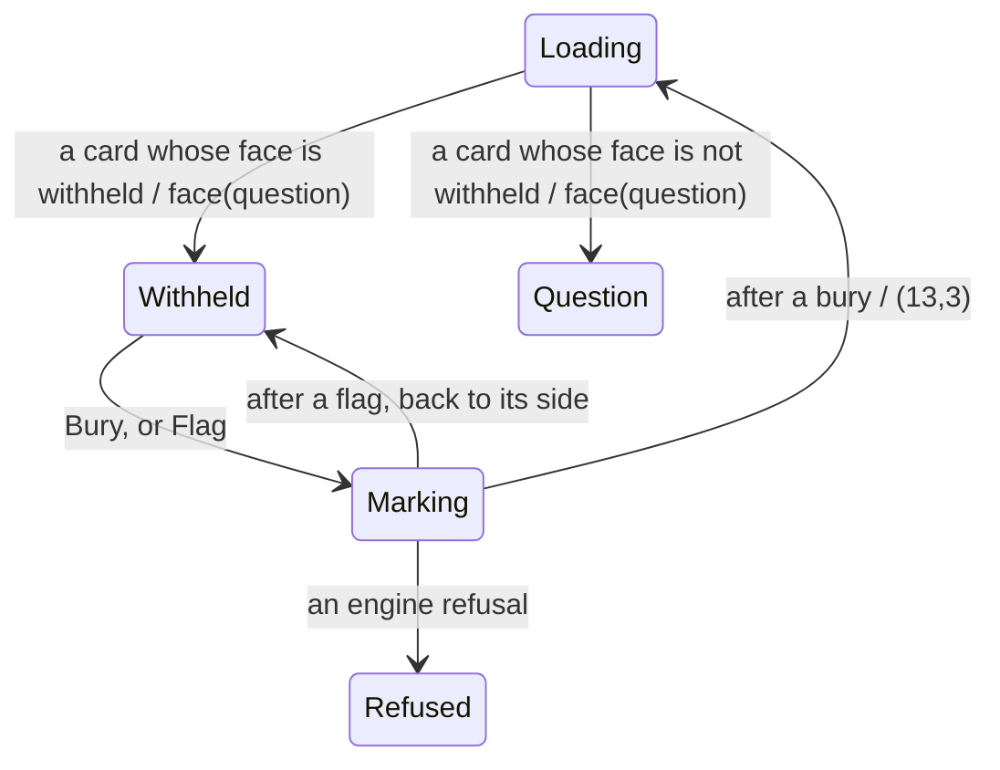

# Schematic: the iPhone and iPad review screen

- **For:** SPEC-348 (#632), decided by ADR-359.
- **Kinds:** component, state machine, data flow.
- **Read at:** DeckStreak `dev` `ac4fbdaeb02f682991a9b26db539dbc20c8ff559` (DEV), #662's head
  `af6da34688467f8866167c4affbb53a45cca9d8b` (ENG), and the engine commit the workspace pins,
  `c538de55a23e695234e794029fce0dafff2d36a9` (PIN). Every `path:line` below names one of the three.
- **Stands on:** the app shell (#625, SPEC-347: the split view, the session, the census), the iPhone
  and iPad half of #619 (`CardWebViewFactory`, layers L1 to L7, `docs/schematics/card-frame-channels.md`
  section 4), and #623's core (`Dispatcher`, the per-transport table).

## 1. Components

What each edge may carry, and what it may not:

| edge | carries | never |
|---|---|---|
| card to factory | one HTML string, the face's `document`; a new view per face | a configuration change, a handler, a base URL, a file URL, a reload into a sealed view |
| session to engine (`run`) | allow-listed pairs' protobuf bytes, built and read by `HarnessWire` | a pair outside the native column; the deck tree's or the states' meaning (the codec's) |
| session to engine (`face`) | a card id and three booleans; back a `CardFace` record | a media path; Swift never resolves or reads a media file |
| core to media folder | a file's bytes for a name that passed the name rule | a name with a separator, `.`, `..` or NUL |
| clip player to voice choices | a language and the installed voices as records | a write to the collection, a sync |

The doors the census holds (SPEC-347 R11, extended): only `session` imports `DeckStreakFFI` or
`HarnessWire` or names `FileManager`; only `card` (and `CardIsolation`'s `isolation` files)
imports `WebKit`; only `speech` imports `AVFoundation`; `view` and `model` import neither.

## 2. The review loop, a state machine

- `Loading`, `Revealing` and `Answering` disable the bar: a tap there is not a transition.
- The session clears its head card when it sends (13,4), so a second rating for one shown card
  finds no head and sends nothing; the model's phase guard is the first fence, the head the
  second.
- Showing a face stops the clip player; `replay` and `stop` are self-loops on `Question` and
  `Answer`.
- `perform(ReviewAction)` is the one entry every gesture uses; the remote and keys of #633
  call the same entry.

## 3. The data of one card

Where a value crosses a boundary:

- **Swift to Rust:** a card id, three booleans, the process arguments (once, at launch), a
  language, and the installed voices as `{identifier, name, language, quality}` records.
- **Rust to Swift:** the document string, clips (`Sound {name, bytes}` or
  `Speech {text, language, rate}`), the omitted names, the voice identifiers.
- **Rust to WebKit:** nothing directly; the document reaches WebKit only through the factory's
  `loadHTMLString(_, baseURL: nil)` (L7), and its media are `data:` URLs inside it, which the rule
  list's `.*` does not see (WebKit's content-rule backend skips `data:`) and which the frame's
  render proof covers (#619).

## 4. Where the numbers come from

| figure | source |
|---|---|
| (7,4), (7,22) | `proto/anki/decks.proto` lines 18 and 38 at PIN; the backend decks service is empty (line 44), so the collection service's order is the method number |
| (13,24) | `proto/anki/scheduler.proto` line 43 at PIN, after the backend scheduler service's three methods (lines 71 to 77) |
| the FrontSide order | `pylib/anki/template.py` lines 236 to 241 and 323 to 325 at PIN |
| the replay order | `qt/aqt/reviewer.py` lines 72 to 79 at PIN |
| the preset's flags | `proto/anki/deck_config.proto` lines 172 and 181 at PIN |
| the native column today | `crates/ffi/src/allow_list.rs` lines 23 to 56 at DEV; `crates/engine-core/src/table.rs` line 113 at ENG |

## 5. Part 2: the review step in the `harness` job, and the factory as #682 leaves it

Read at DeckStreak `dev` `f3392ec3dde43e80f47138f8ec5da8419a9e4b5c` (CUT). Kind: data flow.

The review fixture travels from the engine's job to the review screen's tests, and the `harness`
job's app steps run in this order (`.github/workflows/xcframework.yml` at CUT: the fixture written
at lines 126 to 127 and uploaded at 175; "the app's tests" at 479; "the app, archived" at 494;
"the report" at 532). The step between the app's tests and the archive is part 2's (ADR-359 D8).

The factory the card view awaits is the one #682 leaves
(`ios/CardIsolation/Sources/CardIsolation/CardWebViewFactory.swift` at CUT): its layers are L1 to
L8 and L10 to L13 (lines 4 to 10; L9 is retired and its number not reused), against section 1's
L1 to L7, and `load(_:into:)` (line 55) prefixes the document policy ahead of the HTML it is
given. The card view hands `CardFace.document` to it unchanged, so the page carries the policy's
doctype and then the face's own; nothing in the app sets anything on a configuration.

## 6. The withheld phase (SPEC-380)

Read at the base `e7ecf10d6b796eb1f86fe6544e04a96a0583c791` (`dev`). Decided by ADR-391. This
section is appended to `docs/schematics/ios-review-screen.md`; no line above it changes. The rule
and both reviews' data flow are drawn in `docs/schematics/web-study-screens.md` section 7.

- `ReviewSession.next` answers `withheld` when the ffi's face is withheld and `question`
  otherwise (`ios/App/Sources/ReviewSession.swift:63`): the session's one new decision, 3 to 4 of
  its ceiling of 4.
- In `Withheld` the bar disables Show Answer and every rating, as it does outside their own phases
  (`ios/App/Sources/AnswerBar.swift:33`, `:58`), and `perform` has no arm for them there: a tap is
  not a transition, and no rating is sent.
- Bury and flag join `perform`'s existing patterns (`ios/App/Sources/ReviewModel.swift:86`, `:92`),
  and the chrome's idle names `withheld` by one decision in place of one
  (`ios/App/Sources/ReviewChrome.swift:76-78`).
- The card's place shows the ffi's withheld document, which holds the English line
  (`ios/App/Sources/ReviewView.swift:33`): the view gains no branch, and `withheld` joins the
  phase's one case list (`:7`).
- The head card stays the withheld one until a bury, so a flag marks the card the learner was told
  about.
