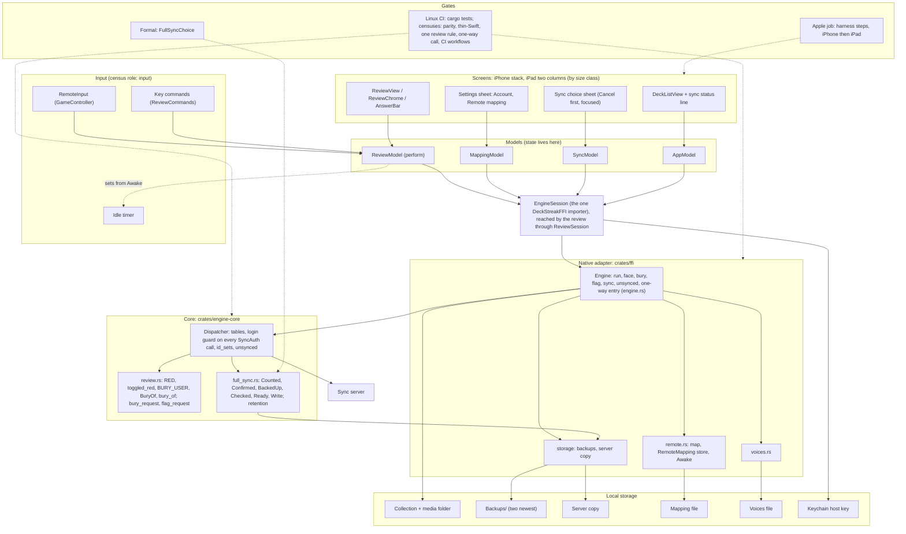
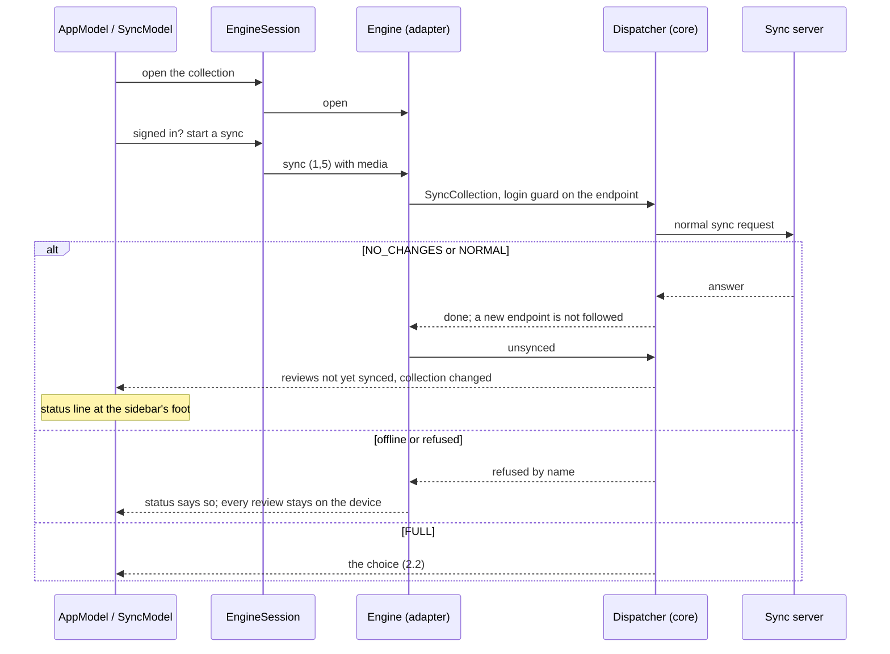
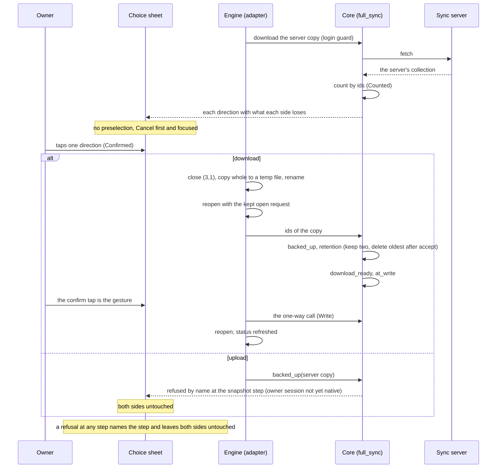
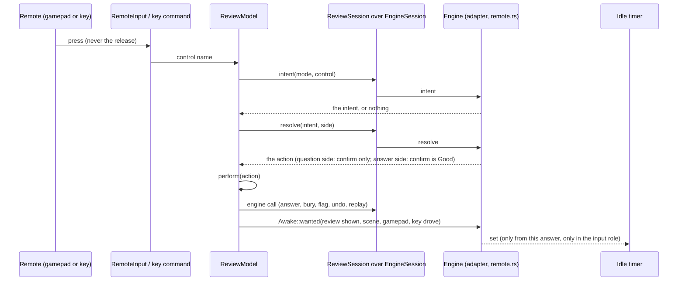

# Schematic: iPhone and iPad Phase 1 parity (SPEC-358, ADR-369)

Read at `D` = `f9381e14311a0cbe7d812946e33355c13d678e01` (dev, with the app shell (#684), the
review screen (#709) and SPEC-350 part 2 (#690) merged). The figures were first read at dev
`3fe90969` and at the shell's red stub (`73a6bda1`); the shell's and the review screen's surfaces
below are read at `D` and corrected where they moved: the review reaches `EngineSession` through
the `ReviewSession` actor (`ReviewSession.swift:24-25`), which imports the codec beside it, and
the sidebar's one toolbar button opens the account sheet (`DeckListView.swift:35`, `:60-63`) that
part b's R14 makes the settings sheet. Nothing here names a host, an identity or a schedule.

## 1. Component diagram

Arrows point from the caller to the callee. The Swift side holds no rule: the adapter and the core
decide, Swift shows. Dashed edges are tests and gates.

What each box owns:

| box | owns | does not own |
|---|---|---|
| Screens | layout, text, the shown choice | any rule, any call |
| Input | binding a control to its NAME; setting the idle timer from the adapter's answer | the control's meaning |
| Models | the review's card and side, the sheet's state | the action a control fires |
| `EngineSession`, `ReviewSession` | the one import of the adapter (`EngineSession`); the codec (both) | any decision |
| Adapter | the remote's map and store, `Awake`, the backup's file steps, the one-way entry | the choice's order, the flag and bury rules |
| Core | the tables, the login guard, the flag and bury rules, the choice's order and retention | any file path or platform call |

## 2. Data flows

### 2.1 A session's sync

### 2.2 The full-sync choice

### 2.3 A remote-driven review

### 2.4 An undo (moved)

Part a builds no native undo: native Undo leaves the allow-list and the native run refuses (3,8)
(#714). The undo sequence drafted here moved to SPEC-358 section 7.

## 3. Boundaries this schematic holds

- Swift imports the adapter in `EngineSession` alone; GameController and the idle timer are named
  in the `input` role alone; the one-way call is made from the choice sheet's confirm handler
  alone. Each is a census, planted-control tested.
- No Swift file names a preference store or a network client; every call to the engine passes the
  adapter's allow-list, which equals the core's native column.
- The flag and bury rules, the choice's order and retention each exist once, in the core.
- A moved rule's mutation rows move with it; none is retired.
