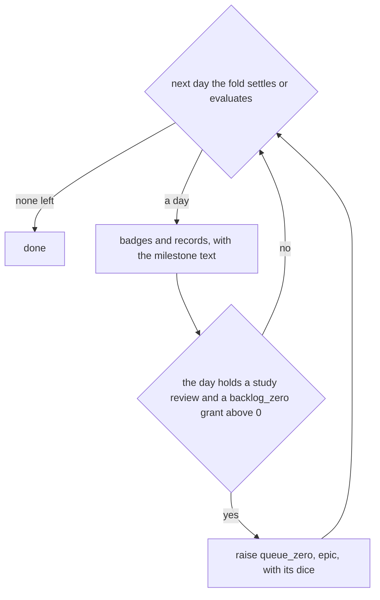
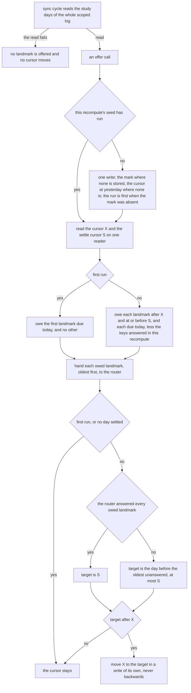
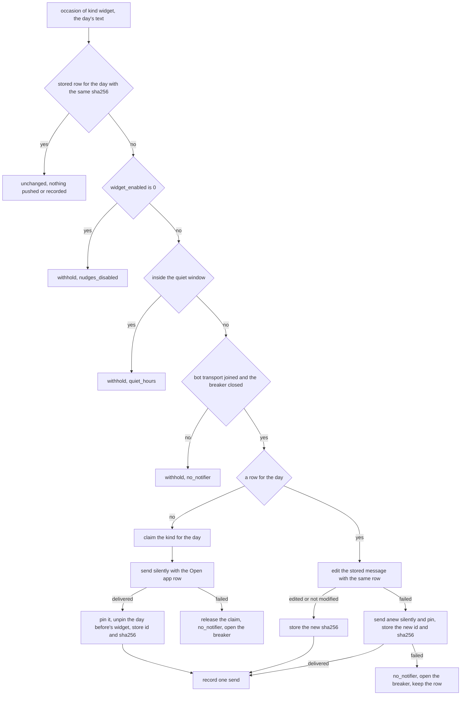
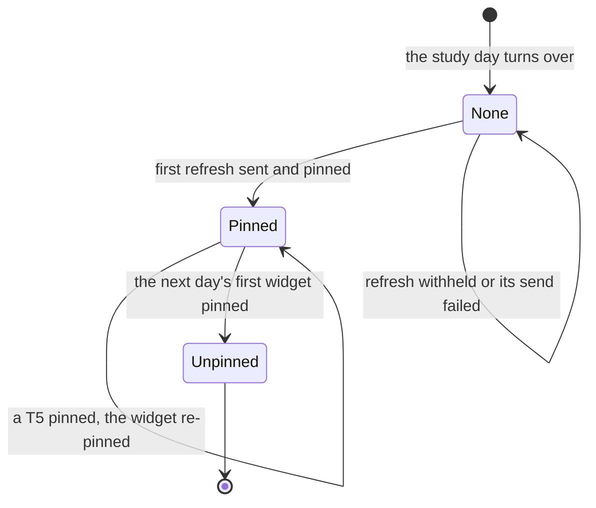

# Schematic: the landmarks, the milestone pings and the pinned widget

Kind: data flow and state machine. Read at DeckStreak `dev` af0693f and at the predecessor's
`27ee2bc` (`landmarks.py:run_landmarks`, `pipeline.py:GamifyPipeline._notify_milestones` and
`_run_sync_cycle_impl`, `pipeline_layers/showcase.py:ShowcaseLayer._update_widget` and
`_repin_widget`, `telegram.py:render_milestone`, `render_widget` and `widget_mood`). Added by the W5
architect turn, under ADR-109 (the widget is one silent pinned message a study day, edited in place
through the router). SPEC-102 builds it. Part b (#127, ADR-322) redraws the landmarks as offers
between the fold's writes, read at `96f6fe31`.

It extends five accepted schematics without changing them: `docs/schematics/notification-router.md`
(the decision each message goes through), `docs/schematics/celebration-ladder-on-the-router.md` (the
tiers, the dice and the T5 pin), `docs/schematics/recompute-settles-each-study-day.md` (the fold
whose awards phase the two new steps join), `docs/schematics/sync-cycle-and-change-gate.md` (the
cycle whose last step refreshes the widget) and `docs/schematics/cron-fire-ledger-and-catch-up.md`
(the hourly job's fires).

## The awards phase: queue zero

Queue zero runs in the seventh phase of the fold (ADR-071), after the badges, for each study day the
fold settles and then for the current one. It raises its occasion through the router, whose
once-ever dedupe is the guard against a second raise.

## The landmarks' offers, between the fold's writes

Redrawn for #127 part b (SPEC-102 section 11, ADR-322), read at `96f6fe31`: the landmarks are no
longer raised inside the awards phase. The sync cycle reads the study days of the whole scoped log
once and hands the fold its offers in turn, the awards' and then the landmarks'. The fold runs them
before each settled day's write, before the current day's write, and once more after its last write
(ADR-303). Each landmark offer call, with today the current study day:

- The router answers on a send, a hold and a withhold alike; only a refusal leaves a landmark
  unanswered, and the next offer call owes it again. A key offered twice reads the router's
  once-ever dedupe as already recorded, so it is sent once.
- The mark is the predecessor's bytes, `{"anniversary": A, "seeded": true, "study_day": N}`, with A
  and N the highest ordinals among the landmarks up to the day evaluated. It is stored once and
  never overwritten; a mark imported from the predecessor makes no run first.
- An anniversary carries the honest variant when the window holds no language study on its day.
- A celebration raised at the morning's recompute falls in quiet hours: the router holds it, and the
  flush at the window's end delivers it (#291).

## A widget refresh

The owner's sync cycle's last step, and the hourly job at minute 44, route one occasion of the kind
`widget`; its arm in `route` decides.

## The widget message across a study day

- The day before's widget is unpinned only when the next day's widget is sent; it is never edited
  again.
- A T5 in `route` or in the flush unpins and pins the day's widget after its own pin, so the widget
  stays the newest pin.
